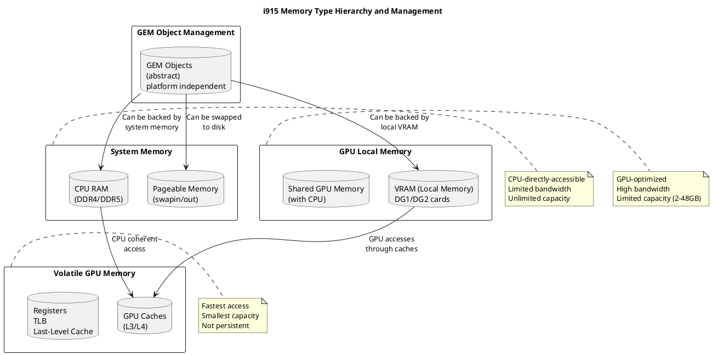
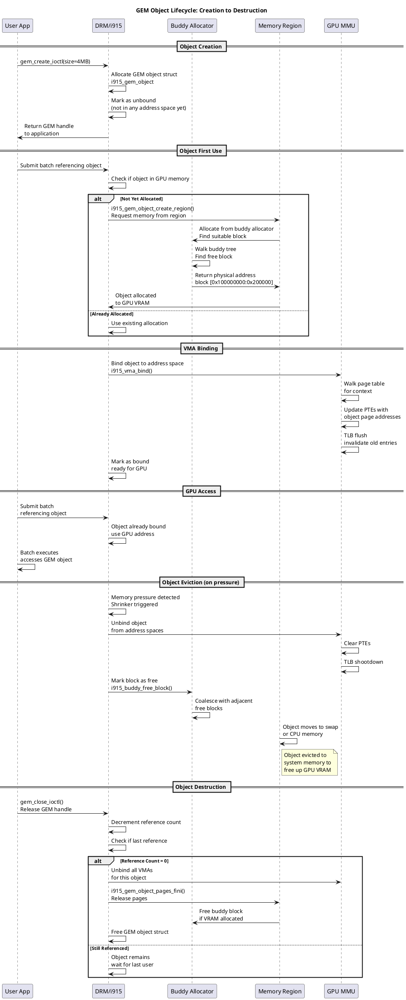
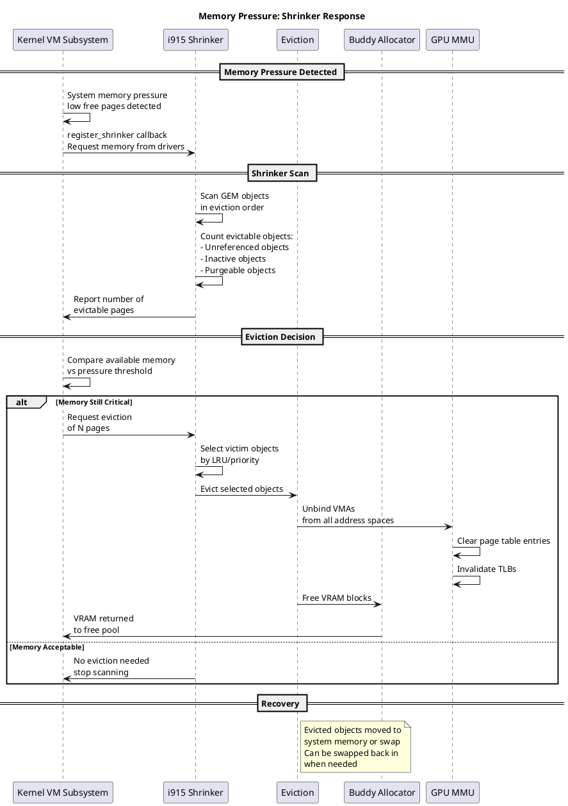
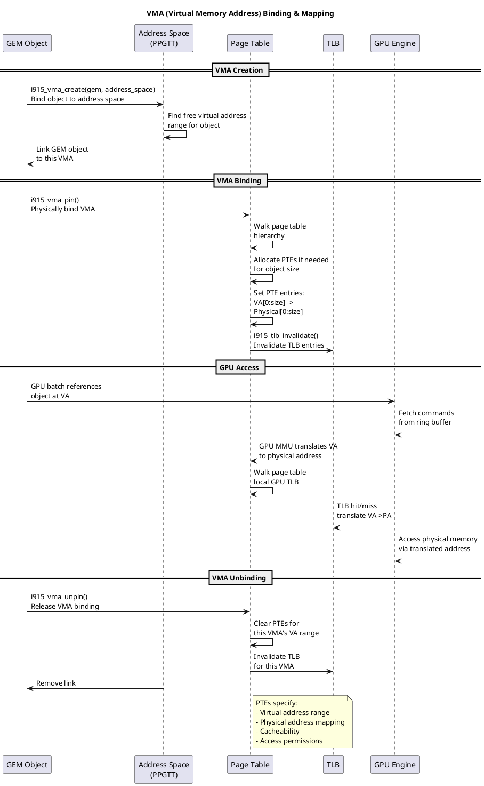
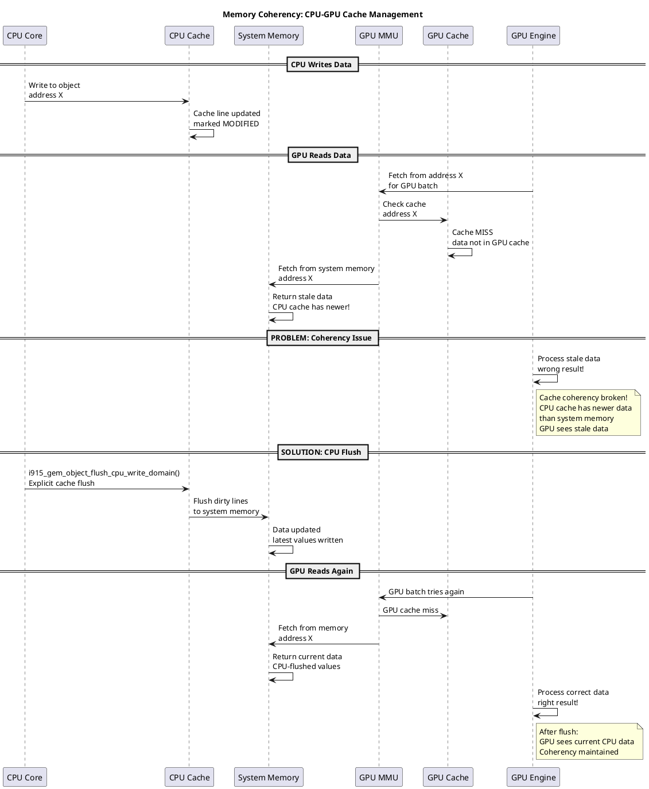

# Memory Management System

## Overview

The Intel i915 GPU driver implements a sophisticated memory management system to handle GPU memory allocation, management, and lifecycle. The system abstracts GPU memory through the **GEM (Graphics Execution Memory)** framework and supports multiple memory regions including system RAM and local VRAM.

**Key Concepts:**
- **GEM Objects**: User-facing abstraction for GPU memory
- **Memory Regions**: Different memory types (system, LMEM, etc.)
- **Buddy Allocator**: Efficient VRAM allocation
- **Memory Pressure**: Eviction and shrinking under memory constraints

---

## Architecture Overview

```
┌─────────────────────────────────────────────────────┐
│           User Application / DRM API                 │
│    (gem_create, gem_mmap, gem_close)                 │
└──────────────────────┬──────────────────────────────┘
                       ↓
        ┌──────────────────────────────┐
        │   i915_gem_create.c          │
        │  (GEM Object Creation API)   │
        └──────────────┬───────────────┘
                       ↓
    ┌──────────────────────────────────────┐
    │ intel_memory_region.c                 │
    │ (Memory Region Abstraction)           │
    │  - System Memory                      │
    │  - Local Memory (LMEM)                │
    │  - Stolen Memory                      │
    └──────────────┬──────────────────────┘
                   ↓
    ┌──────────────────────────────────────┐
    │  i915_buddy.c (Buddy Allocator)      │
    │  - VRAM block allocation             │
    │  - Fragmentation management          │
    └──────────────┬──────────────────────┘
                   ↓
    ┌──────────────────────────────────────┐
    │ i915_gem_pages.c (Page Management)   │
    │ - Shmem backing store                │
    │ - Page swapping                      │
    │ - I/O for swapping                   │
    └──────────────┬──────────────────────┘
                   ↓
    ┌──────────────────────────────────────┐
    │ i915_gem_shrinker.c (Memory Pressure)│
    │ - Eviction                           │
    │ - Shrinking under pressure           │
    └──────────────┬──────────────────────┘
                   ↓
    ┌──────────────────────────────────────┐
    │ i915_vma.c (Virtual Memory Address)  │
    │ - Bind objects into address spaces   │
    │ - GGTT/PPGTT mapping                 │
    └──────────────┬──────────────────────┘
                   ↓
            GPU Hardware Memory
```

---

## Core Components

### 1. **GEM Objects (i915_gem_object.c)**

**Purpose:** Represents a GPU memory allocation from userspace perspective

**Key Structures:**
```c
struct drm_i915_gem_object {
    struct drm_gem_object base;           // Base DRM object
    
    struct intel_memory_region *mm;       // Associated memory region
    struct list_head mm_node;             // Memory region list node
    
    struct page **pages;                  // Backing pages (for shmem)
    unsigned long get_page_count;         // Page pin count
    
    struct i915_vma_resource *vma_res;    // VMA resource
    struct list_head vma_list;            // List of VMAs
    
    struct i915_active active;            // Active reference tracking
    struct mutex lock;                    // Object lock
    
    unsigned int cache_level : 3;         // Cache coherency level
    unsigned int madv : 5;                // Advice for reclamation
    bool dirty : 1;                       // Needs write-back
    
    /* ... memory stats, operations, etc. */
};
```

**Key Operations:**
- `i915_gem_object_create_*()` - Create GEM objects
- `i915_gem_object_put()` - Release reference
- `i915_gem_object_get_pages()` - Get backing pages
- `i915_gem_object_pin_pages()` - Pin in memory
- `i915_gem_object_set_cache_level()` - Set caching behavior

**Lifecycle:**
```
Create → Get Pages → Pin → Bind to VMA → Execution → Unpin → Shrink → Destroy
```

---

### 2. **Memory Regions (intel_memory_region.c)**

**Purpose:** Represents different memory types available to GPU

**Memory Types:**
```c
enum intel_region_id {
    INTEL_MEMORY_SYSTEM,    // System RAM
    INTEL_MEMORY_LOCAL,     // GPU Local Memory (VRAM)
    INTEL_MEMORY_STOLEN,    // Stolen System Memory (legacy)
    INTEL_MEMORY_MOCK,      // Testing
};
```

**Region Operations:**
```c
struct intel_memory_region_ops {
    int (*init)(struct intel_memory_region *mem);
    void (*release)(struct intel_memory_region *mem);
    
    struct drm_i915_gem_object *(*create_object)(
        struct intel_memory_region *mem,
        u64 size,
        unsigned int flags);
};
```

**Region Usage:**
```
┌─────────────────────────────────────────┐
│     intel_memory_region                  │
│  ─────────────────────────────────────   │
│  type: SYSTEM / LOCAL / STOLEN           │
│  total_size: Total available             │
│  avail: Available free                   │
│  ops: Region-specific operations         │
│  private: Implementation data            │
└─────────────────────────────────────────┘
```

---

### 3. **Buddy Allocator (i915_buddy.c)**

**Purpose:** Efficient allocation of VRAM blocks for GPU memory

**Algorithm:**
- Binary buddy system for power-of-2 allocation
- Automatic block merging/splitting for fragmentation management
- Block states: FREE, SPLIT, ALLOCATED

**Key Structures:**
```c
struct i915_buddy_mm {
    struct drm_i915_private *i915;
    
    u64 size;                  // Total memory size
    struct list_head *free_list;  // Free blocks per order
    struct list_head *split_list; // Split blocks
    
    unsigned int n_roots;      // Number of root blocks
    struct i915_buddy_block **roots;  // Root blocks
};

struct i915_buddy_block {
    u64 offset;
    unsigned int order;        // Power-of-2 order
    
    #define I915_BUDDY_FREE      1
    #define I915_BUDDY_ALLOCATED 2
    #define I915_BUDDY_SPLIT     3
    unsigned int state;
    
    struct list_head link;     // Links in free/split lists
};
```

**Allocation Process:**
```
┌─────────────────────────────────┐
│  Request allocation (size)      │
└────────────┬────────────────────┘
             ↓
    ┌────────────────────┐
    │ Find min order:    │
    │ order = ceil(     │
    │  log2(size)       │
    │ )                 │
    └────────────┬───────┘
                 ↓
    ┌──────────────────────────────┐
    │ Traverse free_list[order]    │
    │ Find available block         │
    └────────────┬─────────────────┘
                 ↓
    ┌──────────────────────────────┐
    │ If not found:                │
    │ Split larger block           │
    │ (higher order)               │
    └────────────┬─────────────────┘
                 ↓
    ┌──────────────────────────────┐
    │ Mark block ALLOCATED         │
    │ Return offset                │
    └──────────────────────────────┘
```

**Key Functions:**
- `i915_buddy_alloc()` - Allocate memory block
- `i915_buddy_free()` - Free memory block
- `i915_buddy_free_list()` - Free list of blocks

---

### 4. **Page Management (i915_gem_pages.c)**

**Purpose:** Manage backing physical pages for GEM objects

**Page Sources:**
```c
enum obj_page_type {
    OBJ_PAGE_SHMEM,       // System RAM via shmem
    OBJ_PAGE_LMEM,        // Local GPU memory
    OBJ_PAGE_PHYS,        // Physically contiguous
    OBJ_PAGE_STOLEN,      // Stolen system memory
};
```

**Key Operations:**

```c
// Get pages backing the object
struct page **i915_gem_object_get_pages(struct drm_i915_gem_object *obj);

// Pin pages in memory (prevent eviction)
int i915_gem_object_pin_pages(struct drm_i915_gem_object *obj);

// Unpin pages (allow eviction)
void i915_gem_object_unpin_pages(struct drm_i915_gem_object *obj);

// Get page statistics
struct i915_gem_object_page_iter {
    struct scatterlist *sg;
    unsigned int last;
};
```

**Page Lifecycle:**
```
┌──────────────────┐
│ Allocate Object  │
└────────┬─────────┘
         ↓
   ┌──────────────────┐
   │ get_pages() on   │
   │ first access     │
   └────────┬─────────┘
            ↓
    ┌───────────────────┐
    │ Allocate physical │
    │ pages from shmem  │
    └────────┬──────────┘
             ↓
    ┌────────────────────┐
    │ Build page list    │
    │ (scatter-gather)   │
    └────────┬───────────┘
             ↓
    ┌────────────────────┐
    │ Pin/access count   │
    │ ref counting       │
    └────────┬───────────┘
             ↓
    ┌────────────────────┐
    │ put_pages()        │
    │ Release pages      │
    └────────────────────┘
```

---

### 5. **Memory Pressure & Shrinking (i915_gem_shrinker.c)**

**Purpose:** Handle memory pressure by evicting/shrinking GPU memory

**Shrinking Strategies:**
```c
struct i915_gem_shrinker {
    struct list_head list;         // GEM objects to scan
    unsigned long count;           // Total object count
    unsigned long shrink_count;    // Objects shrunk
    unsigned long shrink_bytes;    // Bytes shrunk
    
    struct shrinker shrinker;      // Linux kernel shrinker
};
```

**Eviction Flow:**
```
┌─────────────────────────────────┐
│   Memory Pressure Detected       │
│   (kswapd, direct reclaim)       │
└────────────┬────────────────────┘
             ↓
    ┌────────────────────────────┐
    │  i915_gem_shrinker_scan()  │
    │  - Scan GEM object list    │
    │  - Find evictable objects  │
    └────────────┬───────────────┘
                 ↓
    ┌────────────────────────────┐
    │  i915_gem_object_evict()   │
    │  - Unbind from GGTT/PPGTT  │
    │  - Mark pages for eviction │
    │  - Update active refs      │
    └────────────┬───────────────┘
                 ↓
    ┌────────────────────────────┐
    │  Notify shrinker of freed  │
    │  memory amount             │
    └────────────────────────────┘
```

**Eviction Constraints:**
- Cannot evict pinned objects
- Cannot evict objects in active use
- Respects object's madv hint (MADV_WILLNEED/DONT_NEED)

---

### 6. **Local Memory (LMEM) Management (i915_gem_lmem.c)**

**Purpose:** Specialized handling for discrete GPU local memory

**LMEM Features:**
```c
struct intel_memory_region {
    enum intel_region_id type;    // INTEL_MEMORY_LOCAL
    
    /* Physical address range */
    u64 start;
    u64 size;
    
    /* Buddy allocator for LMEM */
    struct i915_buddy_mm mm;
    
    /* Private pages management */
    struct drm_mm lmem_mm;
    
    /* LMEM-specific ops */
    struct intel_memory_region_ops ops;
};
```

**LMEM Allocation Process:**
```
User Request (size)
        ↓
i915_gem_create() → INTEL_MEMORY_LOCAL
        ↓
intel_memory_region_allocate()
        ↓
i915_buddy_alloc()
        ↓
Get physical pages from LMEM pool
        ↓
Build page scatter-gather list
        ↓
Return GEM object to user
```

**Key Differences from System Memory:**
| Aspect | System Mem | LMEM |
|--------|-----------|------|
| Source | shmem/page cache | Direct VRAM pool |
| Allocation | Lazy | Eager (buddy allocator) |
| Eviction | Via kswapd | Manual shrinking |
| Coherency | CPU-accessible | GPU-only (needs migration) |
| Lifetime | System controlled | Driver controlled |

---

## Code Flow Examples

### Creating a GEM Object

```c
// User initiates: DRM_IOCTL_I915_GEM_CREATE
int i915_gem_create_ioctl(struct drm_device *dev, void *data, struct drm_file *file)
{
    struct drm_i915_gem_create *args = data;
    
    // Step 1: Choose memory region
    struct intel_memory_region *mem = 
        i915_gem_choose_memory_region(dev_priv, flags);
    
    // Step 2: Create GEM object
    struct drm_i915_gem_object *obj = 
        mem->ops->create_object(mem, args->size, flags);
    
    // Step 3: Add to memory region tracking
    i915_gem_object_set_mmio(obj, mem);
    
    // Step 4: Export to userspace
    int handle = drm_gem_handle_create(file, &obj->base);
    
    args->handle = handle;
    return 0;
}
```

**Call Chain Diagram:**
```
i915_gem_create_ioctl()
    ↓
i915_gem_object_create()
    ↓
i915_gem_object_create_from_data()
    ├→ i915_buddy_alloc() [for LMEM]
    ├→ __i915_gem_object_create() [object init]
    └→ i915_gem_object_set_mmio() [track in region]
```

---

### Binding GEM Object to Address Space (Simplified)

```c
// When GPU needs to access object, bind it to GGTT/PPGTT
int i915_vma_bind(struct i915_vma *vma, ...)
{
    struct drm_i915_gem_object *obj = vma->obj;
    
    // Step 1: Get pages backing the object
    struct page **pages = i915_gem_object_get_pages(obj);
    
    // Step 2: Pin pages (prevent eviction during binding)
    i915_gem_object_pin_pages(obj);
    
    // Step 3: Build page table entries
    for (each page in pages) {
        u64 phys_addr = page_to_phys(page);
        
        // Write to appropriate level in GGTT or PPGTT
        gen8_ppgtt_insert_pte(ppgtt, phys_addr);
    }
    
    // Step 4: Mark as bound
    set_bit(I915_VMA_BOUND, &vma->flags);
    
    return 0;
}
```

---

## Memory Types & Usage

### System Memory
- Backing store for CPU-visible data
- Allocated via shmem filesystem
- Swappable to disk
- Used when LMEM not available

### Local Memory (LMEM)
- GPU-dedicated VRAM
- Fast GPU access
- Limited by GPU memory size
- Requires migration for CPU access

### Stolen Memory (Legacy)
- Reserved from system RAM by BIOS
- Low-latency access
- Mainly for framebuffer

---

## Configuration & Tuning

### Kernel Parameters:
```bash
# Module parameter controls
# i915.prefer_lmem=1     # Prefer LMEM for allocations
# i915.lmem_size=X       # Override LMEM size
```

### Sysfs Interface:
```bash
# Check memory stats
cat /sys/class/drm/card0/device/memory_region*

# Adjust shrinker behavior
echo 100 > /proc/sys/vm/drop_caches
```

---

## Performance Considerations

### 1. **Fragmentation**
- Buddy allocator minimizes fragmentation
- Regular defragmentation of free blocks
- Monitor via debugfs

### 2. **Eviction Overhead**
- Unbinding is expensive (TLB flushes)
- Batch evictions when possible
- Prefer staying within VRAM

### 3. **Page Migration**
- System ↔ LMEM migration is costly
- Minimize for critical paths
- Use memory_region hints

### 4. **Cache Coherency**
- Different cache levels available
- PAT (Page Attribute Table) control
- WC (Write-Combine) vs WB (Write-Back)

---

## Debugging & Introspection

### Debugfs Interface:
```bash
# Check allocated objects
cat /sys/kernel/debug/dri/0/i915_gem_objects

# Memory region stats
cat /sys/kernel/debug/dri/0/memory_regions

---

## Deep Dive: Memory Management Architecture

### Memory Type Hierarchy and Management



### GEM Object Lifecycle



### Memory Region Selection & Eviction

```plantuml
@startuml
title Memory Region Selection: Placement Strategy

rectangle "Available Regions" {
  database "System Memory\n(unlimited capacity)" as sys
  database "GPU VRAM\n(limited, 8-48GB)" as vram_opt
  database "Shared Memory\n(limited)" as shared
}

rectangle "Placement Decision" {
  component "Memory Placement Policy" as policy
}

policy --> policy: Check object requirements:\n- Placement flags\n- Performance needs\n- Available space

alt Object needs GPU access only
  policy --> vram_opt: Place in VRAM\nif available
  vram_opt --> vram_opt: Fast GPU access\nNo CPU access overhead
else Object needs CPU access
  policy --> shared: Place in shared memory\nif available
  shared --> shared: GPU coherent\nCPU accessible
else GPU optional
  policy --> sys: Place in system memory\ndefault fallback
  sys --> sys: Accessible to both\nwith coherency overhead
end

note right of policy
Decision based on:
- Availability
- Bandwidth needs
- Power efficiency
- Thermal constraints
end note

@enduml
```

### Buddy Allocator: Block Management

```plantuml
@startuml
title Buddy Allocator: Free Block Merging Strategy

rectangle "VRAM Layout (1GB total)" as vram {
  rectangle "Freed Block" as freed {
    database "[0x000000:0x100000]\n(1MB) FREE" as b1
    database "[0x100000:0x200000]\n(1MB) USED" as b2
    database "[0x200000:0x400000]\n(2MB) FREE" as b3
  }
}

== Initial State ==

note right of b3
After freeing block at
0x200000 (2MB), check
if buddy can merge
end note

== Merge Check ==

b3 --> b3: Check if buddy free:\nBuddy of [0x200000:0x400000]\nis [0x000000:0x200000]

b3 --> b3: [0x000000:0x200000]\ncontains:\n- Used block [0x100000]\n- Free block [0x000000]

b3 --> b3: Buddy NOT free\n(contains used block)\nCannot merge

== Second Eviction ==

note right of b2
Later, block at 0x100000\nis freed (application done)
end note

b2 --> b2: Check buddy:\n[0x000000:0x100000]

b2 --> b2: Buddy is FREE!\nCan merge

b2 --> b1: Merge with buddy\n[0x000000:0x100000] +\n[0x100000:0x200000]

b1 -.-> b3: New 2MB free block\n[0x000000:0x200000]

b3 --> b3: Now check if THIS\nbuddy free:\nBuddy is [0x200000:0x400000]\nFREE!

b3 -.-> vram: Final merge:\n[0x000000:0x400000]\n4MB free contiguous

note right of vram
Merging creates larger
contiguous blocks for
future allocations
Improves fragmentation
end note

@enduml
```

### Memory Pressure & Shrinker Callback



### Virtual Address Space Management (VMA)



### Memory Coherency: CPU-GPU Synchronization



### Local Memory Management (dGPU)

```plantuml
@startuml
title Local Memory (dGPU): Allocation and Management

rectangle "Discrete GPU (dGPU)" {
  rectangle "Local Memory (VRAM)" {
    database "VRAM 0\n(GPU 0 - 8GB)" as vram0
    database "VRAM 1\n(GPU 1 - 8GB)" as vram1
  }
}

rectangle "System Memory" {
  database "System RAM\n(Shared across GPUs)" as sys_ram
}

rectangle "Peer-to-Peer" {
  database "P2P Buffers\n(direct GPU-GPU)" as p2p
}

== Allocation Strategy ==

vram0 -.-> vram0: Allocate objects\nlarge working sets\nfrequent access

sys_ram -.-> sys_ram: Allocate for\ncpu-gpu sync\nsmall status buffers

== Access Patterns ==

vram0 --> vram0: GPU0: Direct access\nlow latency\nhigh bandwidth\n(100+ GB/s)

vram0 --> sys_ram: GPU0: PCIe access\nto system RAM\nmedium latency\n(15-20 GB/s)

vram1 --> vram0: GPU0: P2P access\nto GPU1 VRAM\nmedium latency\n(similar to PCIe)

note right of vram0
Local memory
provides 5-10x
bandwidth vs PCIe
Critical for perf
end note

note right of p2p
GPU-to-GPU direct
access without
going through CPU
end note

@enduml
```

---

# Active evictions
cat /sys/kernel/debug/dri/0/eviction_stats
```

### Kernel Logging:
```bash
# Enable debug logs
echo "module i915 +p" > /proc/dynamic_debug/control

# Monitor memory pressure
dmesg | grep "GPU memory pressure"
```

---

## Related Components

- **Virtual Memory (VMA):** `i915_vma.c` - Maps objects to address spaces
- **Page Faulting:** `intel_pagefault.c` - Handles on-demand paging
- **Shrinker:** `i915_gem_shrinker.c` - Memory pressure response
- **Swap:** Integrated with Linux kernel swap infrastructure

---

## References

- **Source:** `drivers/gpu/drm/i915/gem/`
- **Headers:** `drivers/gpu/drm/i915/i915_gem_*.h`
- **Selftests:** `drivers/gpu/drm/i915/gem/selftests/`
- **Kernel Docs:** `Documentation/gpu/i915.rst`
