# Graphics Unified Controller (GuC) Firmware System

## Overview

The **GuC (Graphics Unified Controller)** is a microcontroller embedded in modern Intel GPUs that handles GPU command submission, scheduling, and workload management. It provides a more efficient alternative to the older execlists submission mechanism and reduces CPU interrupt overhead.

**Key Responsibilities:**
- Firmware loading and initialization
- Work queue (command buffer) management
- Bi-directional communication with CPU driver
- Workload scheduling and context switching
- Error handling and recovery

---

## Architecture Overview

```
┌─────────────────────────────────────────────────────┐
│           User Application / Kernel Driver          │
│            (i915 kernel module)                     │
└────────────────────┬────────────────────────────────┘
                     ↓
        ┌────────────────────────────┐
        │   intel_guc_submission.c   │
        │  (GuC Submission Backend)  │
        └────────────┬───────────────┘
                     ↓
        ┌────────────────────────────┐
        │    intel_guc_ct.c          │
        │ (Communication Transport)  │
        │  Bi-directional Protocol   │
        └────────────┬───────────────┘
                     ↓
        ┌────────────────────────────┐
        │  intel_guc.c / intel_guc.h │
        │  (GuC Main Driver)         │
        │  - Firmware loading        │
        │  - Initialization          │
        │  - State management        │
        └────────────┬───────────────┘
                     ↓
        ┌────────────────────────────┐
        │  GPU Hardware Registers    │
        │  (GuC Doorbell, Queues)    │
        └────────────┬───────────────┘
                     ↓
            ┌────────────────────┐
            │  GuC Microcontroller│
            │  (Hardware Firmware)│
            └────────────┬───────┘
                         ↓
                GPU Execution Engines
```

---

## Core Components

### 1. **GuC Main Driver (intel_guc.c)**

**Purpose:** Manages GuC firmware lifecycle and overall GuC state

**Key Structures:**
```c
struct intel_guc {
    struct intel_uc *uc;                 // Parent UC (microcontroller)
    struct intel_uc_fw fw;               // Firmware management
    
    struct intel_guc_ct ct;              // Communication transport
    struct intel_guc_log log;            // Logging system
    struct intel_guc_ads ads;            // Address descriptor
    
    struct intel_guc_slpc slpc;          // Self-managed Performance Scaling
    
    /* Work queue (submission queues) */
    struct i915_guc_client *execbuf_client;
    struct guc_wq_item *wq;
    u32 wq_tail;
    
    /* State tracking */
    unsigned long flags;
    #define GUC_INIT_IN_PROGRESS  0
    #define GUC_LOADED            1
    #define GUC_RUN_PARAM_FAILED  2
    #define GUC_CT_ENABLED        3
    
    /* Error tracking */
    struct {
        u32 last_error;
        struct work_struct error_work;
    } error;
};
```

**GuC Initialization Flow:**
```
┌──────────────────────────────────┐
│  GuC Firmware Loading            │
│  (intel_guc_fw_load)             │
└────────────┬─────────────────────┘
             ↓
    ┌────────────────────────────┐
    │ Validate firmware binary   │
    │ - Check version            │
    │ - Verify signature         │
    └────────────┬───────────────┘
                 ↓
    ┌────────────────────────────┐
    │ Allocate GuC data memory   │
    │ (ADS - Address Descriptor) │
    └────────────┬───────────────┘
                 ↓
    ┌────────────────────────────┐
    │ Load firmware to WOPCM     │
    │ (Writes Program Counter)   │
    └────────────┬───────────────┘
                 ↓
    ┌────────────────────────────┐
    │ Enable GuC                 │
    │ (Set run bit)              │
    └────────────┬───────────────┘
                 ↓
    ┌────────────────────────────┐
    │ Wait for handshake         │
    │ (GuC → CPU mailbox)        │
    └────────────┬───────────────┘
                 ↓
    ┌────────────────────────────┐
    │ Initialize GuC CT (if used)│
    │ Setup communication channel│
    └────────────┬───────────────┘
                 ↓
    ┌────────────────────────────┐
    │ GuC Ready for operation    │
    └────────────────────────────┘
```

---

### 2. **Communication Transport (intel_guc_ct.c)**

**Purpose:** Implements bi-directional communication protocol between CPU driver and GuC firmware

**Protocol Overview:**
```
CPU Driver ←→ Doorbell Registers ←→ GuC Firmware
                    ↓
            Command/Response Buffers
                    ↓
            Shared Memory Queues
```

**Key Structures:**
```c
struct intel_guc_ct {
    struct i915_vma *vma;              // Virtual memory for buffers
    
    struct guc_ct_buffer_desc *ctbs;   // CT buffer descriptors
    
    /* Command queue (CPU → GuC) */
    struct {
        u32 head;
        u32 tail;
        void *cmds;                    // Command ring buffer
    } cmd;
    
    /* Response queue (GuC → CPU) */
    struct {
        u32 head;
        u32 tail;
        void *cmds;                    // Response ring buffer
    } rsp;
    
    /* Pending request tracking */
    struct {
        struct list_head pending;
        spinlock_t lock;
        u32 next_id;
    } requests;
    
    /* Tasklet for processing responses */
    struct tasklet_struct tasklet;
    struct work_struct worker;
};
```

**Communication Protocol Flow:**

```
CPU Driver (Kernel)                GuC Firmware (Microcontroller)
        │                                    │
        │  1. Prepare command buffer         │
        ├─ Write CT command (4 DWORDs)       │
        │                                    │
        │  2. Send doorbell                  │
        ├───────────────────────────────────→│
        │                                    │
        │                        3. Firmware reads command
        │                        4. Execute command
        │                        5. Write response to response queue
        │                                    │
        │  6. Firmware asserts interrupt    │
        │←───────────────────────────────────┤
        │                                    │
        │  7. IRQ handler wakes tasklet     │
        │  8. Read response from queue      │
        │  9. Notify waiting sender         │
        │                                    │
```

**Command Format (CT Command):**
```c
struct guc_ct_header {
    u32 type : 4;           // Command type
    u32 action : 16;        // Specific action
    u32 reserved : 4;       
    u32 dlen : 8;           // Data length (DWORDs)
};

// Full command = header + data DWORDs
// Total size = header (1 DWORD) + data (dlen DWORDs)
```

---

### 3. **Work Queue & Submission (intel_guc_submission.c)**

**Purpose:** Implements GPU command submission via GuC work queues

**Submission Mechanism:**

```c
struct i915_guc_client {
    struct intel_guc *guc;
    
    /* Work queue (command buffer) */
    struct i915_vma *vma;
    struct guc_wq_item *wq;            // Work queue items
    u32 wq_head;
    u32 wq_tail;
    u32 wq_size;
    
    /* Queue state */
    struct {
        u32 doorbell_id;               // Assigned doorbell
        u64 doorbell_offset;           // Register offset
    } guc_id;
    
    /* Context tracking */
    struct list_head active_contexts;
    
    spinlock_t lock;
};
```

**Work Queue Item:**
```c
struct guc_wq_item {
    u32 header;
    u32 context_desc;                  // Context reference
    u32 batch_addr_lo;                 // Batch buffer address (low)
    u32 batch_addr_hi;                 // Batch buffer address (high)
    u32 fence_id;                      // Fence identifier
    u32 reserved;
};
```

**Submission Code Flow:**
```c
// Submit work to GuC queue
int intel_guc_submit_request(struct i915_request *rq)
{
    struct intel_guc *guc = rq->engine->gt->uc.guc;
    
    // Step 1: Prepare work queue item
    struct guc_wq_item *wqi = &guc->wq[guc->wq_tail];
    wqi->context_desc = rq->context->guc_id;
    wqi->batch_addr_lo = lower_32_bits(rq->batch_addr);
    wqi->batch_addr_hi = upper_32_bits(rq->batch_addr);
    
    // Step 2: Update work queue tail
    guc->wq_tail = (guc->wq_tail + 1) % guc->wq_size;
    
    // Step 3: Write work queue item to memory (ordering barrier)
    wmb();
    
    // Step 4: Ring doorbell to notify GuC
    intel_guc_notify(guc);
    
    return 0;
}
```

---

### 4. **GuC Logging (intel_guc_log.c)**

**Purpose:** Capture GuC firmware debug logs

**Logging Mechanism:**
```
GuC Firmware writes logs
        ↓
Shared Log Buffer
        ↓
CPU reads when full
        ↓
Parse and store in ring buffer
        ↓
Export via debugfs
```

**Key Structures:**
```c
struct intel_guc_log {
    struct i915_vma *vma;              // Shared log buffer
    struct intel_uncore *uncore;
    
    /* Logging state */
    struct {
        u32 sampled_tail;
        u32 flush_count;
    } stats;
    
    /* Log levels */
    u32 level;                         // Verbosity level
    
    /* Ring buffer for storing logs */
    struct circ_buf relayed_logs;
};
```

---

### 5. **Address Descriptor Structure (intel_guc_ads.c)**

**Purpose:** Provides GuC firmware with essential driver data structures

**ADS Contents:**
```c
struct guc_ads {
    struct guc_ads_engine_usage engine_usage;
    struct guc_ads_payload payload;
    
    u32 golden_context_lrca;           // Golden context reference
    u32 uc_flag;
    
    struct guc_ads_rlc_state {
        u32 head;
        u32 tail;
        u32 status;
    } rlc_state;
    
    /* ... more fields */
};
```

**ADS Update Flow:**
```
Driver modifies scheduling parameters
        ↓
Update ADS structure in shared memory
        ↓
Notify GuC via CT message
        ↓
GuC reads updated ADS
        ↓
Apply new parameters
```

---

## KMD Submission Mode Configuration

### Submission Mode Overview

KMD (Kernel Mode Driver) supports multiple submission modes, determined at driver initialization based on hardware capabilities and kernel configuration:

**Available Submission Modes:**

1. **GuC Submission Mode** (推荐)
   - GuC firmware manages work queue scheduling
   - Driver submits to GuC via CT messages
   - GuC schedules to Command Streamer (CS)
   - Best latency and power efficiency

2. **Direct Submission Mode** (备选)
   - Driver directly submits to Command Streamer ring
   - Bypasses GuC scheduling layer
   - Lower latency but higher CPU overhead
   - Used when GuC unavailable or disabled

3. **Legacy Execlists Mode** (旧架构)
   - Only on older GPUs (pre-Gen 11)
   - Context switching via CPU interrupt
   - Deprecated in modern i915

### Submission Mode Selection Logic

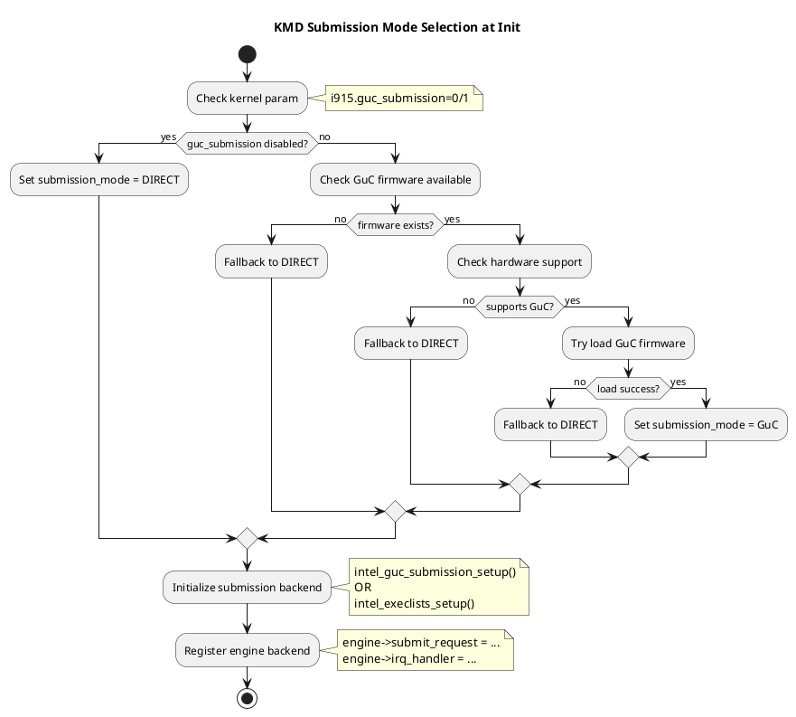

### Submission Mode Configuration Code

**Mode Selection at Driver Initialization:**

```c
// drivers/gpu/drm/i915/gt/intel_engine_cs.c

int intel_engine_init_submission(struct intel_engine_cs *engine)
{
    struct intel_gt *gt = engine->gt;
    struct intel_guc *guc = &gt->uc.guc;
    
    GEM_TRACE("%s\n", engine->name);
    
    // Step 1: Check if GuC submission enabled
    if (!intel_guc_is_enabled(guc)) {
        // Fallback to direct/execlists submission
        return setup_execlists_submission(engine);
    }
    
    // Step 2: Check if GuC loaded successfully
    if (!intel_guc_is_loaded(guc)) {
        // GuC failed to load, use direct submission
        return setup_direct_submission(engine);
    }
    
    // Step 3: Initialize GuC submission backend
    return intel_guc_submission_setup(engine);
}

// Helper to determine submission mode
enum i915_submission_mode intel_engine_submission_mode(
    struct intel_engine_cs *engine)
{
    if (intel_guc_is_loaded(&engine->gt->uc.guc))
        return I915_SUBMISSION_GUC;
    else
        return I915_SUBMISSION_DIRECT;
}
```

**Kernel Parameter Control:**

```c
// drivers/gpu/drm/i915/i915_params.c

// i915_params structure
struct {
    int guc_submission;  // Enable GuC submission (0=no, 1=yes)
    int guc_log_level;   // GuC logging verbosity
    int guc_firmware_path; // Custom firmware path
} i915;

// Parameter definition
MODULE_PARM_DESC(guc_submission,
    "Enable GuC submission (0=disable, 1=enable). "
    "Default: -1 (auto-select based on hardware)");

module_param_named(guc_submission, i915.guc_submission, int, 0400);
```

---

## Direct Submission Mode

### Direct Submission Mechanism

Direct submission allows driver to write directly to engine's ring buffer, bypassing GuC:

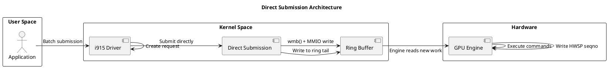

### Direct Submission Code Flow

```c
// drivers/gpu/drm/i915/gt/intel_execlists_submission.c

int execlists_submit_request(struct i915_request *rq)
{
    struct intel_engine_cs *engine = rq->engine;
    struct intel_ring *ring = rq->ring;
    u64 desc = execlists_context_descriptor(rq->context);
    
    // Step 1: Get ring lock for exclusive access
    spin_lock_irq(&engine->active.lock);
    
    // Step 2: Prepare context descriptor
    // (contains context pointer, priority, etc.)
    
    // Step 3: Check if context already running
    if (is_context_running(engine, rq->context)) {
        // Just queue the request, no context switch needed
        queue_request_to_ring(ring, rq);
    } else {
        // Need to context switch first
        write_context_descriptor_to_elsp(engine, desc);
    }
    
    // Step 4: Memory barrier - ensure all writes visible
    wmb();
    
    // Step 5: Update ring tail pointer via MMIO
    // This notifies engine there's new work
    writel(ring->tail, engine->mmio + RING_TAIL);
    
    // Step 6: Release lock
    spin_unlock_irq(&engine->active.lock);
    
    return 0;
}
```

### Direct Submission Ring Buffer Management

**Ring Buffer Layout:**

```
┌─────────────────────────────────┐
│ Instruction 0                   │ ← head (engine reads from)
│ Instruction 1                   │
│ ...                             │
│ Instruction N-1                 │
│ Instruction N                   │ ← tail (driver writes to)
│ Empty                           │
│ Empty                           │
└─────────────────────────────────┘

Ring size: Fixed at init time
Head: Updated by engine as it executes
Tail: Updated by driver as it adds work
```

**Ring Buffer Write:**

```c
u32 *ring_space = get_ring_space(ring, num_dwords);

// Write commands to ring
*ring_space++ = MI_ARB_CHECK;
*ring_space++ = MI_BATCH_BUFFER_START | ...;
*ring_space++ = batch_addr_lo;
*ring_space++ = batch_addr_hi;

// Update ring tail
ring->tail = advance_ring(ring->tail, num_dwords);

// Memory barrier to ensure writes visible
wmb();

// Notify engine via MMIO
writel(ring->tail, engine->mmio + RING_TAIL);
```

---

## GuC vs Direct Submission Comparison

```
┌──────────────────────┬──────────────────────┬──────────────────────┐
│ Aspect               │ GuC Submission       │ Direct Submission    │
├──────────────────────┼──────────────────────┼──────────────────────┤
│ Scheduling           │ GuC firmware         │ CPU driver           │
│ Context switching    │ GuC hardware preempt │ CPU interrupt        │
│ Latency              │ Slightly higher      │ Lower (direct ring)  │
│ CPU overhead         │ Lower (GuC handles)  │ Higher (CPU driven)  │
│ Power efficiency     │ Better (GuC optimized)│ Worse                │
│ Context count limit  │ Unlimited            │ Limited by SW        │
│ Priority support     │ 4 levels + preempt   │ Basic ordering       │
│ Code complexity      │ Higher (CT protocol) │ Lower (direct ring)  │
│ Hardware support     │ Gen 11+              │ All generations      │
│ Recommended for      │ Modern GPUs          │ Compatibility/debug  │
└──────────────────────┴──────────────────────┴──────────────────────┘
```

### Performance Trade-offs

**GuC Submission Benefits:**
- GuC microcontroller handles scheduling autonomously
- CPU can sleep while GuC schedules work
- Better for thermal management (frequency scaling)
- Supports advanced priority preemption
- Scales to many contexts efficiently

**Direct Submission Benefits:**
- Lower submission latency (direct ring write)
- Simpler code path (fewer abstractions)
- Easier debugging (direct ring inspection)
- Works on older hardware without GuC
- Better for single-context workloads

### Submission Mode Decision Tree

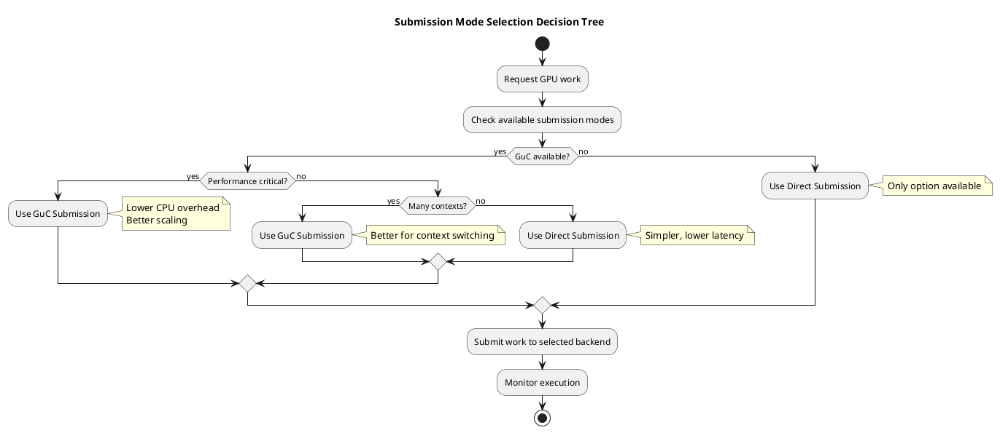

---

## Code Flow Examples

### GuC Request Submission (Simplified Path)

```
User Executes Batch
        ↓
i915_gem_execbuffer_ioctl()
        ↓
i915_request_create()
        ↓
intel_engine_cs_prepare_request()
        ↓
[GuC Submission Path]
        ↓
intel_guc_submit_request()
        ├─ Prepare work queue item
        ├─ Add to work queue
        ├─ Ring doorbell
        └─ Return
        ↓
GuC Firmware Processes
        ├─ Fetch from work queue
        ├─ Parse work queue item
        ├─ Load context
        └─ Submit to engine
        ↓
Engine Executes Batch
        ↓
Interrupt on completion
        ↓
CPU Notifies Application
```

### GuC Communication Flow (CT Message)

```c
int intel_guc_send(struct intel_guc *guc, u32 *action, u32 len)
{
    struct intel_guc_ct *ct = &guc->ct;
    
    // Step 1: Find space in command queue
    u32 head = READ_ONCE(ct->cmd.head);
    u32 space = available_space(ct->cmd.tail, head);
    
    if (space < len)
        return -EBUSY;  // Queue full
    
    // Step 2: Copy command to queue
    u32 *cmd = (u32 *)ct->cmd.cmds + ct->cmd.tail;
    memcpy(cmd, action, len * sizeof(u32));
    
    // Step 3: Update tail pointer
    ct->cmd.tail = (ct->cmd.tail + len) % ct->cmd_size;
    
    // Step 4: Memory barrier to ensure writes visible to GuC
    wmb();
    
    // Step 5: Notify GuC via doorbell
    intel_guc_notify(guc);
    
    // Step 6: Wait for response (or timeout)
    return wait_for_response(ct, timeout);
}
```

---

## Key GuC Features

### 1. **Self-Managed Performance Scaling (SLPC)**
- GuC autonomously adjusts GPU frequency based on workload
- Reduces CPU overhead vs. driver-based RPS
- Configurable frequency targets via CT messages

### 2. **Context Scheduling**
- GuC handles context switching on engine
- Preemption via GuC command
- Priority-based scheduling

### 3. **Doorbell Mechanism**
```
Work Queue → Doorbell Register (Memory-Mapped)
       ↓
    Ring doorbell (write register)
       ↓
    GuC Firmware Interrupt
       ↓
    Process work queue items
```

### 4. **Error Recovery**
```
GuC detects error
        ↓
Sets error bit in status
        ↓
Sends error notification to CPU
        ↓
CPU driver triggers reset
```

---

## GuC vs. Execlists: Comparison

| Feature | GuC Submission | Execlists |
|---------|--------------|-----------|
| Submission Method | Work Queue Doorbell | CPU-driven submission |
| CPU Overhead | Low (GuC handles scheduling) | High (CPU submits each batch) |
| IRQ Frequency | Lower | Higher |
| Complexity | More complex (firmware) | Simpler (SW scheduling) |
| Preemption | GuC-controlled | CPU-controlled |
| Power Efficiency | Better | Baseline |
| Hardware Support | Modern GPUs (Gen11+) | All generations |

---

## Initialization & Configuration

### GuC Enable Sequence:

```
1. Check firmware availability
2. Load firmware binary from filesystem
3. Initialize GuC memory structures (ADS)
4. Upload firmware to WOPCM
5. Set run bit to start GuC
6. Wait for handshake
7. Initialize CT communication (if enabled)
8. Load HUC if present
9. Ready for submission
```

### Module Parameters:
```bash
# Enable GuC submission (vs. execlists)
# i915.enable_guc=3          # Enable GuC + HUC
# i915.guc_log_level=X       # Firmware log verbosity
```

---

## Performance Optimizations

### 1. **Batch Submission Optimization**
- Submit multiple requests per doorbell ring
- Reduces context switches
- Amortizes doorbell overhead

### 2. **SLPC Benefits**
- Eliminates CPU overhead of RPS
- Tighter feedback loop (GuC sees load directly)
- Lower power consumption

### 3. **Interrupt Reduction**
- GuC signals completion via CT messages
- Batches notifications
- Reduces CPU interrupt latency

---

## Debugging & Troubleshooting

### Debugfs Interface:
```bash
# Check GuC status
cat /sys/kernel/debug/dri/0/guc_info

# View GuC logs
cat /sys/kernel/debug/dri/0/guc_log

# Check submission stats
cat /sys/kernel/debug/dri/0/guc_stats
```

### Common Issues:

| Issue | Cause | Solution |
|-------|-------|----------|
| GuC load failure | Missing/corrupt firmware | Update kernel/firmware |
| CT timeout | GuC hung | Check logs, may need reset |
| Submission stalls | Work queue full | Reduce batch size |
| High latency | CT message delays | Enable GuC logging |

---

## H2G GuC Messages (Host to GuC)

### Message Types and Formats

GuC messages are structured commands sent from the CPU driver to the GuC microcontroller. All H2G messages follow a specific format:

```c
// H2G Message Header (DW0)
struct guc_h2g_msg {
    u32 msg_header;     // [31:0] contains action, length, etc.
    u32 payload[...];   // Message-specific payload
};

// Common fields in msg_header
#define GUC_H2G_MSG_ACTION_SHIFT    0
#define GUC_H2G_MSG_ACTION_MASK     (0xFFFFU << 0)
#define GUC_H2G_MSG_LEN_SHIFT       16
#define GUC_H2G_MSG_LEN_MASK        (0xFU << 16)
```

### Core H2G Action Types

#### 1. REGISTER_CONTEXT (0x5501)
**Purpose:** Register a new execution context with GuC

**Parameters:**
```
DW0: ACTION = REGISTER_CONTEXT
DW1: Context ID (guc_id)
DW2: LRC (Logical Ring Context) address
DW3: Context descriptor flags
DW4: Engine class/instance
```

**Registration Flow:**

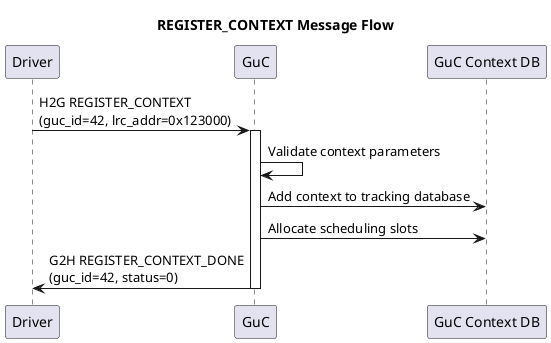

#### 2. SCHED_CONTEXT_MODE_SET (0x5502)
**Purpose:** Enable or disable context scheduling

**Parameters (ENABLE):**
```
DW0: ACTION = SCHED_CONTEXT_MODE_SET | ENABLE
DW1: Context ID (guc_id)
DW2: Enable flag (1 = enable, 0 = disable)
```

**Enable Flow:**

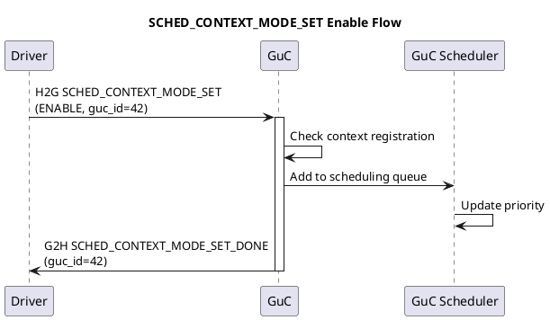

#### 3. SCHED_CONTEXT (0x5503)
**Purpose:** Notify GuC that a context has new work to submit

**Parameters:**
```
DW0: ACTION = SCHED_CONTEXT
DW1: Context ID (guc_id)
```

**Work Submission Flow:**

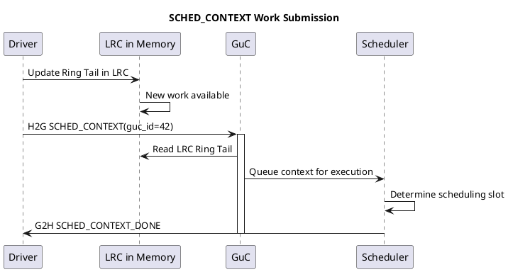

#### 4. DEREGISTER_CONTEXT (0x5504)
**Purpose:** Remove context from GuC scheduling

**Parameters:**
```
DW0: ACTION = DEREGISTER_CONTEXT
DW1: Context ID (guc_id)
```

**Deregistration Flow:**

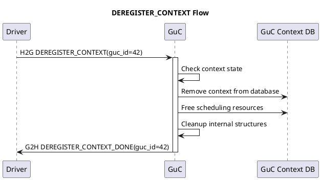

### Complete Context Lifecycle

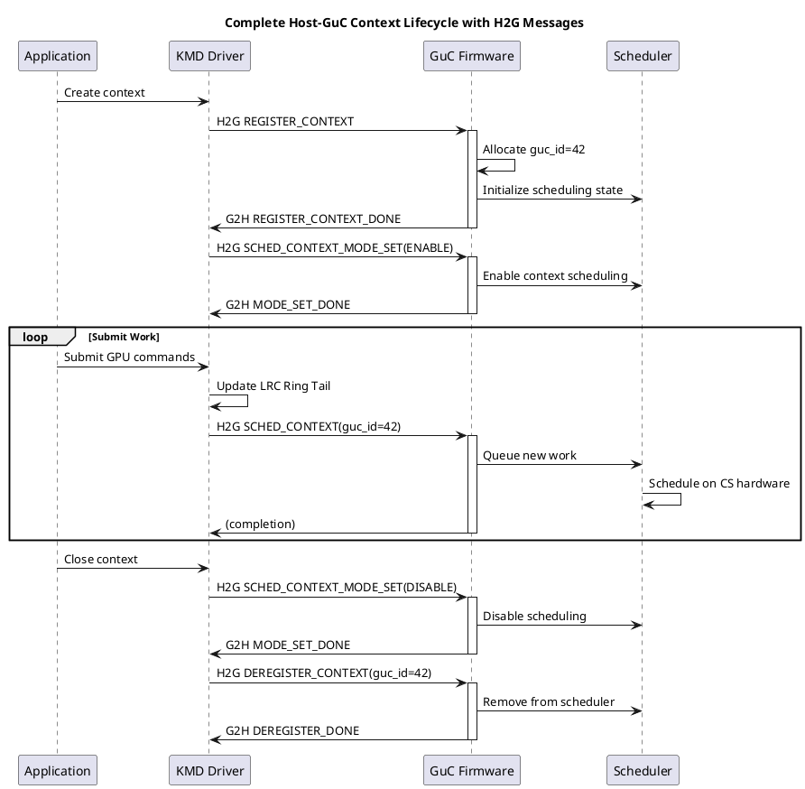

---

## H2G/G2H Communication Protocol

### CTB Message Structure

```c
struct intel_guc_ct_buffer_desc {
    u32 head;           // Current read position (GuC updates)
    u32 tail;           // Current write position (Driver updates)
    u32 size;           // Buffer size in DWords
    u32 reserved;
    u32 head_ptp;       // Host copy of head (optional)
    u32 tail_ptp;       // Host copy of tail (optional)
};
```

### Detailed Message Exchange Timeline

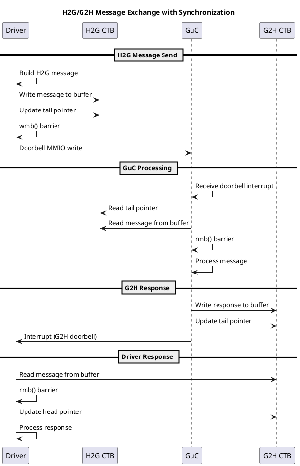

### H2G/G2H State Machine

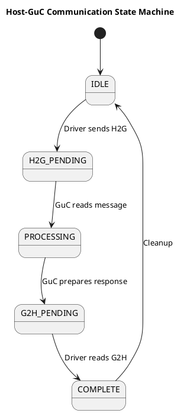

### Host-GuC Interaction Patterns

**Pattern 1: Synchronous Request-Response**

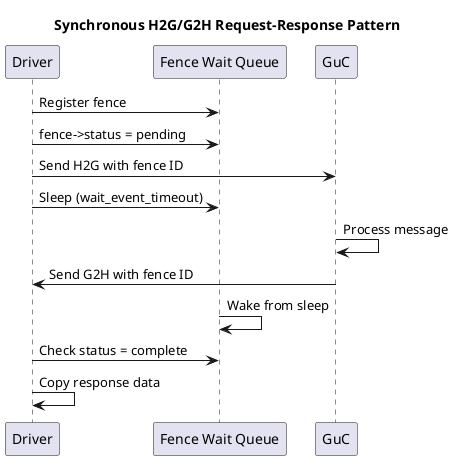

**Pattern 2: Fire-and-Forget Submission**

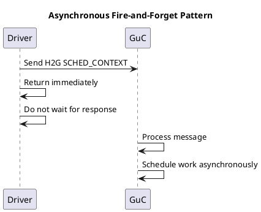

**Pattern 3: Batched Message Submission**

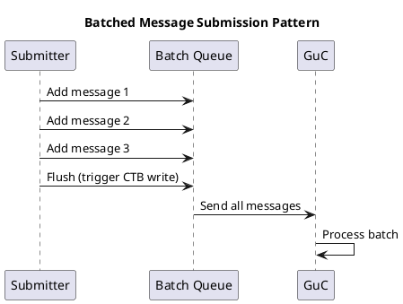

### Message Ordering and Synchronization

**H2G Write Ordering:**
```
Driver writes message to H2G buffer:
1. Write message content (DW0..DWN)
2. wmb() - ensure message visible before tail update
3. WRITE_ONCE(h2g->tail, new_tail) - update pointer
4. MMIO doorbell write - notify GuC
```

**GuC Read Ordering:**
```
GuC processes H2G message:
1. Read tail pointer
2. rmb() - ensure tail visible before reading message
3. Read message content
4. WRITE_ONCE(h2g->head, new_head) - acknowledge
```

**G2H Read Ordering (Driver):**
```
Driver reads G2H response:
1. Read g2h->tail pointer (from interrupt handler)
2. rmb() - ensure tail visible before reading message
3. Read response content
4. WRITE_ONCE(g2h->head, new_head) - acknowledge
```

---

## Deep Dive: Host-GuC Interaction Analysis

### GuC Internal Architecture

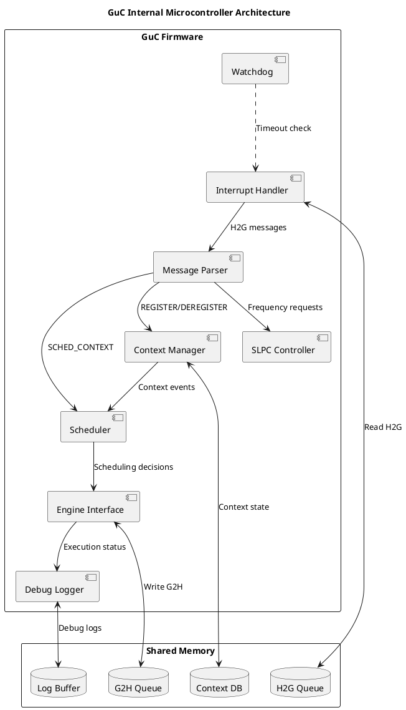

### Context State Machine (GuC Perspective)

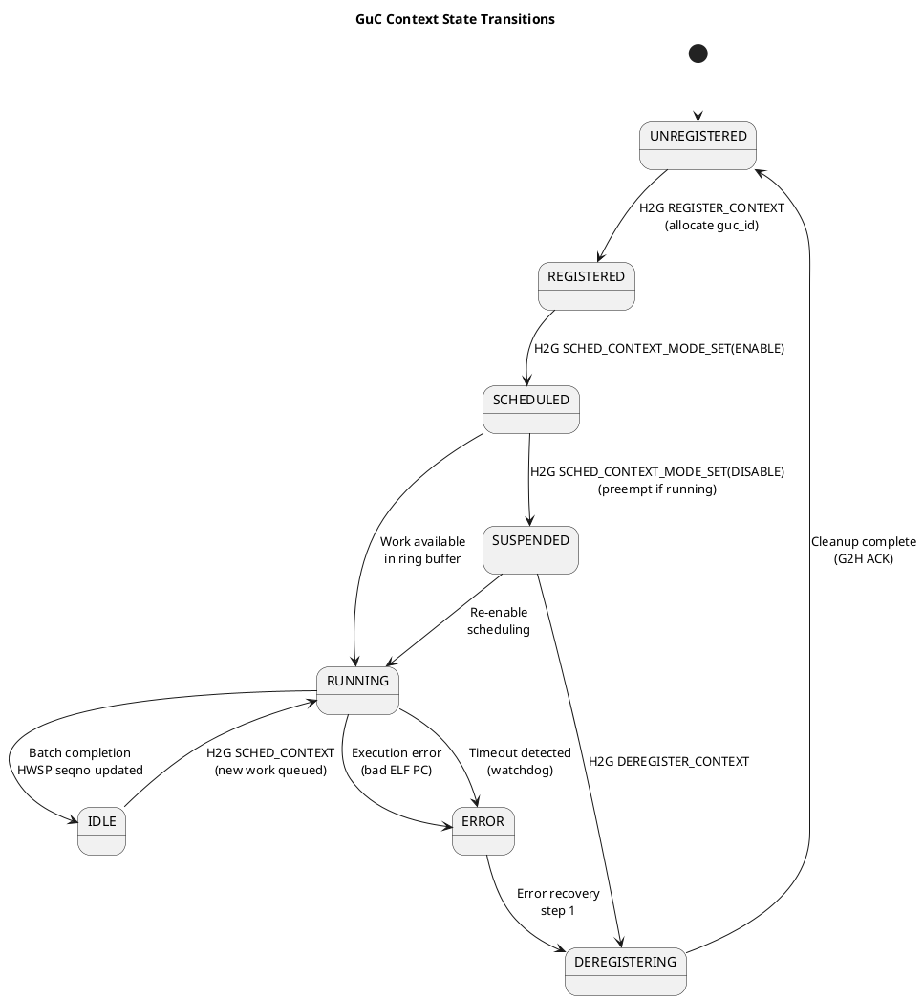

### Memory Layout: Host-GuC Shared Data

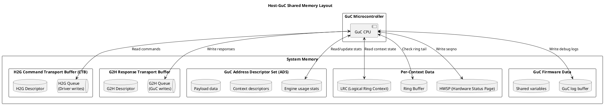

### Request Lifecycle: Complete Timing Diagram

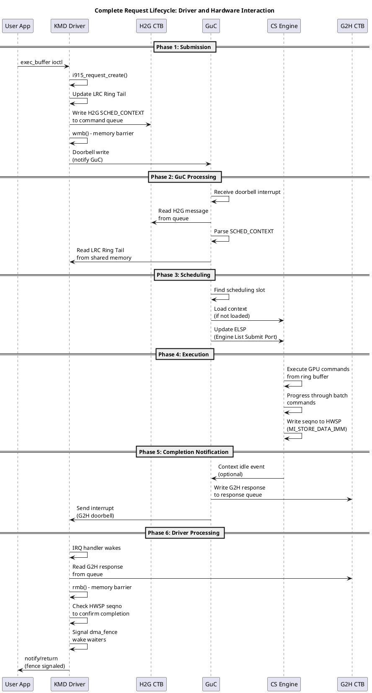

### GuC Scheduling Queue Management

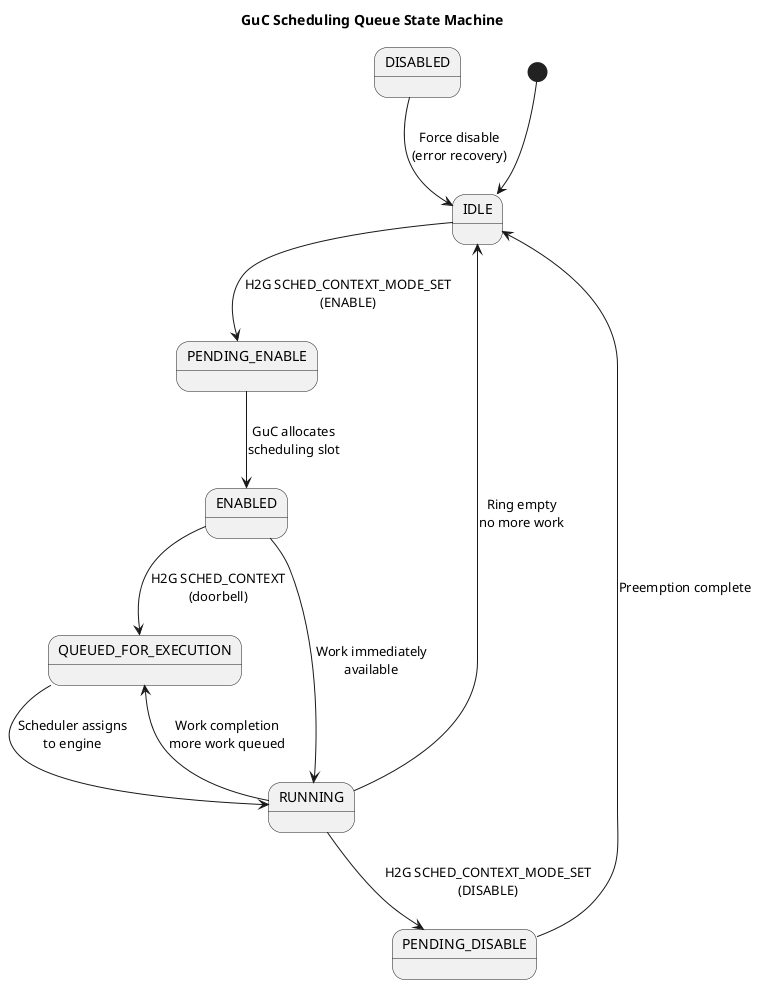

### Priority-Based Preemption Flow

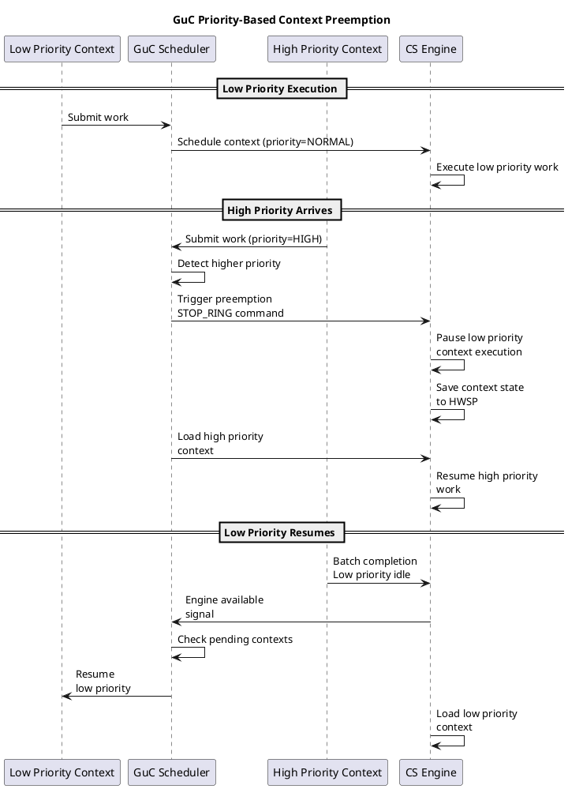

### Error Handling and Recovery

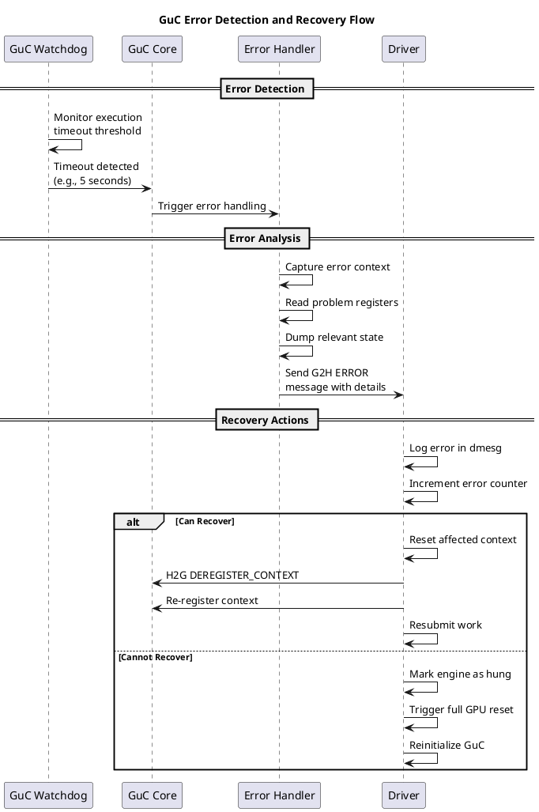

### Concurrent Context Scheduling

```plantuml
@startuml
title GuC Scheduling Multiple Contexts

participant "Context A" as ctxa
participant "Context B" as ctxb
participant "Context C" as ctxc
participant "GuC Scheduler" as sched
participant "CS Engine" as cs

== Initial Submission ==

ctxa -> sched: Submit batch 1 (priority=NORMAL)
ctxb -> sched: Submit batch 1 (priority=HIGH)
ctxc -> sched: Submit batch 1 (priority=NORMAL)

sched -> sched: Sort by priority:\nB(HIGH) > A(NORMAL) > C(NORMAL)

== Scheduling Decision ==

sched -> cs: Load context B (highest priority)
cs -> cs: Execute B's batch

sched -> sched: Keep A, C queued

== While B Executes ==

ctxa -> sched: Submit batch 2
ctxc -> sched: Submit batch 2

sched -> sched: Queue for B completion

== B Completes ==

cs -> sched: Context B idle\nsignal

sched -> sched: Re-evaluate queue:\nA(new work) > C(new work)

sched -> cs: Load context A

cs -> cs: Execute A's batch 2

== A Completes ==

cs -> sched: Context A idle

sched -> cs: Load context C

cs -> cs: Execute C's batch 2

@enduml
```

### GuC Firmware Event Processing

```plantuml
@startuml
title GuC Event Processing Pipeline

rectangle "Event Sources" {
  component "H2G Messages" as h2g_src
  component "Engine Events" as eng_src
  component "Timers" as timer_src
  component "Errors" as err_src
}

rectangle "GuC Event Processing" {
  queue "Event Queue" as eq
  component "Event Dispatcher" as disp
  component "Priority Queue" as pq
}

rectangle "Event Handlers" {
  component "Message Handler" as mh
  component "Scheduling Handler" as sh
  component "Error Handler" as eh
  component "Completion Handler" as ch
}

rectangle "Actions" {
  component "Context State Update" as csu
  component "Scheduler Update" as su
  component "G2H Response" as g2h_resp
  component "Logging" as log
}

h2g_src --> eq: H2G interrupt
eng_src --> eq: Engine event
timer_src --> eq: Timeout
err_src --> eq: Error signal

eq --> disp: Queue event

disp --> pq: Prioritize event\n(critical first)

pq --> mh: H2G message event
pq --> sh: Scheduling event
pq --> eh: Error event
pq --> ch: Completion event

mh --> csu: Update context
sh --> su: Update scheduler
eh --> log: Log error
ch --> g2h_resp: Notify driver

csu --> su: Trigger reschedule
su --> g2h_resp: Send completion

@enduml
```

### Memory Synchronization Details

```plantuml
@startuml
title Memory Synchronization: Driver-GuC Message Exchange

participant "Driver CPU" as cpu
participant "L1/L2 Cache" as cache
participant "System Memory" as mem
participant "GuC Memory" as guc_mem

== Driver Writes H2G Message ==

cpu -> cache: Write message data\n(DW0..DWN)
note left of cache
  L1/L2 cache
  may be coherent
  or incoherent
end note

cpu -> cpu: wmb()\nWrite Memory Barrier

note left of cpu
  SFENCE instruction
  Ensures all writes
  flushed to memory
  before doorbell
end note

cache -> mem: Flush message data

cpu -> mem: MMIO doorbell write\n(guarunteed ordered)

== GuC Reads H2G Message ==

guc_mem -> guc_mem: Check tail pointer

note right of guc_mem
  GuC reads tail
  from shared memory
end note

guc_mem -> guc_mem: rmb()\nRead Memory Barrier

guc_mem -> guc_mem: Read message\n(DW0..DWN)

note right of guc_mem
  LFENCE instruction
  Ensures tail read
  completes before
  message reads
end note

@enduml
```

### Request Submission Bottleneck Analysis

```plantuml
@startuml
title GuC Submission Pipeline Bottlenecks

rectangle "Potential Bottlenecks" {
  component "H2G Queue\nSpace" as h2g_full
  component "G2H Queue\nSpace" as g2h_full
  component "CTB Interrupt\nLatency" as int_lat
  component "GuC Processing\nDelay" as guc_delay
  component "CS Ring\nSpace" as ring_full
}

rectangle "Impact" {
  component "Submission\nStall" as stall
  component "Response\nDelay" as delay
  component "Context\nSwitch" as ctx_sw
  component "Throughput\nReduction" as throughput
}

h2g_full --> stall: Queue full,\ndriver blocks

g2h_full --> delay: No space for\nresponse

int_lat --> delay: IRQ latency\n> 1ms

guc_delay --> throughput: Slow GuC\nprocessing

ring_full --> ctx_sw: No ring space,\nmust switch context

stall --> throughput
delay --> throughput
ctx_sw --> throughput

@enduml
```

### GuC-Engine Communication Timing

```plantuml
@startuml
title GuC to Engine Communication Timing

participant "GuC Firmware" as guc
participant "MMIO Registers" as mmio
participant "CS Engine" as cs
participant "Command Streamer" as cmdstr

== Context Loading ==

guc -> guc: Determine context\nto load

guc -> mmio: Write ELSP register\n(Engine List Submit Port)
note right of guc
  ELSP is write-only
  Triggers HW context load
  Takes ~100-500ns
end note

mmio -> cs: Context load signal

cs -> cs: Load context state\nfrom LRC

cs -> cs: Verify ELF header\nof context

cs -> cmdstr: Initialize command\npointers

== Batch Execution ==

cs -> cmdstr: Fetch commands\nfrom ring buffer

cmdstr -> cmdstr: Parse and execute\nGPU commands

cmdstr -> cmdstr: Execute user batch\ncommands

cmdstr -> cmdstr: Hit MI_BATCH_BUFFER_END

== Status Update ==

cs -> mmio: Execute MI_STORE_DATA_IMM\nwrite seqno to HWSP

mmio -> mmio: HWSP[seqno_offset] = \ncurrent_seqno

cs -> cs: Mark context idle

cs -> guc: Signal context idle\n(if enabled)

@enduml
```

### Doorbell Notification Protocol

```plantuml
@startuml
title Doorbell Interrupt Notification Mechanism

participant "Driver" as drv
participant "H2G Queue" as h2g
participant "Doorbell Register" as doorbell
participant "GuC" as guc

== Submitter Path ==

drv -> h2g: Write H2G command\nto queue buffer

drv -> h2g: Update tail pointer\nwith WRITE_ONCE

drv -> drv: wmb() - ensure visible

drv -> doorbell: MMIO write doorbell\n(0xC4C0 + doorbell_id*4)
note right of doorbell
  Each context has unique
  doorbell register ID
  Writing triggers interrupt
  to GuC
end note

== GuC Interrupt Handler ==

doorbell -> guc: Interrupt signal\n(GPIO or internal)

guc -> guc: Enter interrupt context

guc -> h2g: Read tail pointer\nfrom CTB descriptor

guc -> guc: Calculate messages\nto process

guc -> guc: Loop: read and\nprocess each message

guc -> guc: Update head pointer\nwhen done

guc -> guc: Exit interrupt\nreturn to main

== Optional Response ==

guc -> doorbell: (If response needed)\nSignal G2H doorbell\nto driver

@enduml
```

---

## Related Components

- **Firmware Loading:** `intel_uc_fw.c` - General UC firmware framework
- **HUC:** `intel_huc.c` - Hardware Utility Controller (video encode)
- **Communication:** `gt/uc/abi/` - CT message definitions
- **Scheduling:** `i915_scheduler.c` - CPU-side scheduling

---

## References

- **Source:** `drivers/gpu/drm/i915/gt/uc/`
- **Headers:** `intel_guc.h`, `intel_guc_fwif.h`
- **Selftests:** `selftest_guc.c`, `selftest_doorbells.c`
- **Documentation:** GuC firmware ABI in `abi/guc_communication_mmio.h`
- **Kernel Docs:** `Documentation/gpu/i915.rst#guc`
