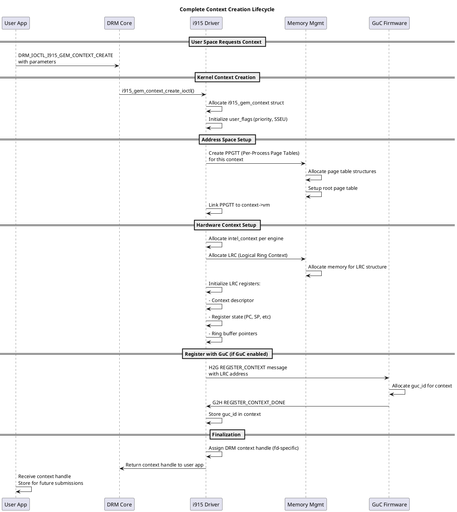
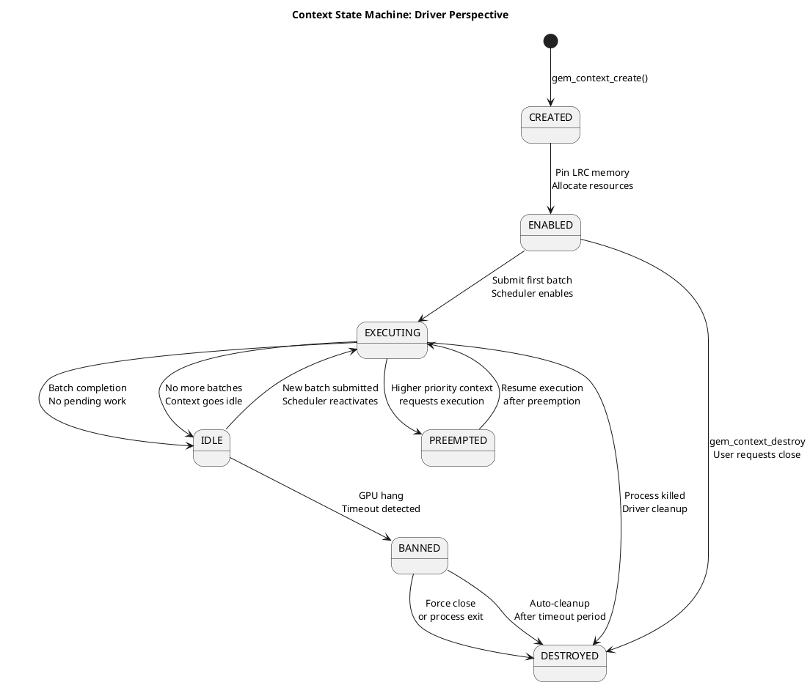
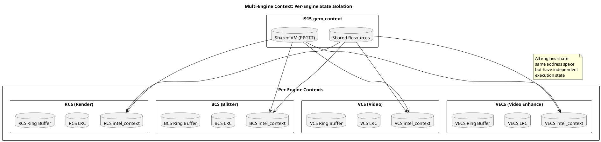
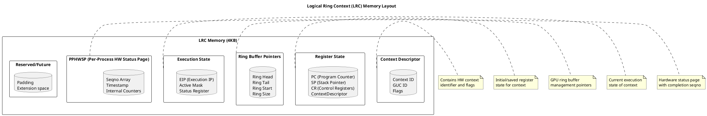
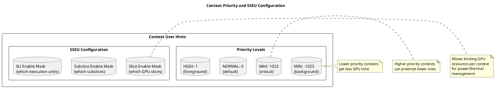
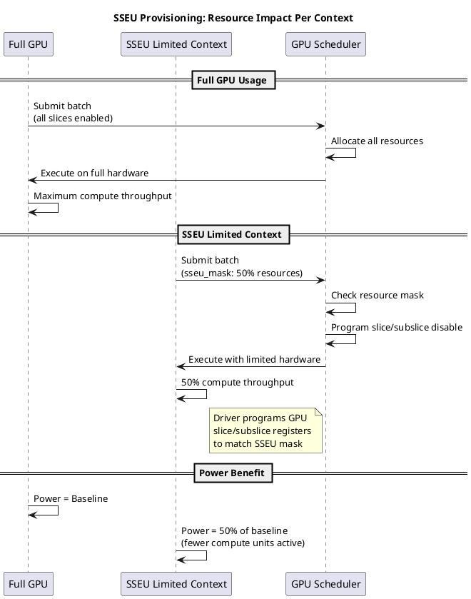
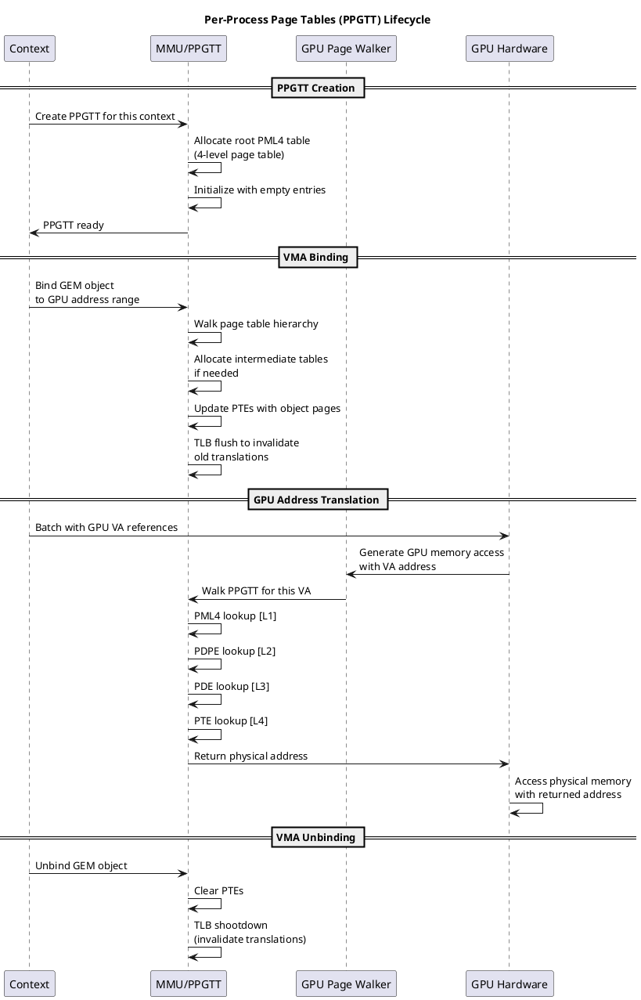
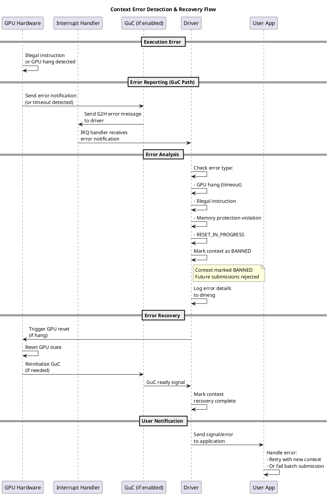
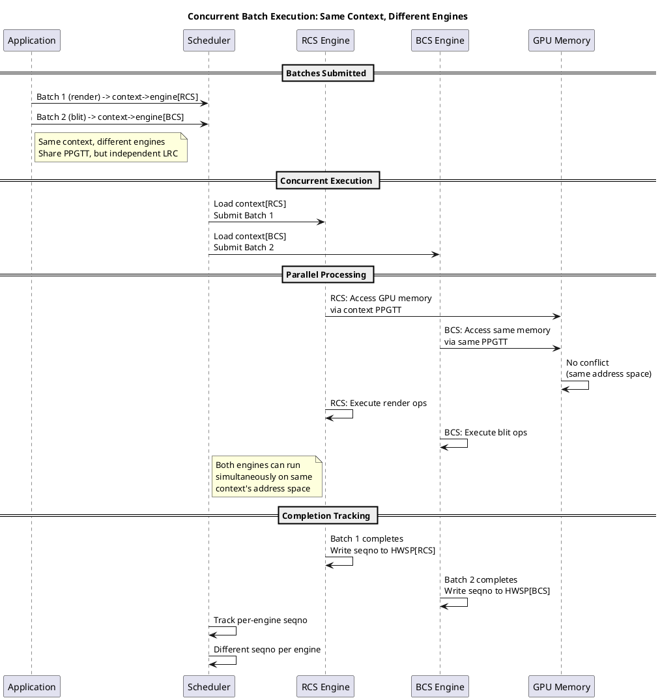

# Context Management System

## Overview

Contexts represent the GPU execution environments for applications. Each context maintains its own address space, execution state, and resource allocations. The i915 driver manages both user-facing contexts and internal hardware contexts.

**Key Concepts:**
- **User Context:** DRM context created by applications (gem_context_create)
- **Hardware Context:** GPU-side context with LRC (Logical Ring Context)
- **Address Space:** Per-context virtual address space (PPGTT)
- **SSEU Configuration:** Slice/Subslice/EU enablement per context

---

## Architecture Overview

```
┌──────────────────────────────────────────────────┐
│           User Application (Mesa/Vulkan)          │
│        drm_intel_gem_context_create()             │
└────────────────┬─────────────────────────────────┘
                 ↓
    ┌────────────────────────────────┐
    │ gem/i915_gem_context.c         │
    │  (User Context API)            │
    │ - Context creation/destruction │
    │ - User parameter handling      │
    └────────────┬───────────────────┘
                 ↓
    ┌────────────────────────────────┐
    │ gt/intel_context.c             │
    │  (Hardware Context)            │
    │ - LRC allocation               │
    │ - Engine binding               │
    └────────────┬───────────────────┘
                 ↓
    ┌────────────────────────────────┐
    │ gt/intel_lrc.c                 │
    │  (Logical Ring Context)        │
    │ - Context memory setup         │
    │ - Initial state                │
    └────────────┬───────────────────┘
                 ↓
    ┌────────────────────────────────┐
    │ gt/intel_engine_cs.c           │
    │  (Engine Command Stream)       │
    │ - Per-engine state             │
    │ - Engine initialization        │
    └────────────┬───────────────────┘
                 ↓
         GPU Hardware Context
         (Per-Engine State)
```

---

## Core Components

### 1. **User Context (gem/i915_gem_context.c)**

**Purpose:** User-facing context API and management

**Key Structure:**
```c
struct i915_gem_context {
    struct kref ref;
    struct drm_i915_private *i915;
    struct drm_i915_file_private *file_priv;
    
    char name[20];                     // Debug name
    
    /* Address space (VM) for this context */
    struct i915_address_space *vm;
    
    /* Per-engine contexts */
    struct intel_context *engines[I915_NUM_ENGINES];
    
    /* Scheduling */
    struct {
        unsigned int priority;         // Priority level
        bool preempt_to_idle;         // Preempt to idle on switch
    } sched;
    
    /* User hints */
    struct {
        #define CONTEXT_SSEU BITFIELD_BIT(0)
        #define CONTEXT_RECOVERABLE BITFIELD_BIT(1)
        #define CONTEXT_BANNABLE BITFIELD_BIT(2)
        unsigned long flags;
        
        struct intel_sseu sseu;        // SSEU configuration
    } user;
    
    /* Protected content */
    bool uses_protected_content;
    
    /* Error handling */
    atomic_t guilty_count;
    atomic_t active_count;
    
    struct list_head link;             // Global context list
};
```

**Context Lifecycle:**

```
┌─────────────────────────────────┐
│   User calls gem_context_create  │
└────────────┬────────────────────┘
             ↓
    ┌────────────────────────────┐
    │ Allocate struct            │
    │ i915_gem_context           │
    └────────┬───────────────────┘
             ↓
    ┌────────────────────────────┐
    │ Create per-engine contexts │
    │ (intel_context)            │
    └────────┬───────────────────┘
             ↓
    ┌────────────────────────────┐
    │ Allocate PPGTT for context │
    │ (Address space)            │
    └────────┬───────────────────┘
             ↓
    ┌────────────────────────────┐
    │ Register with file private │
    │ (DRM context handle)       │
    └────────┬───────────────────┘
             ↓
    ┌────────────────────────────┐
    │ Context ready for use      │
    │ (Applications can submit)  │
    └────────────────────────────┘
```

---

### 2. **Hardware Context (gt/intel_context.c)**

**Purpose:** Per-engine hardware context representation and state management

**Key Structure:**
```c
struct intel_context {
    struct kref ref;
    
    /* Reference to parent GEM context */
    struct i915_gem_context *gem_context;
    
    /* Engine this context is bound to */
    struct intel_engine_cs *engine;
    
    /* Logical Ring Context (LRC) */
    struct i915_vma *lrc_vma;         // LRC memory
    
    /* GPU virtual address */
    struct i915_vma *state;           // Context state
    
    /* Ring buffer for command submission */
    struct intel_ring *ring;
    
    /* Scheduling class */
    struct {
        u8 priority;                   // Priority level
        u8 preempt_timeout;            // Preemption timeout
    } sched;
    
    /* State tracking */
    unsigned long flags;
    #define CONTEXT_ALLOC_BIT       0
    #define CONTEXT_INIT_BIT        1
    #define CONTEXT_BARRIER_BIT     2
    #define CONTEXT_BANNED          3
    
    /* Active tracking */
    struct i915_active active;
    
    /* Statistics */
    struct {
        u64 total_runtime;             // Total GPU time
        u64 total_active;              // Total active time
    } stats;
};
```

**Context Initialization Flow:**

```
intel_context_alloc()
        ↓
intel_lrc_alloc()                      // Allocate LRC memory
        ├─ Allocate context state pages
        ├─ Setup ring buffer
        └─ Get virtual address
        ↓
intel_context_init()                   // Initialize content
        ├─ intel_lrc_init_ctx_state()
        ├─ Load initial register values
        └─ Setup context descriptor
        ↓
intel_context_pin()                    // Pin in memory
        ├─ Pin LRC memory (prevent eviction)
        ├─ Setup engine context registers
        └─ Mark as ready
        ↓
Context operational
```

---

### 3. **Logical Ring Context (gt/intel_lrc.c)**

**Purpose:** Initialize GPU context memory with correct state

**Context Memory Layout:**

```
Context Memory (4KB)
┌─────────────────────────────────┐
│ Register Context (1KB)          │
│  - Per-register GPU state       │
│  - Preserved across switches    │
├─────────────────────────────────┤
│ Extended Registers (1KB)        │
│  - Additional per-engine state  │
├─────────────────────────────────┤
│ Indirect Context (1KB)          │
│  - L3 cache configuration       │
│  - Memory hierarchy state       │
├─────────────────────────────────┤
│ Ring Tail (Offset within page)  │
│  - Ring buffer write position   │
└─────────────────────────────────┘
```

**Initialization Code:**

```c
int intel_lrc_init_ctx_state(struct intel_context *ce)
{
    struct intel_engine_cs *engine = ce->engine;
    struct i915_vma *vma = ce->state;
    
    // Get pages backing context memory
    struct page **pages = vma->obj->mm.pages;
    
    // For each page, initialize register state
    for (i = 0; i < num_pages; i++) {
        u32 *context_page = kmap_atomic(pages[i]);
        
        // Copy golden context template
        memcpy_toio(context_page, 
                   &engine->golden_context_template,
                   golden_context_size);
        
        // Customize for this specific context
        context_page[CTX_RING_BUFFER_START] = ring_buffer_addr;
        context_page[CTX_RING_HEAD] = 0;
        context_page[CTX_RING_TAIL] = 0;
        
        kunmap_atomic(context_page);
    }
    
    return 0;
}
```

---

### 4. **Address Space (PPGTT)**

Each context gets its own Per-Process Graphics Translation Table (PPGTT):

```c
struct i915_address_space *vm = 
    i915_ppgtt_create(dev_priv, vm_flags);
```

**PPGTT Benefits:**
- Isolated address spaces per process
- Prevents one process from accessing another's GPU memory
- Enables VM protection mechanisms
- Supports sparse addressing

---

## Context Parameters & Configuration

### User-Settable Parameters:

```c
struct drm_i915_gem_context_param {
    __u32 ctx_id;
    __u32 size;
    __u64 param;                // Parameter ID
    __u64 value;                // Parameter value
};
```

**Common Parameters:**
```
CONTEXT_PARAM_BAN_PERIOD
  → Maximum time before context ban
  
CONTEXT_PARAM_SSEU
  → Slice/Subslice/EU configuration
  
CONTEXT_PARAM_PRIORITY
  → Scheduling priority
  
CONTEXT_PARAM_RECOVERABLE
  → Can context recover from GPU hangs
```

**Setting SSEU Example:**

```c
// Enable only specific EUs for power saving
int intel_context_set_sseu(struct intel_context *ce,
                          const struct intel_sseu *user_sseu)
{
    struct intel_sseu sseu = default_sseu;
    
    // Validate user configuration
    if (user_sseu->slice_mask & ~available_slices)
        return -EINVAL;
    
    // Apply to context
    ce->sseu = user_sseu;
    
    // Will take effect on next context switch
    return 0;
}
```

---

## Code Flow Examples

### Context Creation (Simplified)

```c
int i915_gem_context_create_ioctl(struct drm_device *dev,
                                  void *data,
                                  struct drm_file *file)
{
    struct drm_i915_gem_context_create *args = data;
    
    // Step 1: Allocate user context
    struct i915_gem_context *ctx = 
        i915_gem_context_create(file_priv);
    
    // Step 2: Create per-engine contexts
    for_each_engine(engine, dev_priv, id) {
        struct intel_context *ce = 
            intel_context_create(engine);
        
        ctx->engines[id] = ce;
        
        // Initialize LRC
        intel_lrc_init_ctx_state(ce);
    }
    
    // Step 3: Create address space (PPGTT)
    ctx->vm = i915_ppgtt_create(dev_priv);
    
    // Step 4: Register with DRM
    int handle = drm_gem_context_handle(file, &ctx->base);
    
    // Step 5: Return handle to user
    args->ctx_id = handle;
    return 0;
}
```

### Context Switch (GuC Submission)

```c
// GuC switches context when new request arrives
void guc_context_switch(struct intel_engine_cs *engine,
                       struct intel_context *next_ce)
{
    // GuC firmware handles the switch
    struct intel_guc *guc = engine->gt->uc.guc;
    
    // Prepare work queue item pointing to next_ce
    struct guc_wq_item wqi = {
        .context_desc = next_ce->guc_id,
        .batch_addr = next_ce->ring->tail,
    };
    
    // Submit to GuC work queue
    intel_guc_submit(&wqi);
    
    // GuC will:
    // 1. Save current context state
    // 2. Load next_ce context state
    // 3. Switch address spaces (PPGTT)
    // 4. Continue execution
}
```

### Requesting Priority Change

```c
int i915_gem_context_setparam_ioctl(struct drm_device *dev,
                                    void *data,
                                    struct drm_file *file)
{
    struct drm_i915_gem_context_param *args = data;
    
    struct i915_gem_context *ctx = 
        i915_gem_context_lookup(file, args->ctx_id);
    
    switch (args->param) {
    case I915_CONTEXT_PARAM_PRIORITY:
        // Validate priority range
        if (args->value > MAX_PRIORITY)
            return -EINVAL;
        
        // Update context priority
        ctx->sched.priority = args->value;
        
        // Reschedule any pending requests
        for_each_engine_request(engine, rq) {
            if (rq->context == ctx) {
                i915_request_set_priority(rq, args->value);
            }
        }
        
        break;
    }
    
    return 0;
}
```

---

## Context Lifecycle & Cleanup

```
Context Created
        ↓
    [User Phase - Active Use]
        ├─ Submit batches
        ├─ Modify parameters
        └─ Monitor execution
        ↓
User closes context handle
        ↓
    [Teardown Phase]
        ├─ Wait for pending requests
        ├─ Free per-engine contexts
        ├─ Release PPGTT
        └─ Free context structure
        ↓
Context Destroyed
```

---

## Context Priorities

Contexts have associated scheduling priorities:

```
HIGH:   Interactive workloads
NORMAL: General compute
LOW:    Background tasks
```

**Priority Effects:**
- Higher priority contexts preempt lower ones
- Affects scheduling order
- May impact power consumption

---

## SSEU (Slice/Subslice/EU) Configuration

Applications can disable specific GPU compute units for power efficiency:

```c
struct intel_sseu {
    u8 slice_mask;      // Which slices are enabled
    u8 subslice_mask;   // Per-slice subslice mask
    u8 eu_mask;         // Per-subslice EU mask
};
```

**Use Cases:**
- Single-threaded apps → Disable extra slices
- Video decode → Specific EU configuration
- Power saving → Minimal EU config

---

## Context Scheduling & Preemption

### Priority-Based Preemption:

```
Engine State:
  Current Context A (priority 50)
           ↓
       Request arrives from Context B (priority 100)
           ↓
       GuC/Driver initiates preemption
           ↓
       Save Context A state
           ↓
       Load Context B state
           ↓
       Switch to Context B
           ↓
       Continue execution
```

---

## Deep Dive: Context Lifecycle & State Management

### Complete Context Creation Flow



### Context State Transitions



### Multi-Engine Context Management



### LRC (Logical Ring Context) Layout



### Context Priority and SSEU Configuration



### SSEU Provisioning Impact



### Address Space (PPGTT) Lifecycle



### Context Error Handling & Recovery



### Concurrent Batch Execution Across Engines



---

## Error Handling & Recovery

### Context Banning:

```c
// On GPU hang, context may be banned
void i915_gem_context_ban(struct i915_gem_context *ctx)
{
    set_bit(CONTEXT_BANNED, &ctx->flags);
    
    // Future submissions from this context will fail
    // User should create new context
}
```

**Ban Triggers:**
- GPU hang during execution
- Multiple timeouts
- Security violations

---

## Debugging & Inspection

### Debugfs Interface:

```bash
# List active contexts
cat /sys/kernel/debug/dri/0/i915_gem_contexts

# Context statistics
cat /sys/kernel/debug/dri/0/context_stats

# Per-context GPU time
cat /sys/kernel/debug/dri/0/context_times
```

---

## Related Components

- **PPGTT/Address Space:** `gt/intel_ppgtt.c` - Per-context page tables
- **Ring Buffer:** `gt/intel_ring.c` - Command ring per context
- **Scheduling:** `i915_scheduler.c` - Request prioritization
- **VMA:** `i915_vma.c` - Virtual memory mappings

---

## References

- **Source:** `gem/i915_gem_context.c`, `gt/intel_context.c`
- **Headers:** `i915_gem_context_types.h`, `intel_context.h`
- **Selftests:** `gem/selftests/` - Context tests
- **Documentation:** `Documentation/gpu/i915.rst#contexts`
