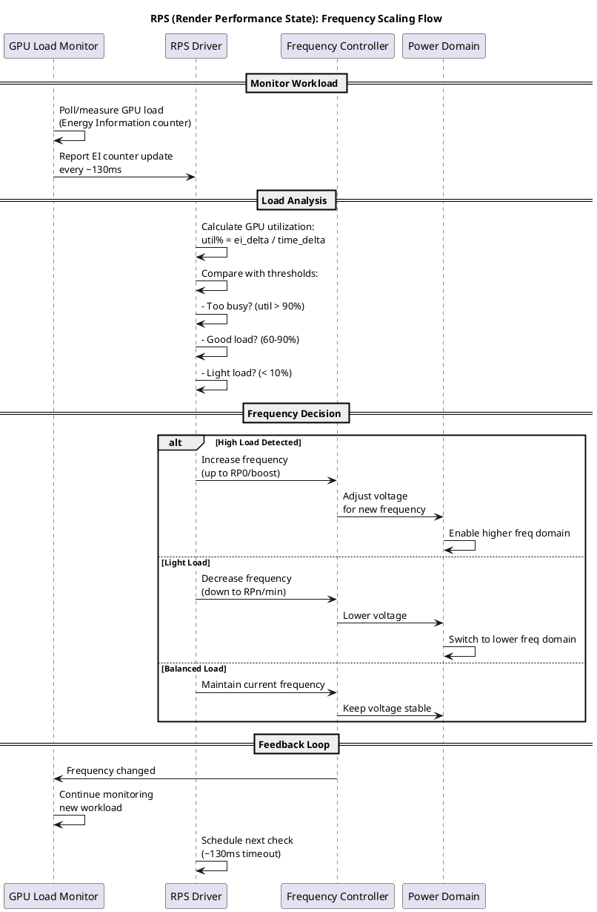
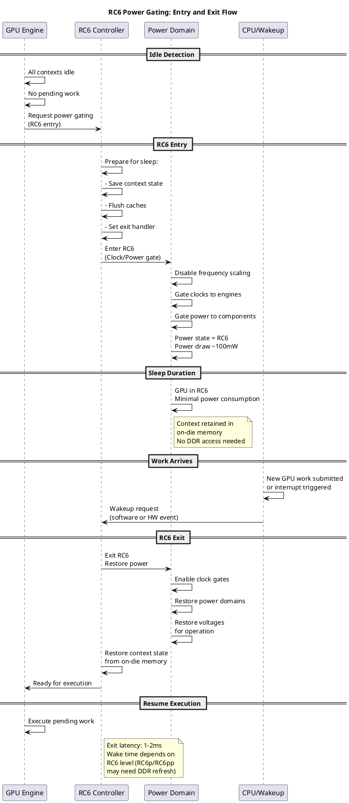
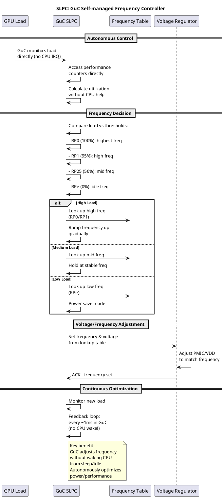
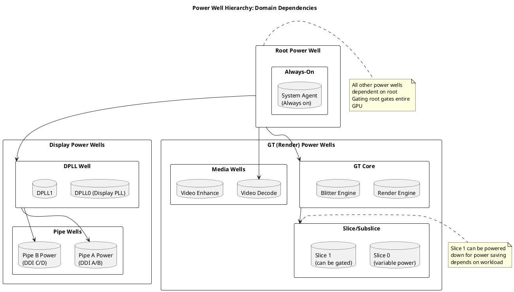
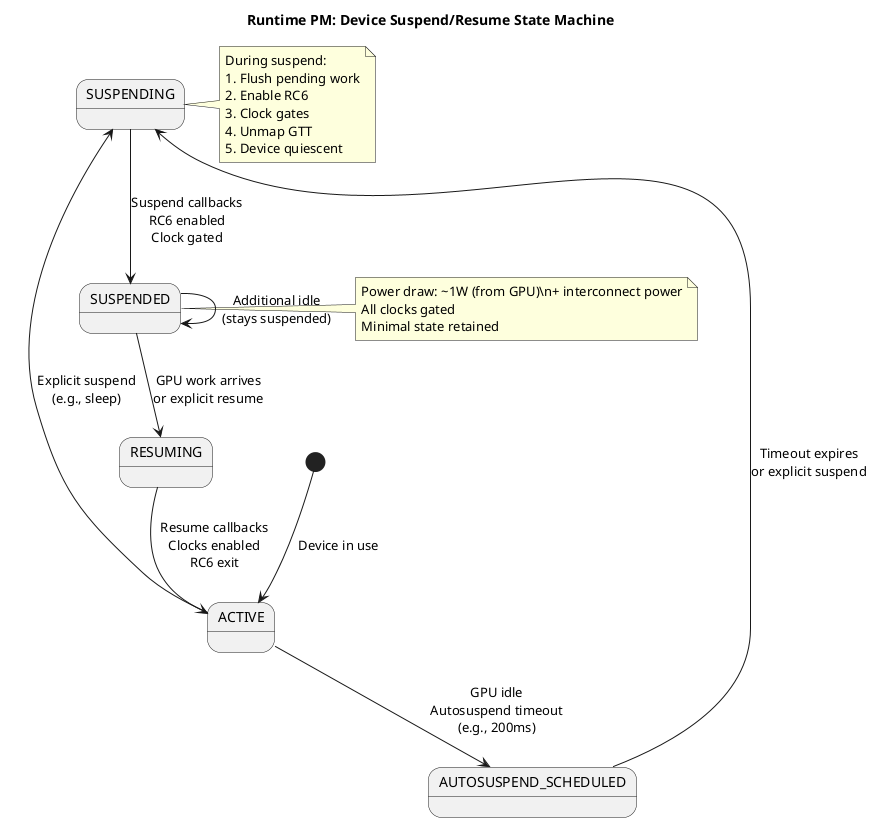
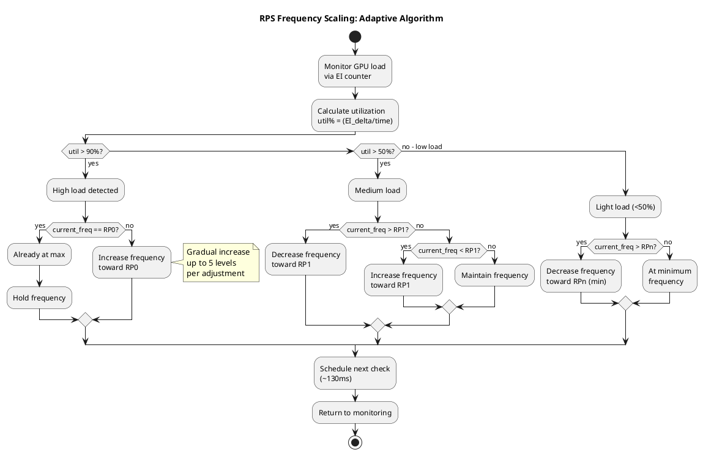
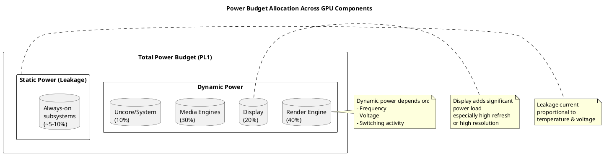
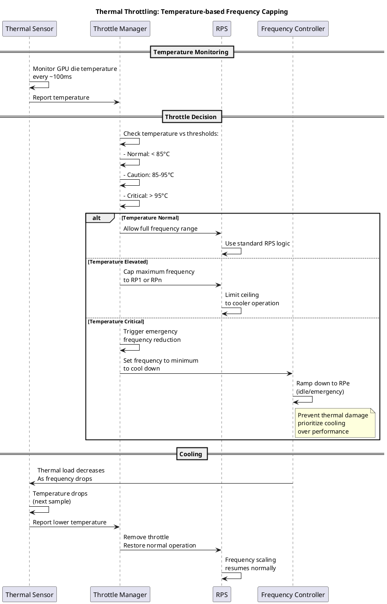

# Power Management System

## Overview

The Intel i915 GPU driver implements comprehensive power management to optimize energy consumption while maintaining performance. The system manages multiple power domains including render (GT), display, and media engines.

**Key Components:**
- **RPS (Render Performance State):** Dynamic frequency/voltage scaling
- **RC6:** Power gating - reduces power when idle
- **SLPC:** Self-managed power scaling via GuC
- **Runtime PM:** Device-level power state control
- **Display Power Wells:** DPLL, CDCLK control

---

## Architecture Overview

```
┌──────────────────────────────────────────────────────┐
│         Workload / Application Activity              │
└──────────┬───────────────────────────────────────────┘
           ↓
    ┌──────────────────────────┐
    │   intel_pm.c             │
    │  (Global Power Policy)   │
    └──────────┬───────────────┘
               ↓
    ┌────────────────────────────────────────┐
    │  gt/intel_rps.c                        │
    │  (Frequency Scaling)                   │
    │  - Dynamic frequency selection         │
    │  - Power budget management             │
    └──────────┬─────────────────────────────┘
               ↓
    ┌────────────────────────────────────────┐
    │  gt/intel_rc6.c                        │
    │  (Power Gating)                        │
    │  - Deep sleep states (RC6, RC6p, RC6pp)│
    │  - Context retention                   │
    └──────────┬─────────────────────────────┘
               ↓
    ┌────────────────────────────────────────┐
    │  intel_runtime_pm.c                    │
    │  (Runtime PM Framework)                │
    │  - Device suspend/resume               │
    │  - Autosuspend with timeout            │
    └──────────┬─────────────────────────────┘
               ↓
         GPU Hardware
    (Frequency/Voltage Control)
```

---

## Core Components

### 1. **Render Performance State (RPS) - intel_rps.c**

**Purpose:** Dynamically adjust GPU frequency based on load

**Key Structure:**
```c
struct intel_rps {
    struct mutex lock;                 // Serialization
    
    /* Hardware limits */
    struct {
        u8 min;                        // Minimum frequency
        u8 max;                        // Maximum frequency
        u8 rp1;                        // RP1 (high frequency)
        u8 rp0;                        // RP0 (max frequency)
    } limits;
    
    /* Current state */
    struct {
        u8 freq_req;                   // Requested frequency
        u8 actual;                     // Actual frequency
        u8 target;                     // Target frequency
    } cur;
    
    /* Load tracking */
    struct {
        u32 ei;                        // Energy Information counter
        unsigned long last_poll;       // Last polling time
    } ei;
    
    /* Interrupt handling */
    struct work_struct work;           // Frequency update work
    struct timer_list timer;           // Polling timer
    
    /* SLPC (Self-managed) mode */
    bool slpc_enabled;
};
```

**Frequency Levels:**
```
RP0 (Max)   ────────────────────────  Turbo/Boost frequency
  │
  │
RP1 (High)  ────────────────────────  Nominal frequency  
  │
  │
... (intermediate levels)
  │
  │
Min         ────────────────────────  Minimum frequency
```

**RPS Control Loop:**

```
┌──────────────────────────────────┐
│   Measure GPU Load (EI counter)  │
│   (Energy Information)           │
└────────────┬─────────────────────┘
             ↓
    ┌──────────────────────────────┐
    │  Compare with target load    │
    │  - If over target: increase  │
    │  - If under target: decrease │
    └────────────┬─────────────────┘
                 ↓
    ┌──────────────────────────────┐
    │  Calculate new frequency     │
    │  - Respect min/max limits    │
    │  - Apply ramp constraints    │
    └────────────┬─────────────────┘
                 ↓
    ┌──────────────────────────────┐
    │  Write to PUNIT              │
    │  (Power Unit Controller)     │
    └────────────┬─────────────────┘
                 ↓
    ┌──────────────────────────────┐
    │  PUNIT changes GPU frequency │
    │  and voltage (DVFS)          │
    └────────────┬─────────────────┘
                 ↓
    ┌──────────────────────────────┐
    │  Sleep (poll interval)       │
    │  Then repeat                 │
    └──────────────────────────────┘
```

**RPS Interrupt Handling:**

```c
// GPU signals RPS interrupt when load threshold crossed
void gen11_rps_irq_handler(struct intel_rps *rps)
{
    u32 pm_isr = intel_uncore_read(uncore, GEN11_PMISR);
    
    if (pm_isr & UP_EI_EXPIRED) {
        // GPU load exceeded threshold
        // Schedule frequency increase
        queue_work(rps->work_queue, &rps->work);
    }
    
    if (pm_isr & DOWN_EI_EXPIRED) {
        // GPU load below threshold
        // Schedule frequency decrease
        queue_work(rps->work_queue, &rps->work);
    }
}
```

---

### 2. **RC6 Power Gating - intel_rc6.c**

**Purpose:** Power down GPU when idle

**RC6 States:**

```
┌─────────────────────────────────────────────────────┐
│                    RC States                        │
├─────────────────────────────────────────────────────┤
│                                                      │
│  Full Power (0V)  ─────────────────────────────────│
│      │                                              │
│      ├── RC0 (On)   │ GPU actively rendering       │
│      │              │ Full voltage, max frequency │
│      │                                              │
│      └── RC1 (Idle) │ GPU idle, ready to RC6      │
│                     │ Slight power reduction       │
│                     │                              │
│          RC6 (Deep Sleep)                          │
│      ┌───────────────────────────────────────────┐ │
│      │ All GPU cores off                          │ │
│      │ Extremely low power                        │ │
│      │ Memory contents preserved                  │ │
│      │                                             │ │
│      ├─ RC6 Classic  │ Slow wakeup (~1ms)         │ │
│      │               │ Basic power saving          │ │
│      │                                             │ │
│      ├─ RC6p         │ Deeper sleep               │ │
│      │               │ GPU-level VRAM still on    │ │
│      │                                             │ │
│      └─ RC6pp        │ Deepest sleep              │ │
│                      │ Most power saving          │ │
│                      │ Longest wakeup time        │ │
│                                                    │ │
└─────────────────────────────────────────────────────┘
```

**RC6 Entry/Exit:**

```
                GPU Active
                    │
                    ↓
        ┌───────────────────────┐
        │ GPU becomes idle      │
        │ No pending requests   │
        └───────────┬───────────┘
                    ↓
        ┌───────────────────────────────┐
        │ Wait for idle threshold       │
        │ (default ~100ms)              │
        └───────────┬───────────────────┘
                    ↓
        ┌───────────────────────────────┐
        │ RC6 eligible:                 │
        │ - No active contexts          │
        │ - Interrupts disabled         │
        │ - Power well allowed off      │
        └───────────┬───────────────────┘
                    ↓
        ┌───────────────────────────────┐
        │ GPU enters RC6                │
        │ - Save context to memory      │
        │ - Power off GPU cores         │
        │ - Reduce voltage              │
        └───────────┬───────────────────┘
                    ↓
            (Very Low Power)
                    ↓
        ┌───────────────────────────────┐
        │ New request arrives / Interrupt│
        └───────────┬───────────────────┘
                    ↓
        ┌───────────────────────────────┐
        │ RC6 exit:                     │
        │ - Restore context             │
        │ - Power on GPU                │
        │ - Restore voltage/frequency   │
        └───────────┬───────────────────┘
                    ↓
                GPU Active
```

**RC6 Configuration:**

```c
struct intel_rc6 {
    struct drm_i915_private *i915;
    
    /* RC6 mode (bitmask) */
    unsigned int level;
    #define INTEL_RC6_ENABLE    (1 << 0)
    #define INTEL_RC6p_ENABLE   (1 << 1)
    #define INTEL_RC6pp_ENABLE  (1 << 2)
    
    /* Wake up time */
    u32 ctx_wake_latency;
    u32 media_wake_latency;
    
    /* Thresholds */
    u32 idle_threshold;                // Time before RC6 entry
    
    /* State tracking */
    bool enabled;
    bool hw_enabled;
};
```

---

### 3. **SLPC (Self-managed Performance) - intel_guc_slpc.c**

**Purpose:** GuC firmware autonomously manages frequency based on workload

**Benefits over CPU-based RPS:**
- Lower CPU overhead (firmware monitors load directly)
- Faster response to load changes
- Tighter feedback loop
- Better integration with GuC submission

**SLPC Flow:**

```
┌─────────────────────────────────────┐
│  GuC Firmware (Running on GuC MC)  │
│                                     │
│  Continuously monitors:             │
│  - GPU load indicators              │
│  - EI (Energy Information)          │
│  - Performance counters             │
└────────────┬──────────────────────┘
             ↓
    ┌────────────────────────────────┐
    │ Apply SLPC scheduling policy   │
    │ - Current workload type        │
    │ - Power budget constraints     │
    │ - Performance targets          │
    └────────────┬───────────────────┘
                 ↓
    ┌────────────────────────────────┐
    │ Calculate target frequency     │
    │ - Within min/max bounds        │
    │ - Respect ramp limits          │
    └────────────┬───────────────────┘
                 ↓
    ┌────────────────────────────────┐
    │ Write to hardware PUNIT        │
    │ (DVFS - Dynamic V/F)           │
    └────────────┬───────────────────┘
                 ↓
    ┌────────────────────────────────┐
    │ Optional: Notify driver        │
    │ (via CT message)               │
    │ for monitoring/debugging       │
    └────────────────────────────────┘
```

**SLPC Configuration:**

```c
int intel_guc_slpc_set_boost(struct intel_guc_slpc *slpc,
                             bool boost_enabled)
{
    // Enable/disable turbo boost mode
    // Message to GuC via CT
    return send_guc_ct_message(slpc->guc,
        SLPC_MSG_BOOST_ENABLE, 
        boost_enabled);
}

int intel_guc_slpc_set_max_freq(struct intel_guc_slpc *slpc,
                                u32 max_freq_mhz)
{
    // Set maximum frequency limit
    return send_guc_ct_message(slpc->guc,
        SLPC_MSG_SET_MAX_FREQ,
        max_freq_mhz);
}
```

---

### 4. **Runtime PM - intel_runtime_pm.c**

**Purpose:** System-level power state management (suspend/resume)

**Power Domains:**

```
GPU Device
    ├── Display Power Domain
    │   ├── DPLL (Display PLL)
    │   ├── CDCLK (Core Display Clock)
    │   └── Power Wells
    │
    ├── GT (Graphics) Power Domain
    │   ├── Render Engine
    │   ├── Media Engines
    │   └── GPU cores
    │
    └── Uncore (Shared)
        ├── System Agent
        ├── PCH (Platform Controller Hub)
        └── Fabric
```

**Runtime PM States:**

```
Active (0 refs)
     │
     │ pm_runtime_put_autosuspend()
     │
     ↓
Autosuspend Timer (default 10s)
     │
     │ [timeout expires]
     │
     ↓
Suspended (D3Hot)
     │
     │ pm_runtime_get() or activity
     │
     ↓
Resume
     │
     ↓
Active
```

**Key Operations:**

```c
// Get runtime PM reference
int intel_runtime_pm_get(struct intel_runtime_pm *pm)
{
    struct drm_i915_private *i915 = pm->i915;
    
    // Increment reference count
    int ret = pm_runtime_get(&i915->drm.dev);
    
    if (ret < 0) {
        // Failed to resume
        return ret;
    }
    
    // Device now active
    return 0;
}

// Release runtime PM reference
void intel_runtime_pm_put(struct intel_runtime_pm *pm)
{
    struct drm_i915_private *i915 = pm->i915;
    
    // Decrement reference count
    pm_runtime_put_autosuspend(&i915->drm.dev);
    
    // May trigger autosuspend if count reaches 0
}
```

---

## Code Flow Examples

### RPS Frequency Update

```c
void intel_rps_boost(struct intel_rps *rps)
{
    struct intel_uncore *uncore = rps->uncore;
    
    // Request high frequency
    rps->cur.freq_req = rps->limits.rp0;
    
    // Write to hardware register
    intel_uncore_write_fw(uncore, GEN6_RPNSWREQ,
                         rps->cur.freq_req << GEN6_RPNSWREQ_SHIFT);
    
    // Signal change
    intel_punit_req_freq_notify(uncore);
}
```

### RC6 Entry Setup

```c
int intel_rc6_init(struct intel_rc6 *rc6)
{
    struct drm_i915_private *i915 = rc6->i915;
    struct intel_uncore *uncore = &i915->uncore;
    
    // Configure RC6 parameters
    intel_uncore_write(uncore, GEN6_RC6_THRESHOLD,
                      rc6->idle_threshold);
    
    // Set RC6 mode
    u32 rc_mode = 0;
    if (rc6->level & INTEL_RC6_ENABLE)
        rc_mode |= GEN6_RC_CTL_RC6_ENABLE;
    if (rc6->level & INTEL_RC6p_ENABLE)
        rc_mode |= GEN6_RC_CTL_RC6p_ENABLE;
        
    intel_uncore_write(uncore, GEN6_RC_CONTROL, rc_mode);
    
    // Enable interrupts
    intel_uncore_write(uncore, GEN6_PMIMR,
                      ~GEN6_PM_RPS_EVENTS);
    
    return 0;
}
```

### GPU Suspend/Resume

```c
int i915_drm_suspend(struct drm_device *dev)
{
    struct drm_i915_private *i915 = dev->dev_private;
    
    // Step 1: Disable interrupts
    i915_irq_uninstall(dev);
    
    // Step 2: Stop RPS/RC6
    intel_rc6_save(&i915->rc6);
    intel_rps_idle(i915);
    
    // Step 3: Save display state
    intel_display_suspend(i915);
    
    // Step 4: Wait for pending GPU work
    intel_gt_wait_for_idle(i915);
    
    // Step 5: Save GPU state
    intel_pm_save_context(i915);
    
    return 0;
}

int i915_drm_resume(struct drm_device *dev)
{
    struct drm_i915_private *i915 = dev->dev_private;
    
    // Step 1: Restore GPU state
    intel_pm_restore_context(i915);
    
    // Step 2: Restore display
    intel_display_resume(i915);
    
    // Step 3: Restart RPS
    intel_rps_enable(&i915->rps);
    
    // Step 4: Restart RC6
    intel_rc6_restore(&i915->rc6);
    
    // Step 5: Re-enable interrupts
    i915_irq_install(dev);
    
    return 0;
}
```

---

## Power Budget & Thermal Management

### Thermal Throttling:

```
Temperature Monitor
        ↓
Temperature Threshold Reached
        ↓
Reduce Maximum Frequency
        ↓
GPU frequency capped
        ↓
Temperature drops
        ↓
Restore normal frequency limits
```

### Power Budget (Intel Xe):

```
Total Available Power
        ↓
    Divided among:
    - Render Engine (40%)
    - Media Engines (30%)
    - Display (20%)
    - Uncore/System (10%)
        ↓
Dynamic allocation based on activity
```

---

## Deep Dive: Power Management State Transitions

### Complete RPS (Frequency Scaling) Workflow



### RC6 Power Gating: Sleep & Wake Sequence



### SLPC (Self-managed Low Power Controller) Operation



### Power Well Hierarchy and Control



### Runtime PM Device State Machine



### Frequency Scaling Decision Tree



### Power Budget Distribution



### Thermal Throttling & Temperature Control



---

## Sysfs Interface

### Power Management Parameters:

```bash
# Check current frequency
cat /sys/class/drm/card0/device/gt/0/freq_cur_mhz

# Check min/max frequency
cat /sys/class/drm/card0/device/gt/0/freq_min_mhz
cat /sys/class/drm/card0/device/gt/0/freq_max_mhz

# Check RC6 state
cat /sys/class/drm/card0/device/power_state

# Set boost mode
echo 1 > /sys/class/drm/card0/device/boost_enabled

# Runtime PM control
echo auto > /sys/bus/pci/devices/0000:00:02.0/power/control
```

---

## Performance Considerations

### 1. **Latency vs. Efficiency**
- Higher frequency = lower latency, higher power
- Lower frequency = more power efficient, higher latency
- RPS balances this dynamically

### 2. **RC6 Wake Latency**
- RC6 entry: ~100μs
- RC6pp exit: ~1-2ms
- Track operations sensitive to latency

### 3. **SLPC Efficiency**
- Reduces interrupt overhead
- Faster frequency response
- Generally preferred when available

---

## Related Components

- **Interrupt Handling:** `i915_irq.c` - RPS interrupt processing
- **Display Power:** `display/intel_display_power.c` - Display power wells
- **Uncore:** `intel_uncore.c` - Low-level hardware access
- **Telemetry:** `i915_pmu.c` - Power metrics monitoring

---

## References

- **Source:** `intel_pm.c`, `intel_runtime_pm.c`, `gt/intel_rps.c`, `gt/intel_rc6.c`
- **Headers:** `intel_pm_types.h`, `intel_runtime_pm.h`
- **Selftests:** `gt/selftest_rc6.c`, `gt/selftest_engine_pm.c`
- **Documentation:** `Documentation/gpu/i915.rst#pm`
