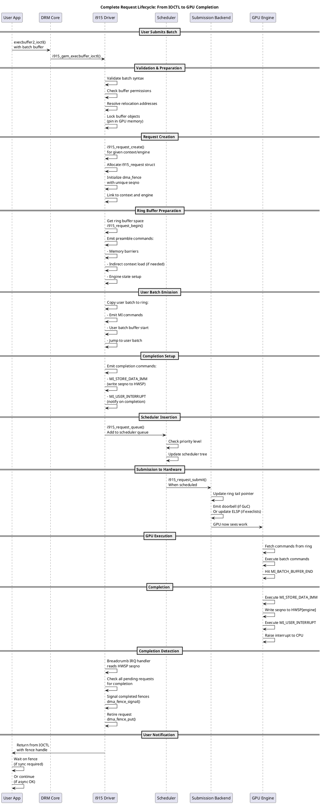
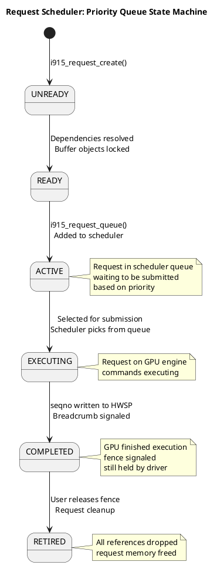
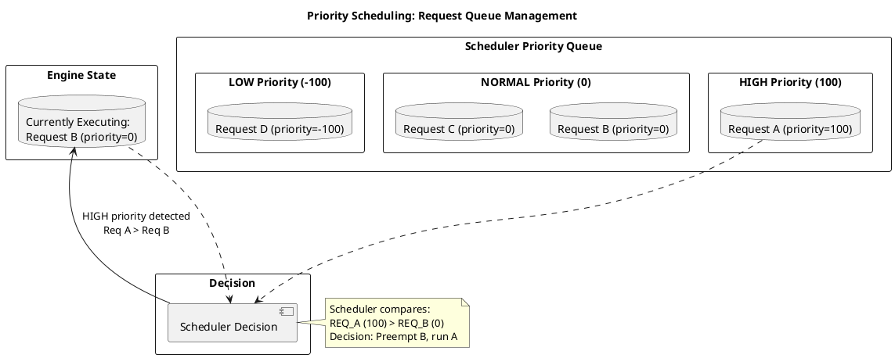
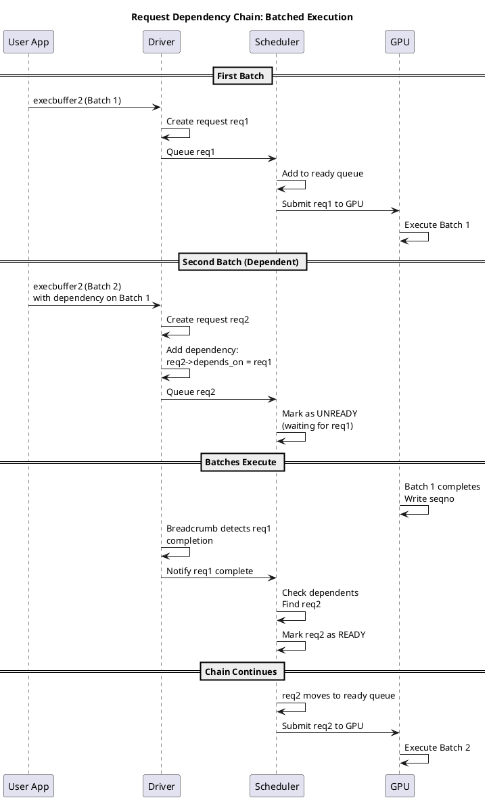
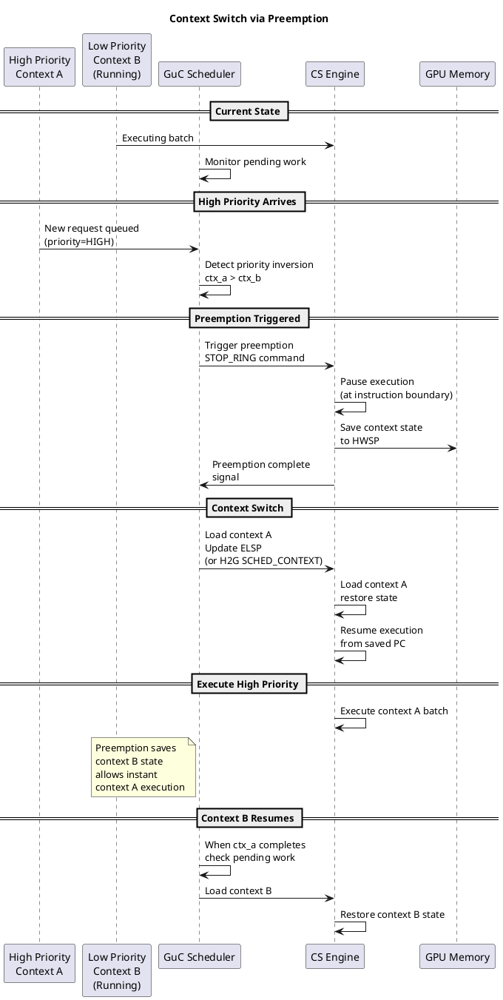
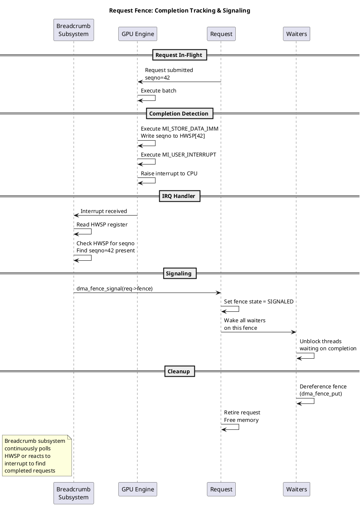
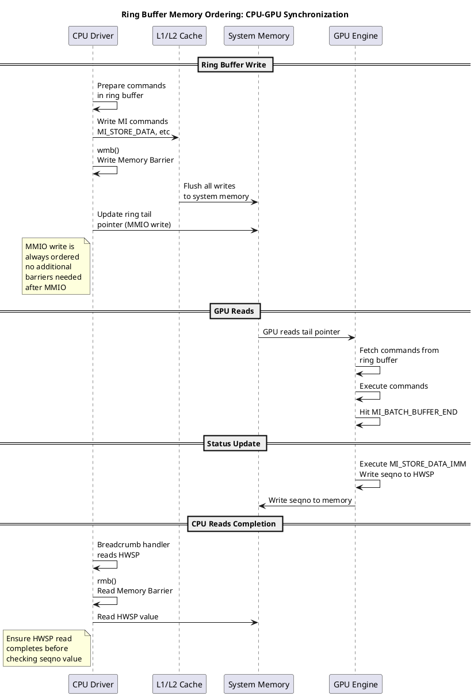
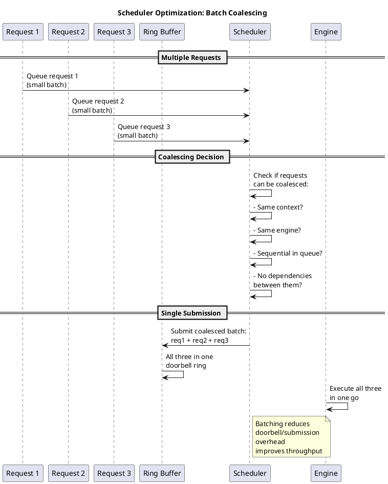

# Request Scheduling & Execution System

## Overview

The request scheduling system manages GPU workload execution. It handles user batch submission, prioritization, scheduling policies, and execution on GPU engines. The system supports both CPU-driven (execlists) and firmware-driven (GuC) submission models.

**Key Concepts:**
- **i915_request:** GPU command batch representation
- **Scheduler:** Prioritizes and orders requests
- **Submission:** Passes requests to hardware/firmware
- **Fencing:** Tracks request completion

---

## Architecture Overview

```
┌───────────────────────────────────────────────────┐
│         User Application (Vulkan/OpenGL)          │
│    execbuffer2_ioctl / submit_to_gem_context      │
└────────────────┬────────────────────────────────┘
                 ↓
        ┌────────────────────────┐
        │ gem/i915_gem_execbuffer│
        │ (User batch handling)  │
        └────────────┬───────────┘
                     ↓
        ┌────────────────────────┐
        │ i915_request.c         │
        │ (GPU request object)   │
        └────────────┬───────────┘
                     ↓
        ┌────────────────────────┐
        │ i915_scheduler.c       │
        │ (Request prioritization)
        └────────────┬───────────┘
                     ↓
        ┌────────────────────────────────┐
        │  Submission Backend Selection  │
        ├────────────────────────────────┤
        │  intel_guc_submission.c        │
        │  (GuC-based - Modern)          │
        │        OR                      │
        │  intel_execlists_submission.c  │
        │  (CPU-driven - Older)          │
        └────────────┬───────────────────┘
                     ↓
            GPU Hardware Execution
```

---

## Core Components

### 1. **GPU Request (i915_request.c)**

**Purpose:** Represents a single GPU command batch submission

**Key Structure:**
```c
struct i915_request {
    struct intel_context *context;         // Associated context
    struct list_head signal_link;          // Signal tracking
    
    /* Batch buffer info */
    u64 batch;                             // Batch buffer GPU address
    u64 batch_res;                         // Batch resource
    
    /* Ring buffer state */
    struct intel_ring *ring;               // Ring buffer
    u32 head;                              // Start of ring entry
    u32 tail;                              // End of ring entry
    
    /* Execution tracking */
    struct dma_fence fence;                // Completion fence
    struct list_head active_link;          // Active request list
    struct i915_active active;             // Active reference tracking
    
    /* Scheduling */
    struct {
        struct list_head link;             // Scheduler link
        int priority;                      // Priority level
    } sched;
    
    /* Timing */
    unsigned long emitted_jiffies;         // Submission time
    unsigned long timeout;                 // Execution timeout
    
    /* Result/completion */
    u32 global_seqno;                      // Global sequence number
    u32 seqno;                             // Per-engine sequence
    
    /* Statistics */
    struct {
        struct i915_request_stats stats;
        ktime_t start_time;
        ktime_t end_time;
    } timing;
};
```

**Request Lifecycle:**

```
┌──────────────────────────────────┐
│  User submits batch via execbuf  │
└────────────┬─────────────────────┘
             ↓
    ┌────────────────────────────┐
    │ Create i915_request object │
    │ - Allocate structure       │
    │ - Initialize fence         │
    │ - Link to context          │
    └────────────┬───────────────┘
                 ↓
    ┌────────────────────────────┐
    │ Prepare batch:             │
    │ - Copy user cmds to ring   │
    │ - Add pipeline flushes     │
    │ - Add completion marker    │
    └────────────┬───────────────┘
                 ↓
    ┌────────────────────────────┐
    │ Queue to scheduler         │
    │ - Add to priority queue    │
    │ - Ready for submission     │
    └────────────┬───────────────┘
                 ↓
    ┌────────────────────────────┐
    │ Scheduler submits request  │
    │ - Via GuC or Execlists     │
    └────────────┬───────────────┘
                 ↓
    ┌────────────────────────────┐
    │ GPU Execution              │
    │ - Fetch from ring          │
    │ - Execute commands         │
    │ - Update completion marker │
    └────────────┬───────────────┘
                 ↓
    ┌────────────────────────────┐
    │ Request Completion         │
    │ - Signal fence             │
    │ - Wake waiting processes   │
    │ - Update statistics        │
    └────────────┬───────────────┘
                 ↓
    ┌────────────────────────────┐
    │ Retire Request             │
    │ - Remove from tracking     │
    │ - Free resources           │
    │ - Notify scheduler         │
    └────────────────────────────┘
```

---

### 2. **Request Scheduler (i915_scheduler.c)**

**Purpose:** Manage request execution order and prioritization

**Scheduling Policy:**

```c
struct i915_sched_engine {
    struct intel_engine_cs *engine;    // Associated engine
    
    /* Ready list - awaiting submission */
    struct rb_tree queue;              // Priority queue
    
    /* Currently executing request */
    struct i915_request *active;
    
    /* Statistics */
    struct {
        u32 total_submitted;           // Total batches submitted
        u32 total_completed;           // Total batches completed
        u64 total_time_us;             // Total execution time
    } stats;
    
    spinlock_t lock;
    struct work_struct work;           // Submission work
};
```

**Priority Queue Structure:**

```
Priority Levels: 0 (LOW) ... 1023 (HIGH)

rb_tree:
    ┌─────────────────────────────────┐
    │  Priority 1023 (Interactive)    │
    │  ├─ Request A                   │
    │  └─ Request B                   │
    ├─────────────────────────────────┤
    │  Priority 768 (Normal)          │
    │  ├─ Request C                   │
    │  ├─ Request D                   │
    │  └─ Request E                   │
    ├─────────────────────────────────┤
    │  Priority 256 (Background)      │
    │  └─ Request F                   │
    └─────────────────────────────────┘

Submission Order (with preemption):
Priority 1023 → 768 → 256
(high priority preempts lower)
```

**Scheduling Algorithm:**

```c
void i915_sched_engine_submit(struct i915_sched_engine *sched)
{
    // Get highest priority request
    struct i915_request *rq = 
        rb_first(&sched->queue);
    
    if (!rq)
        return;  // Nothing to submit
    
    // Check if can submit now
    if (sched->active && sched->active->priority > rq->priority) {
        // Current request has higher priority
        // Check if can preempt
        if (can_preempt(rq)) {
            // Preempt current request
            preempt_request(sched->active);
            
            // Remove from queue
            rb_erase(&rq->sched.link, &sched->queue);
            
            // Submit new request
            sched->engine->submit(rq);
        }
        return;
    }
    
    // Submit highest priority request
    rb_erase(&rq->sched.link, &sched->queue);
    sched->engine->submit(rq);
}
```

---

### 3. **Batch Execution (gem/i915_gem_execbuffer.c)**

**Purpose:** User-facing API for batch submission

**Execution Buffer Structure:**

```c
struct drm_i915_gem_execbuffer2 {
    __u64 buffers_ptr;                 // Array of objects to execute
    __u32 buffer_count;                // Number of objects
    
    __u32 batch_start_offset;          // Offset in batch buffer
    __u32 batch_len;                   // Batch buffer length
    
    __u32 DR1;                         // Deprecated (context state)
    __u32 DR4;                         // Deprecated
    
    __u32 num_cliprects;               // Clipping rectangles (legacy)
    __u64 cliprects_ptr;               // Pointer to clip array
    
    __u32 flags;                       // Execution flags
    __u32 rsvd1;
    __u64 rsvd2;
};
```

**Execution Flow:**

```
User calls execbuffer2_ioctl
        ↓
    i915_gem_execbuffer2()
        ├─ Validate batch buffer
        ├─ Lock all buffer objects
        ├─ Create relocation list
        ├─ Resolve addresses
        └─ Submit for execution
        ↓
    i915_gem_execbuffer_move_to_gpu()
        ├─ Bind buffers to address space
        ├─ Ensure all pages present
        └─ Set access flags
        ↓
    i915_request_create()
        ├─ Allocate request object
        ├─ Link to context
        └─ Initialize fence
        ↓
    [Build command stream]
        ├─ Prepare initial state
        ├─ Add user batch buffer
        ├─ Add pipeline flushes
        ├─ Add semaphores
        └─ Add completion marker
        ↓
    [Submit to scheduler]
        ├─ Add to priority queue
        ├─ Check for immediate dispatch
        └─ Return fence to user
        ↓
User continues (GPU executes in parallel)
```

---

### 4. **Ring Buffer Management (gt/intel_ring.c)**

**Purpose:** Manage per-context command ring buffer

**Ring Structure:**

```
Ring Buffer (Virtual Memory):
┌──────────────────────────────┐
│ 4KB aligned GPU memory       │
│ Powers of 2: 4K, 8K, 16K...  │
└────────────┬─────────────────┘
             ↓
┌──────────────────────────────┐
│ Current State:               │
│                              │
│  HEAD ──→ (oldest entries)   │
│           │                  │
│           ├─ Command A       │
│           ├─ Command B       │
│           ├─ Command C       │
│  TAIL ──→ (newest entries)   │
│           │                  │
│           ├─ (free space)    │
│           ├─ (free space)    │
│                              │
└──────────────────────────────┘

Wrap-around:
TAIL approaches end
        ↓
Write to start (HEAD must be beyond wrapped point)
        ↓
Wrap-around handled transparently
```

**Ring Operation:**

```c
int intel_ring_space(struct intel_ring *ring)
{
    // Calculate available space for commands
    u32 space = ring->effective_size - 
                (ring->tail - ring->head);
    
    return space;
}

int intel_ring_begin(struct intel_ring *ring, u32 num_dwords)
{
    // Ensure enough space for num_dwords
    while (intel_ring_space(ring) < num_dwords) {
        // Wait for GPU to consume entries (HEAD advances)
        wait_for_space(ring);
    }
    
    return 0;
}

void intel_ring_emit(struct intel_ring *ring, u32 data)
{
    // Write DWORD to ring
    iowrite32(data, ring->vaddr + ring->tail);
    ring->tail = (ring->tail + 4) % ring->size;
}
```

---

## Submission Backends

### Execlists (CPU-driven)

**Flow:**
```
CPU Driver
    ↓
Prepare Execution List (ExecList Context)
    ↓
Write to ELSP (Execution List Submit Port)
    ↓
GPU fetches context from list
    ↓
GPU executes batch
```

**Files:** `intel_execlists_submission.c`

### GuC (Firmware-driven)

**Flow:**
```
CPU Driver
    ↓
Prepare Work Queue Item
    ↓
Ring Doorbell
    ↓
GuC Firmware processes
    ↓
GuC schedules on engine
    ↓
GPU executes batch
```

**Files:** `intel_guc_submission.c`

---

## Preemption Mechanism

**Hardware Preemption:**
```
High Priority Request arrives
        ↓
Scheduler initiates preemption
        ↓
GPU completes current instruction
        ↓
GPU context saved to memory
        ↓
GPU loads high-priority context
        ↓
High-priority batch executes
        ↓
(Resume previous on completion)
```

**Preemption Configuration:**

```c
// Set preemption timeout
int intel_context_set_preemption_timeout(
    struct intel_context *ce,
    u32 timeout_ms)
{
    // Maximum time current context can run
    // before being preempted
    ce->preemption_timeout = timeout_ms;
    
    // Too low: excessive preemptions
    // Too high: priority inversion
}
```

---

## Code Flow Example

### Complete Execution Path

```c
int i915_gem_execbuffer2_ioctl(struct drm_device *dev,
                               void *data,
                               struct drm_file *file)
{
    struct drm_i915_gem_execbuffer2 *args = data;
    
    // Step 1: Get context
    struct i915_gem_context *ctx = 
        i915_gem_context_lookup(file, args->rsvd1);
    
    // Step 2: Validate buffers
    struct i915_execbuffer eb;
    validate_buffers(&eb, args);
    
    // Step 3: Lock all objects
    lockdep_assert_held(&file->table_lock);
    
    // Step 4: Move to GPU
    i915_gem_execbuffer_move_to_gpu(&eb);
    
    // Step 5: Create request
    struct i915_request *rq = 
        i915_request_create(ctx->engines[engine]);
    
    // Step 6: Prepare batch
    prepare_batch_buffer(rq, args);
    
    // Step 7: Add completion marker
    i915_request_add_barrier(rq);
    
    // Step 8: Submit
    i915_request_queue(rq);
    
    // Step 9: Return to user
    args->fence_out = rq->fence.seqno;
    
    return 0;
}
```

---

## Deep Dive: Request Scheduling Architecture

### Complete Request Submission and Execution Flow



### Request Scheduler State Machine



### Priority-Based Scheduling with Preemption



### Request Dependency Chain & Batching



### Engine-Level Queue Management

```plantuml
@startuml
title Per-Engine Request Queue: Ring Buffer Management

rectangle "Scheduler" {
  queue "Pending Queue" as pend {
    participant "Ready requests" as ready_q
  }
}

rectangle "Engine" {
  queue "Active Queue" as active {
    participant "In-flight requests" as inflight
  }
  
  database "Ring Buffer" {
    participant "Ring Position" as ring
  }
}

pend -->|selected for execution| active

active --> ring: Ring tail update\n(MMIO or doorbell)

ring --> ring: Engine fetches commands\nfrom ring buffer start

note right of active
Multiple requests
in-flight per engine
typically 2-8 active
depending on HW
end note

note right of ring
Ring buffer is circular
Engine reads from head
Driver writes to tail
end note

@enduml
```

### Context Switching & Preemption Mechanics



### Request Fence Completion Tracking



### Memory Ordering in Ring Buffer Operations



### Scheduler Optimization: Batch Coalescing



---

## Performance Optimizations

### 1. **Batch Submission Optimization**
- Submit multiple requests per doorbell
- Reduces context switch overhead

### 2. **Priority Management**
- Interactive workloads get high priority
- Background work deferred

### 3. **Preemption Granularity**
- Preempt on instruction boundaries
- Minimize context save/restore

---

## Debugging & Inspection

### Debugfs:
```bash
# Check scheduler state
cat /sys/kernel/debug/dri/0/i915_request

# Request statistics
cat /sys/kernel/debug/dri/0/request_stats

# Scheduler queue
cat /sys/kernel/debug/dri/0/scheduler_dump
```

---

## Related Components

- **Virtual Memory:** `i915_vma.c` - Buffer mapping
- **Context:** `i915_gem_context.c` - Execution context
- **Fencing:** `intel_breadcrumbs.c` - Completion tracking
- **Power:** `intel_engine_pm.c` - Per-engine power

---

## References

- **Source:** `i915_request.c`, `i915_scheduler.c`, `gem/i915_gem_execbuffer.c`
- **Headers:** `i915_request.h`, `intel_engine.h`
- **Selftests:** `selftest_execlists.c`
