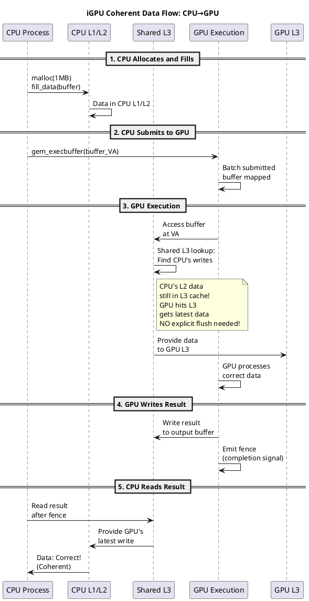
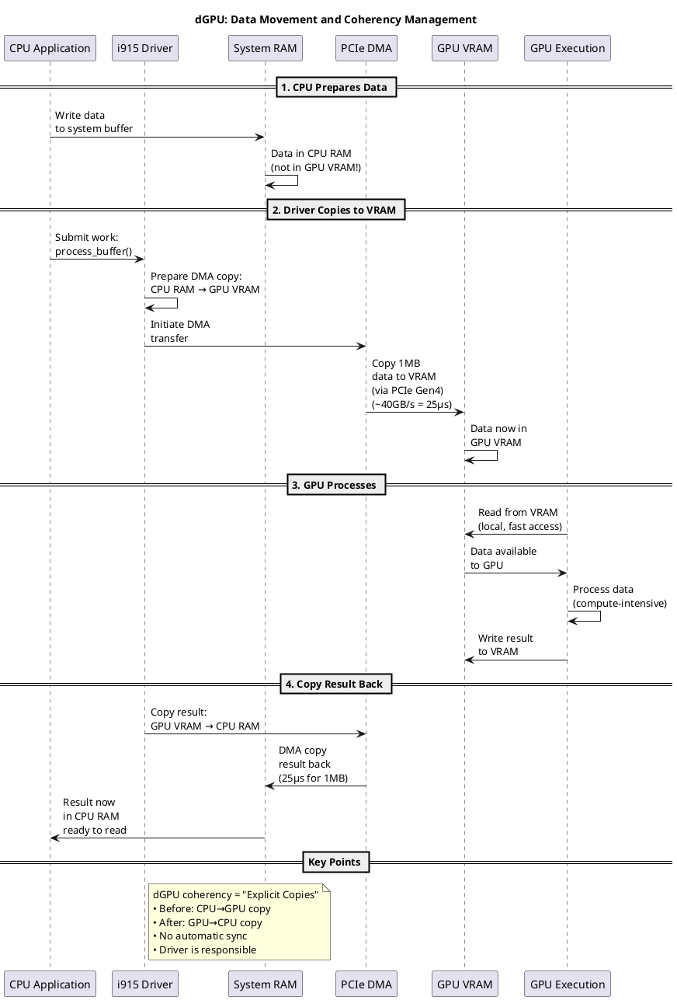
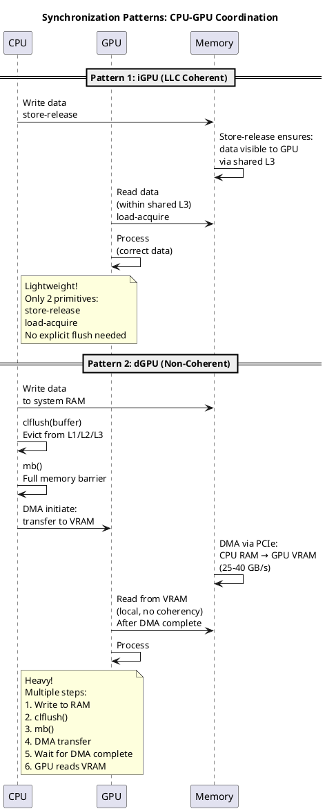
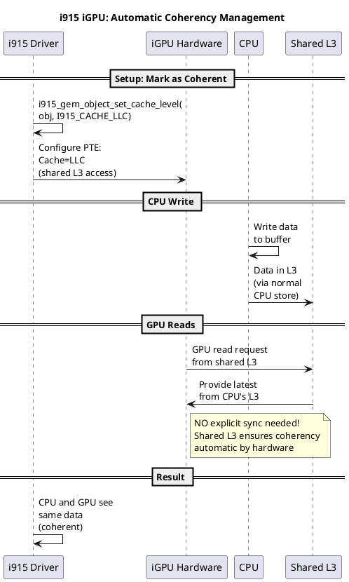
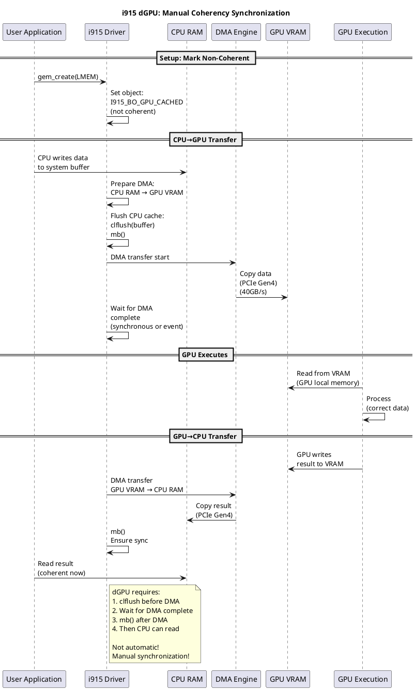
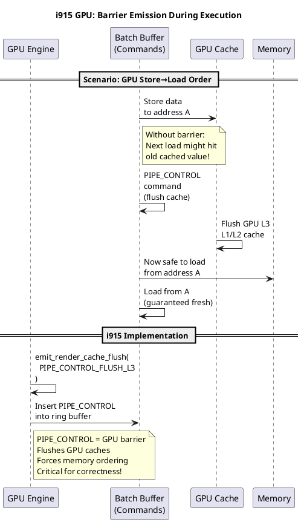

# CPU-GPU Memory Coherency: Architecture & Implementation

**Document:** i915 GPU Driver Memory Coherency System  
**Topic:** Maintaining data consistency between CPU and GPU  
**Coverage:** Integrated GPUs (iGPU) vs Discrete GPUs (dGPU)  
**Kernel Version:** 6.8+

---

## Table of Contents

1. [Executive Summary](#executive-summary)
2. [Coherency Fundamentals](#coherency-fundamentals)
3. [Integrated GPU (iGPU) Coherency](#integrated-gpu-igpu-coherency)
4. [Discrete GPU (dGPU) Coherency](#discrete-gpu-dgpu-coherency)
5. [Coherency Models](#coherency-models)
6. [Synchronization Primitives](#synchronization-primitives)
7. [Implementation in i915](#implementation-in-i915)
8. [Performance Implications](#performance-implications)
9. [Debugging Coherency Issues](#debugging-coherency-issues)

---

## Executive Summary

### The Coherency Problem

```
┌──────────────────────────────────────────────────────┐
│         CPU vs GPU Memory Challenge                  │
├──────────────────────────────────────────────────────┤
│                                                      │
│  CPU writes data to memory buffer                    │
│  GPU reads the same memory buffer                    │
│                                                      │
│  Question:                                           │
│  Does GPU see CPU's latest writes?                  │
│  Or does it see stale cached data?                  │
│                                                      │
│  Answer: DEPENDS on coherency model!                │
│                                                      │
└──────────────────────────────────────────────────────┘
```

### Two Distinct Architectures

| Aspect | **Integrated GPU (iGPU)** | **Discrete GPU (dGPU)** |
|--------|---------------------------|-------------------------|
| **Location** | Same chip as CPU | Separate card (PCIe) |
| **Memory Bus** | Shared QPI/DMI | PCIe Gen3/4/5 |
| **Coherency** | Hardware-supported | Limited, needs software |
| **Latency** | Ultra-low (cache hits) | High (PCIe round-trips) |
| **Bandwidth** | 40-100 GB/s | 8-64 GB/s (depending on Gen) |
| **Memory Sharing** | Direct (same DDR4) | Copies via PCIe |
| **Cache Snooping** | Yes (built-in) | No (manual management) |
| **Sync Primitives** | Store-release, Load-acquire | Full memory barriers |

### Key Questions Answered

This document explains:

✅ **How does CPU write→GPU read coherency work?**  
✅ **Why is iGPU coherency "free" but dGPU is expensive?**  
✅ **What synchronization primitives ensure consistency?**  
✅ **How does the i915 driver implement this?**  
✅ **What are the performance trade-offs?**  

---

## Coherency Fundamentals

### The Memory Hierarchy Problem

```plantuml
@startuml
title Memory Hierarchy: Cache Coherency Challenge

rectangle "CPU Complex" {
  participant "CPU Core 0" as cpu0
  participant "L1 Cache\n(32KB)" as l1_0
  participant "L2 Cache\n(256KB)" as l2_0
  participant "L3 Cache\n(Shared)" as l3
}

rectangle "GPU Complex" {
  participant "GPU Slice" as gpu_slice
  participant "L3 GPU Cache" as gpu_l3
  participant "GPU Local\nData Port" as gpu_dp
}

rectangle "Main Memory" {
  participant "DDR4/DDR5" as ddr
}

== CPU Writes ==

cpu0 -> l1_0: Write data\nAddress 0x1000\nValue: 0xAB

l1_0 -> l2_0: Write-back\n(if needed)

l2_0 -> l3: Write-back\n(if L2 evicted)

note right of l1_0
Data now in\nCPU L1 cache
but DDR still has\nOLD value!
end note

== GPU Reads (Without Coherency) ==

gpu_slice -> gpu_l3: Read from\nAddress 0x1000

gpu_l3 -> ddr: Cache miss\nfetch from DDR

ddr -> gpu_l3: Data: 0x00\n(STALE! CPU hasn't\nwritten back)

gpu_slice -> gpu_dp: GPU reads 0x00\nWrong value!\n(Coherency bug)

== With Coherency ==

l1_0 -> l3: Snoop: Who else\nwants 0x1000?

gpu_l3 -> l1_0: "I'm reading 0x1000"\n(snoop request)

l1_0 -> gpu_l3: "Here's latest:\n0xAB"\n(shared from L1)

gpu_slice -> gpu_dp: GPU reads 0xAB\nCorrect!\n(Coherent)

@enduml
```

### Coherency Models: Levels of Guarantees

```plantuml
@startuml
title Coherency Models: Spectrum of Guarantees

state "Incoherent\n(Worst)" as incoherent {
  note right of incoherent
  • No synchronization
  • CPU writes ≠ GPU reads
  • Data corruption likely
  • NEVER use for GPU access!
  end note
}

state "WC (Write-Combine)" as wc {
  note right of wc
  • Writes buffered, no reads
  • GPU can write, CPU can read
  • Asymmetric: good for GPU→CPU
  • Not for CPU→GPU
  end note
}

state "WT (Write-Through)" as wt {
  note right of wt
  • Writes go to memory
  • Reads from cache
  • Slower than WB
  • Safer than WC
  end note
}

state "WB (Write-Back)" as wb {
  note right of wb
  • Standard x86 model
  • Writes cached
  • Explicit flush needed
  • Highest performance
  • Requires sync primitives
  end note
}

state "Coherent\n(Best)" as coherent {
  note right of coherent
  • Hardware snooping
  • Automatic cache sync
  • CPU↔GPU reads/writes ok
  • iGPU only!
  end note
}

[*] --> incoherent
incoherent --> wc: unsafe
wc --> wt: safer
wt --> wb: performance
wb --> coherent: ideal (iGPU)

@enduml
```

---

## Integrated GPU (iGPU) Coherency

### Why iGPU Can Be Coherent

```plantuml
@startuml
title iGPU Coherency: Shared Cache Hierarchy

rectangle "Intel CPU Package\n(Die)" {
  rectangle "CPU Complex" {
    participant "CPU Core" as cpu
    participant "L1i/L1d Cache" as l1
    participant "L2 Cache" as l2
  }
  
  participant "Shared L3\n(Ring Bus)" as l3_shared
  
  rectangle "GPU Complex\n(on same die)" {
    participant "GPU Slice" as gpu
    participant "GPU L3 Cache" as gpu_l3
  }
  
  participant "Ring\nInterconnect" as ring
}

rectangle "Main Memory" {
  participant "DDR4 Channel" as ddr
}

== Coherent Read ==

cpu -> l1: Write data\nto 0x1000

l1 -> l2: Write to L2

l2 -> l3_shared: Write to L3\n(shared cache)

note right of l3_shared
Key: Shared L3!
CPU and GPU both\ncan access via same cache!
end note

gpu -> ring: Read from 0x1000\nvia Ring Bus

ring -> l3_shared: Check shared L3\nfor 0x1000

l3_shared -> gpu: Found: Latest value\nfrom CPU!\n(Coherent hit)

== No Need for Explicit Sync ==

note right of ring
Because CPU and GPU
share L3 cache,
hardware automatically
handles coherency!

No MESI/MOESI needed
No explicit flushes needed
(unless crossing caches)
end note

@enduml
```

### iGPU Coherency Modes

```plantuml
@startuml
title iGPU: Different Coherency Modes

database "iGPU Coherency Options" {
  state "LLC (Last Level Cache)" as llc {
    note right of llc
    • Data in CPU L3 cache
    • GPU accesses via shared L3
    • Fastest: cache-to-cache
    • Implicit coherency
    • Default for iGPU buffers
    end note
  }
  
  state "L3 Coherent\n(Explicit)" as l3_explicit {
    note right of l3_explicit
    • Mark buffer: L3_COHERENT
    • Driver ensures L3 visibility
    • Explicit fence sync
    • For shared data
    end note
  }
  
  state "GPU-Cached" as gpu_cached {
    note right of gpu_cached
    • Data in GPU-side caches
    • CPU sees stale data
    • Need clflush + fence
    • For GPU-to-CPU data flow
    end note
  }
  
  state "Uncached" as uncached {
    note right of uncached
    • Bypass all caches
    • Direct DDR access
    • Slowest but predictable
    • For synchronization points
    end note
  }
}

note bottom of llc
iGPU default: LLC mode
Automatic coherency via
shared L3 cache
Most efficient!
end note

@enduml
```

### iGPU Memory Flow Example



---

## Discrete GPU (dGPU) Coherency

### Why dGPU Coherency Is Hard

```plantuml
@startuml
title dGPU Coherency Challenge: Separate Systems

rectangle "CPU Side (Host)" {
  participant "CPU Core" as cpu
  participant "CPU L3" as cpu_l3
  participant "Main RAM\n(DDR4)" as cpu_ram
}

cloud "PCIe Link\n(Bridge)" as pcie

rectangle "GPU Side (Device)" {
  participant "GPU Device\nMemory (VRAM)" as gpu_vram
  participant "GPU Cache" as gpu_cache
  participant "GPU Execution" as gpu_exec
}

== Problem 1: Separate Memory ==

cpu -> cpu_l3: CPU writes\nto system RAM

cpu_l3 -> cpu_ram: Data in CPU RAM

gpu_exec -> gpu_vram: GPU accesses\nVRAM\n(NOT system RAM!)

gpu_vram -> gpu_vram: GPU VRAM is\nSEPARATE from\nCPU RAM!

note right of gpu_vram
Data NOT automatically copied!
GPU doesn't see CPU's writes!
Coherency broken!
end note

== Problem 2: No Cache Snooping ==

cpu -> cpu_l3: CPU cache:\nAddress 0x1000 = 0xAB

gpu_exec -> gpu_cache: GPU cache:\nAddress 0x1000 = 0x00\n(old copy)

note right of pcie
PCIe has NO snoop protocol!
GPU cache doesn't know
CPU updated the data!
Stale cache hit in GPU!
end note

== Problem 3: Latency ==

pcie -> pcie: PCIe latency:\nEven with direct memory\naccess (P2P),\nlatency is HIGH\n(microseconds vs\nnanoseconds in iGPU)

note right of pcie
Even with PCIe P2P:
• 1-10 μs latency
• vs iGPU: 1-10 ns
• 1000x slower!
end note

@enduml
```

### dGPU Coherency Solutions

```plantuml
@startuml
title dGPU Coherency: Three Solution Approaches

state "Solution 1:\nExplicit Copies" as sol1 {
  note right of sol1
  • Copy data CPU→GPU before
  • GPU processes
  • Copy result GPU→CPU after
  • Safest but slowest
  • via PCIe DMA (40GB/s)
  • For all data transfers
  end note
}

state "Solution 2:\nPCIe P2P Access" as sol2 {
  note right of sol2
  • Allow direct CPU access\nto GPU VRAM
  • Requires GPU TLU support
  • Still slow (1-10 μs)
  • No snoop coherency
  • Explicit barriers needed
  • Good for "warm" data
  end note
}

state "Solution 3:\nCohesive Memory\n(AMD/NVIDIA)" as sol3 {
  note right of sol3
  • Unified virtual address
  • Automatic migration
  • Hardware page migration
  • Not widely used (Intel)
  • Complex synchronization
  end note
}

[*] --> sol1
sol1 --> sol2: performance
sol2 --> sol3: ideal (rare)

@enduml
```

### dGPU Data Movement Architecture



---

## Coherency Models

### Comparison: iGPU vs dGPU

```plantuml
@startuml
title Coherency Models: iGPU vs dGPU Comparison

rectangle "iGPU (Integrated)" {
  database "Cache Hierarchy" {
    state "CPU L1/L2/L3\n↓\nShared L3\n↓\nGPU L3\n↓\nDDR4" as igpu_cache
    
    note right of igpu_cache
    Shared L3 = coherency point
    automatic snoop/share
    implicit consistency
    end note
  }
  
  state "Sync Model:\nRelease/Acquire" as igpu_sync {
    note right of igpu_sync
    Lightweight:
    • store-release
    • load-acquire
    • Fence (optional)
    • TSO semantics
    end note
  }
}

rectangle "dGPU (Discrete)" {
  database "Memory Layout" {
    state "CPU RAM\n↕\n(PCIe)\n↕\nGPU VRAM" as dgpu_mem
    
    note right of dgpu_mem
    Separate memory spaces
    No shared cache
    No snoop coherency
    Explicit copies needed
    end note
  }
  
  state "Sync Model:\nDMA Barriers" as dgpu_sync {
    note right of dgpu_sync
    Heavy:
    • Full memory fence
    • DMA complete signal
    • Explicit CPU-GPU sync
    • Complex sequencing
    end note
  }
}

@enduml
```

### Memory Ordering Guarantees

```plantuml
@startuml
title Memory Ordering: CPU vs GPU Perspectives

rectangle "CPU Memory Model\n(TSO - Total Store Order)" {
  state "CPU Store → CPU Load" as cpu_model
  note right of cpu_model
  Guaranteed ordering:
  1. Store completes
  2. Later loads see it
  (with barriers for GPU)
  end note
}

rectangle "GPU Memory Model\n(Relaxed)" {
  state "GPU Store ↛ GPU Load" as gpu_model
  note right of gpu_model
  NOT automatically ordered:
  1. GPU store to location A
  2. GPU load from location B
  → No guaranteed order!
  Explicit fence needed
  end note
}

rectangle "iGPU Cross-Domain\n(Coherent)" {
  state "CPU Store → GPU Load" as igpu_cd
  note right of igpu_cd
  With coherency:
  • Use store-release
  • GPU can see via L3
  • Fast (cache-to-cache)
  end note
  
  state "GPU Store → CPU Load" as igpu_cd2
  note right of igpu_cd2
  With coherency:
  • GPU uses store-release
  • CPU sees via shared L3
  • Fast + coherent
  end note
}

rectangle "dGPU Cross-Domain\n(Non-Coherent)" {
  state "CPU Store → GPU Read" as dgpu_cd
  note right of dgpu_cd
  Non-coherent:
  • CPU must flush
  • DMA must transfer
  • GPU reads from VRAM
  • Slow (PCIe latency)
  end note
  
  state "GPU Store → CPU Read" as dgpu_cd2
  note right of dgpu_cd2
  Non-coherent:
  • GPU writes VRAM
  • DMA transfers to CPU
  • CPU reads from RAM
  • Slow + manual sync
  end note
}

@enduml
```

---

## Synchronization Primitives

### Fence Types and Their Semantics

```plantuml
@startuml
title Synchronization Primitives: Fence Types

database "Fence Categories" {
  state "Memory Fence\n(wmb, rmb, mb)" as mem_fence {
    note right of mem_fence
    CPU-side barriers:
    • wmb(): Write barrier
    • rmb(): Read barrier
    • mb(): Full barrier
    • CPU cache → memory
    • Expensive operation
    end note
  }
  
  state "Store-Release" as store_rel {
    note right of store_rel
    Lightweight fence:
    • store-release: StL
    • GPU can see change
    • Cheaper than mb()
    • Part of atomic
    end note
  }
  
  state "Load-Acquire" as load_acq {
    note right of load_acq
    Lightweight fence:
    • load-acquire: LdL
    • See latest value
    • Cheaper than mb()
    • Part of atomic
    end note
  }
  
  state "GPU Flush\n(clflush)" as gpu_flush {
    note right of gpu_flush
    Cache flush:
    • Evict CPU cache line
    • Force to memory
    • Expensive (per-line)
    • For dGPU sync
    end note
  }
  
  state "GPU Fence\n(seqno)" as gpu_fence {
    note right of gpu_fence
    GPU completion:
    • seqno: Sequence number
    • incremented on completion
    • GPU engine signaling
    • Async notification
    end note
  }
}

note bottom
iGPU prefers:
store-release + load-acquire

dGPU requires:
mb() + clflush() + GPU fence
end note

@enduml
```

### Synchronization Patterns



---

## Implementation in i915

### Coherency Flag Management

```plantuml
@startuml
title i915: Coherency Flag Handling

state "GEM Object Creation" as create {
  note right of create
  i915_gem_create_object()
  user provides flags:
  • I915_GEM_CREATE_COHERENT
  • I915_GEM_CREATE_UNCACHED
  • (default: LLC coherent)
  end note
}

state "Flag Storage" as storage {
  note right of storage
  struct drm_i915_gem_object {
    flags: I915_BO_COHERENT,
    I915_BO_UNCACHED,
    I915_BO_GPU_CACHED
  }
  end note
}

state "Binding Decision" as binding {
  note right of binding
  During VMA binding:
  • Check object flags
  • Decide cache policy
  • Set PTE attributes
  • Configure GPU L3
  end note
}

state "Execution" as exec {
  note right of exec
  During GPU execution:
  • Respect coherency level
  • Emit appropriate barriers
  • GPU accesses via correct cache level
  end note
}

[*] --> create
create --> storage
storage --> binding
binding --> exec

@enduml
```

### i915 Coherency for iGPU



### i915 Coherency for dGPU



### Barrier Emission During GPU Execution



---

## Performance Implications

### Latency Comparison: iGPU vs dGPU

```plantuml
@startuml
title Performance: iGPU vs dGPU Latency

state "iGPU LLC Coherent\n(Optimal)" as igpu_opt {
  note right of igpu_opt
  CPU write → GPU read:
  • store-release: 10-20ns
  • Shared L3 access: 20-50ns
  • load-acquire: 10-20ns
  Total: ~50-100ns
  (cache-to-cache fast!)
  end note
}

state "iGPU Uncached\n(Safe but slow)" as igpu_uncached {
  note right of igpu_uncached
  CPU write → GPU read:
  • clflush: 100-200ns per line
  • mb(): 50-100ns
  • GPU miss → DDR: 50-100ns
  Total: ~300-500ns
  (avoids coherency bugs)
  end note
}

state "dGPU Coherent P2P\n(Rare)" as dgpu_p2p {
  note right of dgpu_p2p
  CPU write → GPU read:
  • mb(): 100ns
  • PCIe P2P read: 1-10μs
  • GPU hit cache: 100ns
  Total: ~2-15μs
  (1000x slower than iGPU!)
  end note
}

state "dGPU Copy\n(Common)" as dgpu_copy {
  note right of dgpu_copy
  CPU write → GPU execute:
  • Prepare: 1μs
  • clflush: 1-10μs (per 64B)
  • mb(): 100ns
  • DMA init: 1μs
  • DMA transfer: 25-40GB/s
    = 40μs per MB
  • Wait completion: 1-10μs
  Total: 50-100μs per MB!
  (much slower)
  end note
}

@enduml
```

### Bandwidth Comparison

```plantuml
@startuml
title Bandwidth: Cache vs Memory vs PCIe

database "Data Transfer Methods" {
  state "L3-to-L3\n(iGPU Cache)" as l3_bw {
    note right of l3_bw
    • Bandwidth: 100+ GB/s
    • Shared cache
    • Zero-copy
    • Implicit coherency
    • Typical: GPUs and CPUs
    • Preferred!
    end note
  }
  
  state "DDR4 Memory\n(iGPU RAM)" as ddr4_bw {
    note right of ddr4_bw
    • Bandwidth: 50-100 GB/s
    • Both CPU/GPU access
    • Via cache hierarchy
    • Explicit coherency
    end note
  }
  
  state "PCIe Gen4\n(dGPU Link)" as pcie4_bw {
    note right of pcie4_bw
    • Bandwidth: 32 GB/s (theoretical)
    • Actual: 25-30 GB/s
    • For CPU↔GPU transfers
    • DMA copies only
    • Much slower!
    end note
  }
  
  state "PCIe Gen5\n(Future)" as pcie5_bw {
    note right of pcie5_bw
    • Bandwidth: 64 GB/s (theoretical)
    • Actual: 50+ GB/s
    • Still slower than RAM
    • Bottleneck!
    end note
  }
}

@enduml
```

### Performance Implications for i915

```plantuml
@startuml
title i915 Performance: Coherency Trade-offs

rectangle "iGPU: High Performance" {
  state "Use LLC Coherent\nwhenever possible" as igpu_perf
  
  note right of igpu_perf
  ✓ Fast: L3 cache access
  ✓ Simple: no clflush needed
  ✓ Safe: hardware ensures
  ✓ Default: automatic
  
  Best choice for:
  • Shared buffers
  • Frequent CPU-GPU sync
  • Real-time workloads
  • General compute
  end note
}

rectangle "dGPU: Bandwidth Limited" {
  state "PCIe DMA is bottleneck" as dgpu_perf
  
  note right of dgpu_perf
  ✗ Limited by PCIe (32GB/s)
  ✗ vs DDR4 (100GB/s)
  ✗ vs iGPU L3 (100GB/s)
  
  Optimization strategies:
  1. Minimize transfers
  2. Batch copies (large DMAs)
  3. Async DMA operations
  4. Overlap with compute
  5. Consider memory migration
  end note
}

@enduml
```

---

## Debugging Coherency Issues

### Common Coherency Bugs

```plantuml
@startuml
title Debugging: Common Coherency Mistakes

state "Bug: Missing clflush" as bug1 {
  note right of bug1
  dGPU Symptom:
  • CPU writes data
  • GPU reads garbage
  • Data is in CPU cache
  • DMA copies stale value
  • GPU sees wrong data
  
  Fix:
  clflush(buffer) before DMA
  end note
}

state "Bug: Wrong Cache Level" as bug2 {
  note right of bug2
  iGPU Symptom:
  • CPU and GPU see different data
  • Incoherent access
  • Race conditions
  
  Cause:
  • Marked I915_BO_GPU_CACHED
  • But accessing via L3
  
  Fix:
  Use I915_CACHE_LLC
  for coherent access
  end note
}

state "Bug: Missing Memory Barrier" as bug3 {
  note right of bug3
  Symptom:
  • GPU executes in wrong order
  • Store before load sees stale
  • Corruption in results
  
  Cause:
  • No PIPE_CONTROL
  • No mb() on CPU side
  
  Fix:
  Emit proper barriers
  before dependent ops
  end note
}

state "Bug: DMA Not Complete" as bug4 {
  note right of bug4
  dGPU Symptom:
  • GPU reads partial data
  • DMA copy interrupted
  • GPU sees partial buffer
  
  Cause:
  • No wait for DMA complete
  • GPU started too early
  
  Fix:
  Wait for DMA complete
  before GPU execution
  end note
}

@enduml
```

### Debugging Strategies

```plantuml
@startuml
title Debugging Coherency: Analysis Techniques

participant "Developer" as dev
participant "i915 Driver" as driver
participant "GPU Hardware" as hw
participant "Memory/Caches" as mem

== Step 1: Check Buffer Flags ==

dev -> driver: Examine drm_i915_gem_object\nflags field

driver -> driver: Is it marked:\nI915_BO_COHERENT?\nI915_BO_GPU_CACHED?\nI915_BO_UNCACHED?

dev -> dev: Verify correct\nfor use case

== Step 2: Check Sync Points ==

dev -> driver: Review submission path:\nAre barriers emitted?

driver -> driver: Look for:\nmb(), clflush()\nPIPE_CONTROL\ni915_gem_object_set_cache_level()

dev -> dev: Verify synchronization\nbefore dependent ops

== Step 3: Inspect GPU Execution ==

dev -> hw: Check GPU command stream\nfor dependencies

hw -> hw: PIPE_CONTROL flush?\nPIPE_CONTROL TLB?\nMemory ordering?

dev -> dev: Verify barriers in\nbatch buffer

== Step 4: Memory Inspection ==

dev -> mem: After execution:\nread buffer contents

mem -> dev: Compare:\nExpected vs Actual

dev -> dev: Identify which\nelements are wrong\n(partial transfer?\nstale cache?)

== Step 5: Trace Synchronization ==

dev -> driver: Enable tracing:\necho 'drm:i915_gem_*' >\n/sys/kernel/debug/\ndynamic_debug/control

driver -> dev: Log:\nwhen buffers mapped\nwhen DMA starts/ends\nwhen GPU executes

dev -> dev: Check ordering:\nDMA complete before GPU?\n

@enduml
```

### Debugfs Inspection Points

```plantuml
@startuml
title Debugfs: Coherency Inspection Tools

database "Available Debugfs Interfaces" {
  state "i915_gem_objects" as obj_debug {
    note right of obj_debug
    cat /sys/kernel/debug/dri/0/\ni915_gem_objects
    
    Shows:
    • Object flags (coherency mode)
    • Cache level
    • Memory region
    • Size and usage
    end note
  }
  
  state "i915_memory_regions" as mem_debug {
    note right of mem_debug
    cat /sys/kernel/debug/dri/0/\ni915_memory_regions
    
    Shows:
    • Available regions
    • LMEM vs System
    • Allocation stats
    • Fragmentation
    end note
  }
  
  state "GPU Registers" as gpu_regs {
    note right of gpu_regs
    cat /sys/kernel/debug/dri/0/\ni915_ring_registers
    
    Shows:
    • Ring buffer state
    • Head/tail pointers
    • Fault registers
    • TLB state
    end note
  }
  
  state "Page Table Dumps" as pt_debug {
    note right of pt_debug
    cat /sys/kernel/debug/dri/0/\ni915_page_tables
    
    Shows:
    • Page table entries
    • Cache coherency bits
    • Memory type bits
    • Permissions
    end note
  }
}

@enduml
```

---

## Conclusion

### Summary Table: iGPU vs dGPU Coherency

| Aspect | **iGPU** | **dGPU** |
|--------|---------|---------|
| **Coherency** | Automatic (L3 shared) | Manual (separate memory) |
| **Latency** | ~100ns (cache-to-cache) | ~10-100μs (PCIe + DMA) |
| **Bandwidth** | 100+ GB/s (L3 shared) | 25-40 GB/s (PCIe) |
| **Sync Primitive** | store-release/load-acquire | clflush + mb() + DMA wait |
| **Default Safe** | Yes (LLC coherent) | No (must manage) |
| **Performance** | Excellent | Limited by PCIe |
| **Complexity** | Simple (automatic) | Complex (manual sync) |
| **Best Use** | Shared data, frequent sync | Large bulk transfers |

### Key Takeaways

✅ **iGPU is Coherent by Default**
- Shared L3 cache ensures automatic coherency
- Use `store-release` and `load-acquire` for synchronization
- Minimal overhead: ~50-100ns

✅ **dGPU Requires Manual Synchronization**
- Separate memory spaces (CPU RAM vs GPU VRAM)
- Must explicitly copy data via PCIe DMA
- Use `clflush()` and `mb()` before transfers
- Significant overhead: 10-100μs

✅ **Choose Cache Level Wisely**
- iGPU: Default to `I915_CACHE_LLC` (coherent)
- dGPU: Accept non-coherency, manage explicitly
- Uncached mode slower but safer (avoids bugs)

✅ **Barriers Are Critical**
- CPU side: `mb()`, `clflush()`
- GPU side: `PIPE_CONTROL` flush commands
- Missing barriers = data corruption

✅ **Performance Varies Dramatically**
- iGPU: Cache-to-cache (nanoseconds)
- dGPU: PCIe DMA (microseconds for setup, ~25ns per byte)
- Batch large transfers to amortize overhead

---

## References

**Source Code:**
- `drivers/gpu/drm/i915/gem/i915_gem_object.c` - Coherency flag management
- `drivers/gpu/drm/i915/intel_memory_region.c` - Region coherency
- `drivers/gpu/drm/i915/gt/intel_engine_cs.c` - PIPE_CONTROL emission
- `drivers/gpu/drm/i915/gt/gen6_ppgtt.c` - Page table cache bits

**Documentation:**
- `Documentation/gpu/i915.rst` - i915 kernel documentation
- Intel Architecture Manual - Memory coherency protocols
- PCIe Specification - PCIe coherency mechanisms

**Related i915 Docs:**
- `01-Memory-Management.md` - GEM object lifecycle
- `06-Virtual-Memory.md` - Page table structures
- `02-GuC-Firmware.md` - Firmware synchronization
