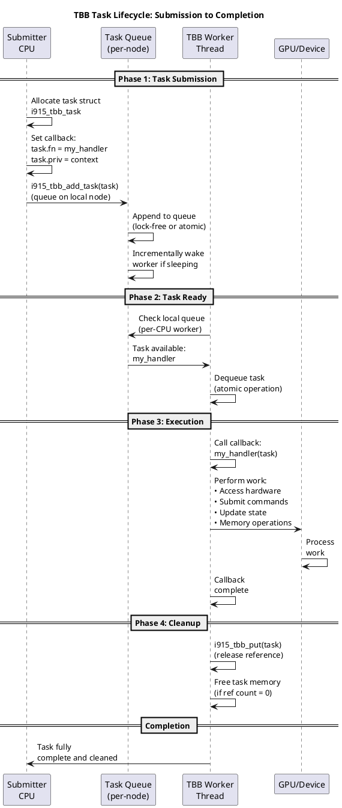
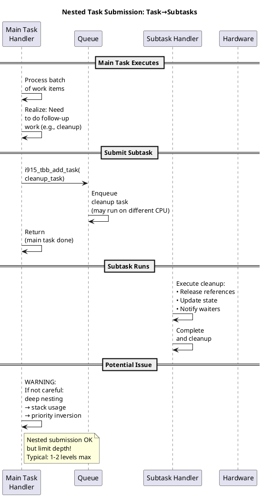
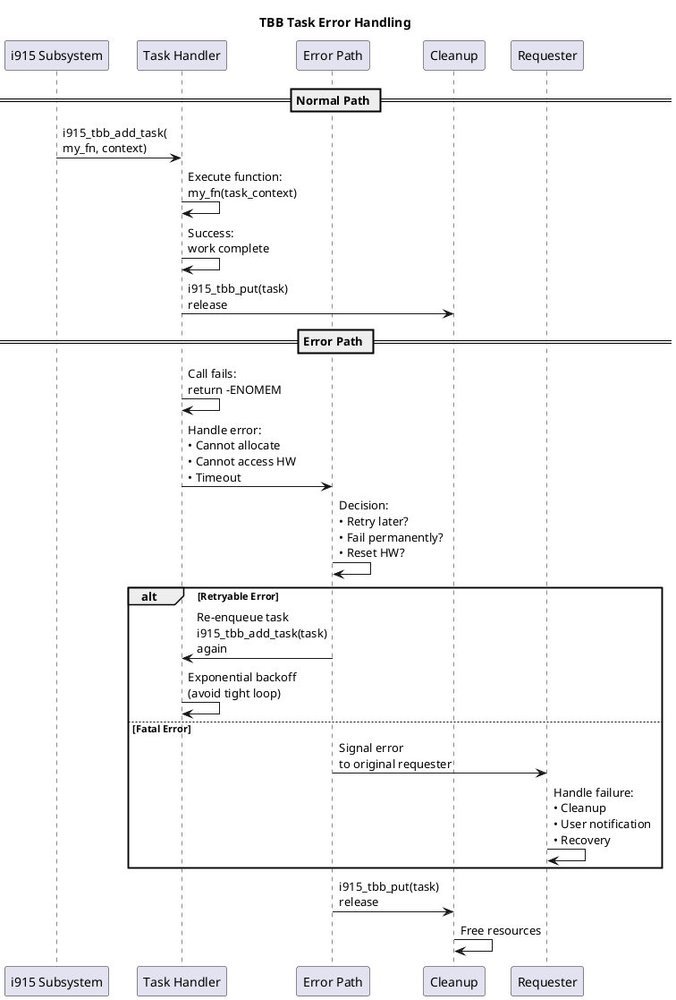
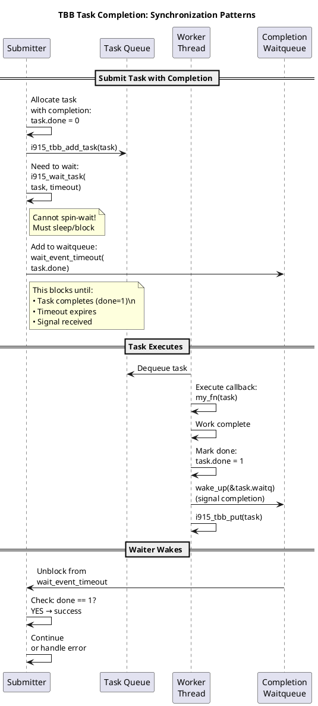

# TBB Implementation Guide - Practical Usage in i915

**Companion Document:** 07-TBB-Task-Scheduling.md  
**Focus:** How to use TBB in i915 driver code  
**Source:** Real implementation patterns from i915 codebase

---

## Table of Contents

1. [Quick Start](#quick-start)
2. [API Reference](#api-reference)
3. [Common Patterns](#common-patterns)
4. [Code Examples](#code-examples)
5. [Error Handling](#error-handling)
6. [Performance Tips](#performance-tips)
7. [Debugging Tips](#debugging-tips)
8. [Pitfalls to Avoid](#pitfalls-to-avoid)

---

## Quick Start

### Minimal Working Example

```c
#include "i915_tbb.h"

// 1. Define callback function
static void my_work_fn(struct i915_tbb *task)
{
    // Do work here
    pr_debug("Executing task work\n");
}

// 2. In your submission path
{
    struct i915_tbb *task = kmalloc(sizeof(*task), GFP_KERNEL);
    if (!task)
        return -ENOMEM;
    
    // 3. Initialize task
    i915_tbb_init_task(task, my_work_fn);
    
    // 4. Submit task
    i915_tbb_add_task(task);
    
    // Task will execute when CPU available
    // Callback is responsible for cleanup
}
```

### Zero-Copy Variant (Embedded Task)

```c
// Task embedded in data structure
struct my_work_data {
    struct i915_tbb task;  // Embedded
    int counter;
    struct mutex lock;
};

static void work_fn(struct i915_tbb *task)
{
    struct my_work_data *data = 
        container_of(task, typeof(*data), task);
    
    // Access data without separate allocation
    mutex_lock(&data->lock);
    data->counter++;
    mutex_unlock(&data->lock);
}

// Usage
{
    struct my_work_data *data = get_data();
    i915_tbb_init_task(&data->task, work_fn);
    i915_tbb_add_task(&data->task);
    // No separate cleanup needed
}
```

---

## API Reference

### Function Signatures

#### `i915_tbb_init_task()`

```c
static inline void i915_tbb_init_task(
    struct i915_tbb *tsk, 
    void (*fn)(struct i915_tbb *task))
```

**Purpose:** Initialize task structure  
**Parameters:**
- `tsk`: Task to initialize
- `fn`: Callback function to execute
**Returns:** void  
**Notes:**
- Must be called before `i915_tbb_add_task()`
- Not required if task is zeroed and fn set manually

#### `i915_tbb_add_task()`

```c
static inline void i915_tbb_add_task(struct i915_tbb *task)
{
    i915_tbb_add_task_on(task, WORK_CPU_UNBOUND);
}
```

**Purpose:** Submit task for execution (late-binding to any CPU)  
**Parameters:**
- `task`: Task to submit
**Returns:** void  
**Guarantees:**
- Task will execute exactly once
- Execution on same or different CPU than caller
- NUMA-aware scheduling

#### `i915_tbb_add_task_on()`

```c
void i915_tbb_add_task_on(struct i915_tbb *task, int cpu)
```

**Purpose:** Submit task with CPU preference  
**Parameters:**
- `task`: Task to submit
- `cpu`: Preferred CPU (WORK_CPU_UNBOUND for any)
**Returns:** void  
**Notes:**
- `cpu` is a preference, not guarantee
- CPU-bound submission still uses late-binding within node

#### `i915_tbb_cancel_task()`

```c
bool i915_tbb_cancel_task(struct i915_tbb *task)
```

**Purpose:** Attempt to cancel task before execution  
**Parameters:**
- `task`: Task to cancel
**Returns:**
- `true`: Task cancelled (never executed)
- `false`: Task executed or executing
**Notes:**
- Only safe if task not accessed after submission
- False return doesn't mean task running (may be completed)

#### `i915_tbb_suspend_local()` / `i915_tbb_resume_local()`

```c
int i915_tbb_suspend_local(void);
void i915_tbb_resume_local(int cpu);
```

**Purpose:** Suspend/resume TBB on current CPU  
**Use Cases:**
- CPU hotplug (suspend before offline)
- High-priority preemption windows
- Power transitions
**Returns (suspend):**
- Current CPU number
**Parameters (resume):**
- `cpu`: CPU to resume (from suspend return)

#### `i915_tbb_node()`

```c
struct i915_tbb_node *i915_tbb_node(int nid)
```

**Purpose:** Get TBB node for NUMA node  
**Parameters:**
- `nid`: NUMA node ID
**Returns:** Pointer to node structure  
**Notes:**
- Returns fallback `&no_node` if invalid
- Used internally by task submission
- Rarely needed in driver code

#### `i915_tbb_allow_spin()`

```c
bool i915_tbb_allow_spin(void)
```

**Purpose:** Check if busy-spinning is safe  
**Returns:**
- `true`: Can safely spin (TBB not overloaded)
- `false`: Should avoid spinning (TBB has pending work)
**Use Cases:**
- GPU wait loops: Decide spin vs sleep
- Optimization: Spin if TBB available, sleep if loaded

#### `i915_tbb_schedule()`

```c
long i915_tbb_schedule(long timeout)
```

**Purpose:** Schedule with TBB awareness  
**Parameters:**
- `timeout`: Timeout for scheduling
**Returns:** Remaining time  
**Behavior:**
- Checks for pending TBB work before scheduling
- Wakes TBB if work available
- Returns from `io_schedule_timeout()`
**Use Cases:**
- Long-latency GPU waits
- Efficient idle detection

---

## Common Patterns

### Pattern 1: Fire-and-Forget Task

```c
// Submit work, don't wait for completion

void schedule_memory_shrink(struct i915_device *dev)
{
    struct i915_tbb *task;
    
    task = kzalloc(sizeof(*task), GFP_KERNEL);
    if (!task)
        return;
    
    i915_tbb_init_task(task, shrink_callback);
    i915_tbb_add_task(task);
    
    // Returns immediately, work happens later
}

static void shrink_callback(struct i915_tbb *task)
{
    // Free task when done
    kfree(task);
}
```

**Characteristics:**
- Asynchronous execution
- Caller doesn't wait
- Callback responsible for cleanup

### Pattern 2: Batch Task with Synchronization

```c
// Submit task, wait for completion

struct batch_work {
    struct i915_tbb task;
    struct completion done;
    int result;
};

void do_batch_work_sync(struct i915_device *dev)
{
    struct batch_work work = {
        .result = -EBUSY,
    };
    
    init_completion(&work.done);
    i915_tbb_init_task(&work.task, batch_callback);
    i915_tbb_add_task(&work.task);
    
    // Wait for completion
    if (wait_for_completion_timeout(&work.done, 
                                    msecs_to_jiffies(1000))) {
        pr_debug("Work completed: %d\n", work.result);
    } else {
        pr_err("Work timeout\n");
    }
}

static void batch_callback(struct i915_tbb *task)
{
    struct batch_work *work = container_of(task, 
                                           typeof(*work), task);
    
    // Do work
    work->result = perform_batch_operation();
    
    // Signal completion
    complete(&work->done);
}
```

**Characteristics:**
- Synchronous from caller's perspective
- Task completes before continue
- Good for critical operations

### Pattern 3: Conditional Task Submission

```c
// Only submit if not already queued

static struct i915_tbb pending_task = {
    .link = LIST_HEAD_INIT(pending_task.link),
};
static DEFINE_SPINLOCK(task_lock);

void schedule_gpu_reset_if_needed(struct i915_device *dev)
{
    unsigned long flags;
    bool already_queued;
    
    spin_lock_irqsave(&task_lock, flags);
    
    // Check if already submitted
    already_queued = !list_empty(&pending_task.link);
    
    if (!already_queued) {
        i915_tbb_init_task(&pending_task, reset_callback);
        i915_tbb_add_task(&pending_task);
    }
    
    spin_unlock_irqrestore(&task_lock, flags);
}

static void reset_callback(struct i915_tbb *task)
{
    perform_gpu_reset();
    
    // Mark as not queued for future submissions
    INIT_LIST_HEAD(&task->link);
}
```

**Characteristics:**
- Prevents duplicate submissions
- Single instance pattern
- Idempotent operations

### Pattern 4: Task with Context Preservation

```c
// Preserve caller context in task

struct i915_tbb_context {
    struct i915_tbb task;
    struct i915_device *dev;
    uint32_t engine_id;
    struct i915_request *request;  // Reference to request
    struct kref ref;
};

static void context_ref_put(struct kref *ref)
{
    struct i915_tbb_context *ctx = container_of(ref,
                                                 typeof(*ctx), ref);
    i915_request_put(ctx->request);
    kfree(ctx);
}

void schedule_request_completion(struct i915_request *req)
{
    struct i915_tbb_context *ctx;
    
    ctx = kzalloc(sizeof(*ctx), GFP_KERNEL);
    if (!ctx)
        return;
    
    kref_init(&ctx->ref);
    i915_request_get(req);
    ctx->request = req;
    ctx->dev = req->engine->i915;
    ctx->engine_id = req->engine->id;
    
    i915_tbb_init_task(&ctx->task, completion_callback);
    i915_tbb_add_task(&ctx->task);
}

static void completion_callback(struct i915_tbb *task)
{
    struct i915_tbb_context *ctx = container_of(task,
                                                 typeof(*ctx), task);
    
    // Use preserved context
    pr_debug("Request %u completed on engine %u\n",
             ctx->request->global_seqno,
             ctx->engine_id);
    
    // Cleanup
    kref_put(&ctx->ref, context_ref_put);
}
```

**Characteristics:**
- Preserves caller's data structures
- Reference counting for safety
- Flexible context capture

### Pattern 5: CPU-Specific Task

```c
// Submit task to specific CPU

void schedule_register_write_on_cpu(
    struct i915_device *dev, 
    unsigned int target_cpu,
    uint32_t reg, uint32_t value)
{
    struct register_write_task *task;
    
    task = kmalloc(sizeof(*task), GFP_KERNEL);
    if (!task)
        return;
    
    task->reg = reg;
    task->value = value;
    task->dev = dev;
    
    i915_tbb_init_task(&task->tbb_task, register_write_fn);
    
    // Submit to specific CPU
    i915_tbb_add_task_on(&task->tbb_task, target_cpu);
}

static void register_write_fn(struct i915_tbb *task)
{
    struct register_write_task *rw = container_of(task,
                                                   typeof(*rw),
                                                   tbb_task);
    
    // Write register
    writel(rw->value, rw->dev->regs + rw->reg);
    
    kfree(rw);
}
```

**Characteristics:**
- CPU-localized execution
- Still uses late-binding within node
- Good for MMIO operations

---

## Deep Dive: TBB Usage Patterns

### Task Submission and Execution Timeline



### TBB Task in i915: Typical Usage Flow

```plantuml
@startuml
title i915 TBB Usage: Real-World Pattern

rectangle "i915 Codepath\n(e.g., Memory Shrinking)" {
  participant "Shrinker Callback" as shrinker
  participant "TBB Task Queue" as tbb
  participant "Worker Thread" as worker
  participant "Memory Region" as memregion
}

== Trigger: Memory Pressure ==

shrinker -> shrinker: i915_gem_shrinker_scan()\ncalled by memory subsystem

shrinker -> shrinker: Calculate:\nfreeable memory needed

shrinker -> shrinker: Cannot free\nfrom atomic context\n(shrink callback)

== Defer Work ==

shrinker -> tbb: Schedule async work:\ni915_tbb_add_task(\nevict_objects_task)

tbb -> tbb: Enqueue task\non local NUMA node

tbb -> shrinker: Return immediately\n(not blocking)

shrinker -> shrinker: Return to\nmemory subsystem

== Async Execution ==

worker -> tbb: Pop task\nfrom queue

worker -> memregion: Execute eviction:\n• Select LRU objects\n• Unmap from GPU\n• Free physical pages

memregion -> memregion: Objects evicted\nmemory freed

worker -> worker: Task complete\ncleanup

== Impact ==

shrinker -> shrinker: Memory pressure\nresolved in background\n(non-blocking)

note right of shrinker
Key benefit:
Shrinking doesn't block
atomic context
memory allocation
responsive system
end note

@enduml
```

### Nested Task Submission: TBB Inside TBB



### Error Handling in TBB Tasks



### TBB with Synchronization: Waiting for Tasks



---

## Code Examples

### Example 1: Memory Pressure Handler

```c
// Real-world example: Handle memory pressure with TBB

struct i915_memory_shrink_task {
    struct i915_tbb task;
    struct i915_device *dev;
    struct kref ref;
    int freed_pages;
    int error;
};

void i915_gem_shrink_worker(void)
{
    struct i915_memory_shrink_task *task;
    
    task = kzalloc(sizeof(*task), GFP_KERNEL);
    if (!task)
        return;
    
    // Get device reference
    task->dev = get_device_ref();
    kref_init(&task->ref);
    task->freed_pages = 0;
    task->error = 0;
    
    i915_tbb_init_task(&task->task, shrink_memory_fn);
    i915_tbb_add_task(&task->task);
}

static void shrink_memory_fn(struct i915_tbb *task)
{
    struct i915_memory_shrink_task *shrink =
        container_of(task, typeof(*shrink), task);
    struct i915_device *dev = shrink->dev;
    
    // Scan memory regions
    shrink->freed_pages = 0;
    
    // Look for evictable objects
    list_for_each_entry(obj, &dev->mm.objects, list) {
        if (obj->mm.pages && !obj->mm.pinned) {
            i915_gem_object_evict(obj);
            shrink->freed_pages += obj->mm.page_count;
        }
    }
    
    if (shrink->freed_pages > 0) {
        pr_debug("Memory shrink freed %d pages\n", 
                 shrink->freed_pages);
    }
    
    // Cleanup
    put_device_ref(shrink->dev);
    kfree(shrink);
}
```

### Example 2: GPU Error Handling

```c
// Error handling with TBB for asynchronous capture

struct i915_gpu_error_capture {
    struct i915_tbb task;
    struct i915_device *dev;
    struct i915_gpu_error_state *error_state;
    unsigned long flags;
};

void i915_gpu_error_capture_async(struct i915_device *dev)
{
    struct i915_gpu_error_capture *capture;
    
    capture = kzalloc(sizeof(*capture), GFP_KERNEL);
    if (!capture)
        return;
    
    capture->dev = dev;
    capture->flags = jiffies;
    
    i915_tbb_init_task(&capture->task, capture_error_state);
    i915_tbb_add_task(&capture->task);
}

static void capture_error_state(struct i915_tbb *task)
{
    struct i915_gpu_error_capture *capture =
        container_of(task, typeof(*capture), task);
    struct i915_device *dev = capture->dev;
    
    // Capture GPU error state
    mutex_lock(&dev->error_capture_lock);
    
    // Collect registers
    capture->error_state = collect_gpu_registers(dev);
    
    // Analyze state
    analyze_gpu_hang(capture->error_state);
    
    // Store for debugging
    dev->last_error_state = capture->error_state;
    
    mutex_unlock(&dev->error_capture_lock);
    
    pr_err("GPU error captured at %lu\n", capture->flags);
    
    kfree(capture);
}
```

### Example 3: Batch Register Update

```c
// Batch multiple register updates into single TBB task

struct i915_register_update {
    uint32_t reg;
    uint32_t value;
    struct list_head link;
};

struct i915_batch_register_update {
    struct i915_tbb task;
    struct list_head updates;
    spinlock_t lock;
    struct i915_device *dev;
};

static struct i915_batch_register_update batch_update = {
    .updates = LIST_HEAD_INIT(batch_update.updates),
    .lock = __SPIN_LOCK_UNLOCKED(batch_update.lock),
};

void queue_register_update(struct i915_device *dev,
                          uint32_t reg, uint32_t value)
{
    struct i915_register_update *update;
    unsigned long flags;
    bool need_schedule = false;
    
    update = kmalloc(sizeof(*update), GFP_KERNEL);
    if (!update)
        return;
    
    update->reg = reg;
    update->value = value;
    
    spin_lock_irqsave(&batch_update.lock, flags);
    
    // Add to batch queue
    list_add_tail(&update->link, &batch_update.updates);
    
    // Schedule task if first update in batch
    if (list_is_singular(&batch_update.updates)) {
        need_schedule = true;
        batch_update.dev = dev;
    }
    
    spin_unlock_irqrestore(&batch_update.lock, flags);
    
    if (need_schedule) {
        i915_tbb_init_task(&batch_update.task, 
                          apply_register_updates);
        i915_tbb_add_task(&batch_update.task);
    }
}

static void apply_register_updates(struct i915_tbb *task)
{
    struct i915_batch_register_update *batch =
        container_of(task, typeof(*batch), task);
    unsigned long flags;
    struct i915_register_update *update, *tmp;
    
    spin_lock_irqsave(&batch->lock, flags);
    
    // Apply all pending updates
    list_for_each_entry_safe(update, tmp, &batch->updates, link) {
        writel(update->value, 
               batch->dev->regs + update->reg);
        
        list_del(&update->link);
        kfree(update);
    }
    
    spin_unlock_irqrestore(&batch->lock, flags);
    
    pr_debug("Applied batch register updates\n");
}
```

---

## Error Handling

### Safe Task Cancellation

```c
// Correct way to cancel a task

bool safe_cancel_task(struct i915_tbb *task)
{
    // Try to cancel
    if (i915_tbb_cancel_task(task)) {
        // Successfully cancelled - task never ran
        kfree(task);
        return true;
    }
    
    // Task executed or executing
    // Callback is responsible for cleanup
    return false;
}

// Usage
if (!safe_cancel_task(my_task)) {
    // Let callback clean up
    wait_for_callback();
}
```

### Handling Submission Failure

```c
// Memory allocation failure handling

struct work_context {
    struct i915_tbb task;
    void (*cleanup_fn)(struct work_context *);
};

int try_schedule_work(struct i915_device *dev,
                      void (*work_fn)(struct i915_tbb *),
                      void (*cleanup_fn)(struct work_context *))
{
    struct work_context *ctx;
    
    ctx = kzalloc(sizeof(*ctx), GFP_KERNEL);
    if (!ctx) {
        pr_err("Failed to allocate work context\n");
        return -ENOMEM;
    }
    
    ctx->cleanup_fn = cleanup_fn;
    i915_tbb_init_task(&ctx->task, work_fn);
    i915_tbb_add_task(&ctx->task);
    
    return 0;
}
```

### Timeout Handling

```c
// Work with timeout

int do_work_with_timeout(struct i915_device *dev, 
                        unsigned long timeout_ms)
{
    struct work_context *ctx;
    struct completion done;
    int result = -ETIME;
    
    ctx = kzalloc(sizeof(*ctx), GFP_KERNEL);
    if (!ctx)
        return -ENOMEM;
    
    init_completion(&ctx->done);
    
    i915_tbb_init_task(&ctx->task, work_with_completion);
    i915_tbb_add_task(&ctx->task);
    
    // Wait with timeout
    if (wait_for_completion_timeout(&ctx->done,
                                    msecs_to_jiffies(timeout_ms))) {
        result = ctx->result;
    } else {
        // Timeout
        pr_warn("Work timeout after %lu ms\n", timeout_ms);
        
        // Try to cancel (may already be executing)
        i915_tbb_cancel_task(&ctx->task);
    }
    
    kfree(ctx);
    return result;
}
```

---

## Performance Tips

### Tip 1: Use Embedded Tasks

```c
// SLOW: Separate allocation
struct task_data *data = kmalloc(sizeof(*data), GFP_KERNEL);
struct i915_tbb *task = kmalloc(sizeof(*task), GFP_KERNEL);

// FAST: Embedded task
struct task_data {
    struct i915_tbb task;  // Embedded
    // ... rest of structure
} data;
```

**Benefit:** Single allocation, better cache locality

### Tip 2: Batch Similar Work

```c
// SLOW: Individual task per operation
for (i = 0; i < 1000; i++) {
    struct i915_tbb *task = kmalloc(...);
    i915_tbb_init_task(task, operation);
    i915_tbb_add_task(task);  // 1000 submissions
}

// FAST: Batch operations
struct batch {
    struct i915_tbb task;
    struct list_head items;  // 1000 items
};

batch.items = collect_operations();
i915_tbb_init_task(&batch.task, batch_operation);
i915_tbb_add_task(&batch.task);  // Single submission
```

**Benefit:** Reduced lock contention, better batching

### Tip 3: Avoid Frequent Wakeups

```c
// SLOW: Wake on every task
for (i = 0; i < 1000; i++) {
    i915_tbb_add_task(&tasks[i]);  // 1000 wakeups
}

// FAST: Batch additions
// TBB automatically coalesces wakeups when tasks queued together
// Just keep adding; final task triggers single wakeup
```

**Benefit:** Fewer context switches

### Tip 4: Choose Right Callback Pattern

```c
// PATTERN A: Callback does all work
static void work_fn(struct i915_tbb *task) {
    do_work();
    kfree(task);
}
// PRO: Simple, self-contained
// CON: Callback can't return status

// PATTERN B: Completion-based
static void work_fn(struct i915_tbb *task) {
    struct context *ctx = container_of(task, ...);
    ctx->result = do_work();
    complete(&ctx->done);
}
// PRO: Caller can wait for result
// CON: More complex setup

// PATTERN C: Context preservation
static void work_fn(struct i915_tbb *task) {
    struct context *ctx = container_of(task, ...);
    ctx->result = do_work();
    queue_event(ctx->event);  // Notify elsewhere
}
// PRO: Decoupled, asynchronous notification
// CON: Requires event system
```

---

## Debugging Tips

### Tip 1: Verify Task Execution

```c
// Use markers to verify task ran

struct debug_task {
    struct i915_tbb task;
    unsigned long submitted_at;
    unsigned long executed_at;
};

static void debug_callback(struct i915_tbb *task)
{
    struct debug_task *dt = container_of(task, typeof(*dt), task);
    
    dt->executed_at = jiffies;
    unsigned long latency = dt->executed_at - dt->submitted_at;
    
    pr_debug("Task latency: %lu jiffies\n", latency);
}

// When submitting
dt->submitted_at = jiffies;
i915_tbb_init_task(&dt->task, debug_callback);
i915_tbb_add_task(&dt->task);
```

### Tip 2: Track Task State

```c
// Enum for task state tracking

enum task_state {
    TASK_CREATED,
    TASK_QUEUED,
    TASK_EXECUTING,
    TASK_COMPLETED,
};

struct state_tracked_task {
    struct i915_tbb task;
    enum task_state state;
};

// In callback
static void track_callback(struct i915_tbb *task)
{
    struct state_tracked_task *st = container_of(task, typeof(*st), task);
    
    st->state = TASK_EXECUTING;
    // ... work ...
    st->state = TASK_COMPLETED;
}

// Submit
st->state = TASK_QUEUED;
i915_tbb_add_task(&st->task);
```

### Tip 3: Use SysRq Dumps

```bash
# Enable TBB debug output
echo t > /proc/sysrq-trigger

# Look for TBB output in dmesg
dmesg | grep "TBB\|Threads"
```

### Tip 4: Measure Performance Impact

```c
// Simple timing macro

#define TBB_TIME_START(var) \
    unsigned long var = get_jiffies_64()

#define TBB_TIME_END(var, label) \
    pr_debug("%s: %lu cycles\n", label, get_jiffies_64() - var)

// Usage
{
    TBB_TIME_START(t1);
    i915_tbb_add_task(&task);
    TBB_TIME_END(t1, "task_submission");
}
```

---

## Pitfalls to Avoid

### Pitfall 1: Accessing Task After Submission

```c
// WRONG: Task might be executing/completed
struct i915_tbb *task = kmalloc(...);
i915_tbb_init_task(task, callback);
i915_tbb_add_task(task);
task->data = 42;  // WRONG! Race condition

// RIGHT: Set data before submission
task->data = 42;  // Set before
i915_tbb_add_task(task);

// Or: Use container_of in callback
struct context {
    struct i915_tbb task;
    int data;  // Protected by context lifetime
};

context->data = 42;
i915_tbb_init_task(&context->task, callback);
i915_tbb_add_task(&context->task);
```

### Pitfall 2: Not Freeing Allocated Tasks

```c
// WRONG: Memory leak
void schedule_work(void)
{
    struct i915_tbb *task = kmalloc(sizeof(*task), GFP_KERNEL);
    i915_tbb_init_task(task, callback);
    i915_tbb_add_task(task);
    // Never frees task!
}

// RIGHT: Free in callback
static void callback(struct i915_tbb *task)
{
    // Do work
    kfree(task);
}

// Or: Use embedded task
struct my_data {
    struct i915_tbb task;
    // ... other fields
};
// Freed with parent structure
```

### Pitfall 3: Blocking in Callback

```c
// WRONG: Blocks thread pool
static void blocking_callback(struct i915_tbb *task)
{
    // This blocks the CPU and delays other tasks!
    down(&slow_semaphore);  // WRONG
    msleep(100);             // WRONG
    wait_event(...);         // WRONG
}

// RIGHT: Use completion
static void async_callback(struct i915_tbb *task)
{
    // Do quick work
    schedule_async_operation();
    
    // Don't wait for result
    // It will notify us later
}

// Or: Use different thread pool for blocking work
```

### Pitfall 4: Task Executed Multiple Times

```c
// WRONG: Task queued multiple times
for (int i = 0; i < 10; i++) {
    i915_tbb_add_task(&shared_task);  // WRONG!
}
// Task might execute multiple times!

// RIGHT: Use reference counting or new task per submission
for (int i = 0; i < 10; i++) {
    struct i915_tbb *task = kmalloc(...);
    i915_tbb_init_task(task, callback);
    i915_tbb_add_task(task);  // Each task unique
}

// Or: Design task to be idempotent
static bool task_submitted = false;

if (!task_submitted) {
    task_submitted = true;
    i915_tbb_add_task(&shared_task);
}
```

### Pitfall 5: Ignoring NUMA Affinity

```c
// SUBOPTIMAL: Cross-NUMA access
struct large_data {
    struct i915_tbb task;
    char buffer[1024];  // NUMA-remote allocation
};

data = kzalloc(sizeof(*large_data), GFP_KERNEL);
// Buffer might be on different NUMA node than execution!

// BETTER: NUMA-local allocation
data = kmalloc_node(sizeof(*large_data), 
                    GFP_KERNEL, 
                    cpu_to_node(raw_smp_processor_id()));

// Or: Accept cross-NUMA cost if work is CPU-light
```

---

## Quick Reference Checklist

```
[ ] Task initialized before submission
    i915_tbb_init_task(&task, callback)

[ ] Task data set before submission
    task->data = value; then i915_tbb_add_task()

[ ] Memory allocated for separate tasks
    for each submission: new kmalloc() call

[ ] Callback frees allocated memory
    static void callback(...) { kfree(task); }

[ ] No blocking operations in callback
    No mutex_lock, semaphore, wait_event

[ ] No assumptions about execution timing
    Callback might execute immediately or later

[ ] Cancellation handled correctly
    if (!i915_tbb_cancel_task()) { wait_for_callback(); }

[ ] NUMA locality considered
    Data should be near execution CPU if possible

[ ] Statistics checked for debugging
    Use SysRq to view pending tasks and statistics

[ ] Error paths tested
    Memory allocation failures handled
```

---

**End of Implementation Guide**
