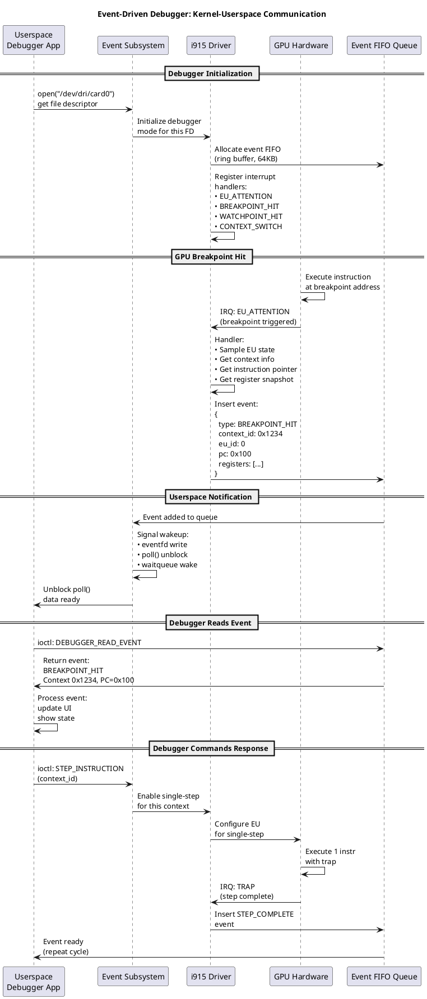
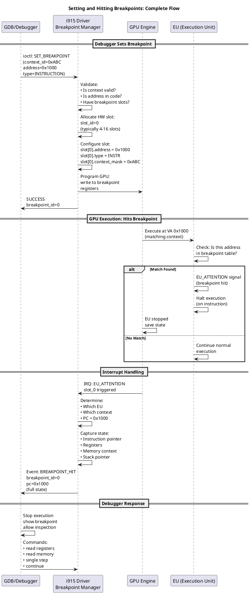
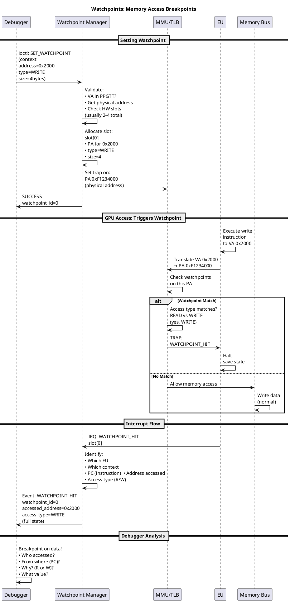
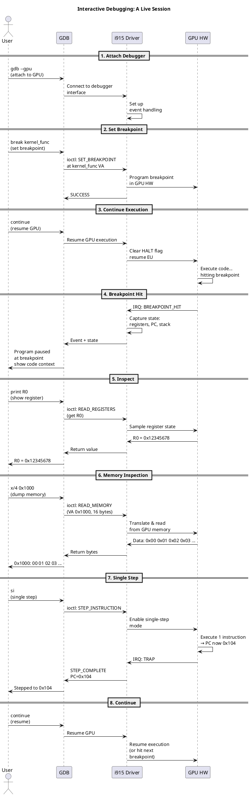

# Intel i915 GPU Debugger: Implementation & Practical Guide

**Date:** February 6, 2026  
**Status:** Complete  
**Focus:** Practical usage, API reference, real-world examples, and debugging patterns

---

## Table of Contents

1. [Quick Start](#quick-start)
2. [API Reference](#api-reference)
3. [Error State Access Patterns](#error-state-access-patterns)
4. [Hang Detection & Recovery](#hang-detection--recovery)
5. [Debugger Protocol Usage](#debugger-protocol-usage)
6. [Firmware Debugging](#firmware-debugging)
7. [Common Debugging Scenarios](#common-debugging-scenarios)
8. [Error Handling & Edge Cases](#error-handling--edge-cases)
9. [Performance Tuning](#performance-tuning)
10. [Real-World Examples](#real-world-examples)

---

## Quick Start

### 5-Minute Setup for GPU Debugging

#### **1. Enable Debug Logging**

```bash
# Enable GuC logging (firmware visibility)
echo 2 > /sys/kernel/debug/dri/0/gt0/uc/guc_log_level

# Reduce heartbeat timeout for faster hang detection
echo 500 > /sys/kernel/debug/dri/0/gt0/heartbeat_interval_ms

# Optional: Stream GuC logs in real-time
cat /sys/kernel/debug/dri/0/gt0/uc/guc_log_dump > /tmp/guc_logs.txt &
```

#### **2. Trigger & Capture Error State**

```bash
# Your GPU-using application
./glxgears &
GLXGEARS_PID=$!

# Wait for hang (or artificially trigger reset for testing)
sleep 10

# Capture error state
cat /sys/kernel/debug/dri/0/i915_error_state > /tmp/error_state.txt

# Check reset counts
cat /sys/class/drm/card0/error/reset_count
# Output: 2 (number of times GPU reset)
```

#### **3. Analyze State**

```bash
# View error capture
head -100 /tmp/error_state.txt

# Check engine state
grep -A 5 "Engine:" /tmp/error_state.txt

# Look for faults
grep -i "fault\|error\|hung" /tmp/error_state.txt
```

---

## API Reference

### Core Functions for Error Capture

#### **`i915_capture_error_state()` - Trigger Manual Capture**

```c
#include <drm/drm_print.h>
#include "i915_gpu_error.h"

// Capture GPU state immediately (usually called on hang)
struct i915_gpu_coredump *coredump = i915_capture_error_state(i915);

if (coredump) {
    // Process the coredump
    struct drm_printer p = drm_info_printer(i915_info);
    i915_error_state_printf(coredump, &p);
    
    // Clean up
    i915_gpu_coredump_put(coredump);
}
```

#### **`i915_error_state_store()` - Save Error State**

```c
// Store error state for debugfs access (automatic, but can be manual)
void show_error_state(struct drm_i915_private *i915)
{
    struct i915_gpu_coredump *coredump;
    
    coredump = i915_capture_error_state(i915);
    if (coredump) {
        i915_error_state_store(i915, coredump);
        i915_gpu_coredump_put(coredump);
    }
}
```

### Heartbeat Control Functions

#### **`intel_engine_park()` / `intel_engine_unpark()`**

```c
#include "gt/intel_engine_heartbeat.h"

// Disable heartbeat (for idle engines)
void idle_engine(struct intel_engine_cs *engine)
{
    intel_engine_park(engine);
    // Heartbeat stopped, no more periodic pulses
    // Reduces power consumption for idle GPU
}

// Re-enable heartbeat
void wake_engine(struct intel_engine_cs *engine)
{
    intel_engine_unpark(engine);
    // Heartbeat resumes normal operation
}
```

#### **`intel_engine_heartbeat_create()` / `intel_engine_heartbeat_cancel()`**

```c
#include "gt/intel_engine_heartbeat.h"

// During engine initialization
struct intel_engine_cs *engine = ...;

// Create heartbeat with default interval
int err = intel_engine_heartbeat_create(engine);
if (err) {
    drm_err(&i915->drm, "Failed to create heartbeat: %d\n", err);
    return err;
}

// Later, during cleanup
intel_engine_heartbeat_cancel(engine);
// Heartbeat deallocated and work queue cancelled
```

### Userspace Debugger Protocol

#### **`I915_DEBUGGER_OPEN` - Establish Debugger Session**

```c
#include "i915_debugger.h"

// Userspace code
struct i915_debugger_open_param {
    __u32 pid;                  // Process ID (debugger process)
    __u32 client_fd;            // DRM client fd
    __u32 event_fifo_size;      // 16-4096 entries
    __u32 flags;                // Currently 0
    __u64 __reserved;           // For future extensions
};

struct i915_debugger_open_param param = {
    .client_fd = open("/dev/dri/renderD128", O_RDWR),
    .event_fifo_size = 256,     // Moderate event buffering
    .flags = 0,
};

int event_fd = ioctl(client_fd, I915_DEBUGGER_OPEN, &param);
if (event_fd < 0) {
    perror("I915_DEBUGGER_OPEN");
    return;
}

// Use event_fd for polling/reading events
// struct pollfd pfd = {event_fd, POLLIN, 0};
// poll(&pfd, 1, -1);  // Wait for events
```

#### **`I915_UUID_REGISTER` - Register Debuggable Resource**

```c
#include "i915_debugger.h"

// Register a GPU object for debugging
struct i915_uuid_resource {
    uuid_t uuid;                    // Must be unique
    struct drm_gem_object *obj;     // GPU object to track
    struct drm_file *file;          // Client owning object
};

int register_debuggable_object(int drm_fd, uuid_t uuid, uint32_t handle)
{
    struct drm_i915_gem_register_uuid_ioctl {
        uuid_t uuid;
        __u32 handle;
        __u32 __reserved[3];
    } param = {};
    
    uuid_copy(param.uuid, uuid);
    param.handle = handle;
    
    if (ioctl(drm_fd, DRM_IOCTL_I915_UUID_REGISTER, &param) < 0) {
        perror("I915_UUID_REGISTER");
        return -errno;
    }
    return 0;
}

// Unregister when done
int unregister_debuggable_object(int drm_fd, uuid_t uuid)
{
    struct drm_i915_gem_register_uuid_ioctl param = {};
    uuid_copy(param.uuid, uuid);
    
    if (ioctl(drm_fd, DRM_IOCTL_I915_UUID_UNREGISTER, &param) < 0) {
        perror("I915_UUID_UNREGISTER");
        return -errno;
    }
    return 0;
}
```

#### **Reading Debugger Events**

```c
#include "i915_debugger.h"

int read_debugger_events(int event_fd)
{
    struct i915_debugger_event event;
    ssize_t nbytes;
    
    // Read events until EAGAIN
    while ((nbytes = read(event_fd, &event, sizeof(event))) > 0) {
        switch (event.type) {
        case I915_DEBUGGER_EVENT_CLIENT:
            printf("CLIENT CREATE/DESTROY: handle=%llu\n", 
                   event.client_handle);
            break;
            
        case I915_DEBUGGER_EVENT_CONTEXT:
            printf("CONTEXT CREATE: client=%llu context=%llu\n",
                   event.client_handle, event.context_handle);
            break;
            
        case I915_DEBUGGER_EVENT_EU_ATTENTION:
            printf("EU ATTENTION: engine=%d attention_mask=0x%llx\n",
                   event.eu_attention.engine_class,
                   event.eu_attention.eu_attention);
            break;
            
        case I915_DEBUGGER_EVENT_PAGEFAULT:
            printf("PAGEFAULT: addr=0x%llx type=%d eu_mask=0x%llx\n",
                   event.pagefault.page_addr,
                   event.pagefault.fault_type,
                   event.pagefault.eu_attention);
            break;
            
        default:
            printf("Unknown event: %d\n", event.type);
        }
    }
    
    if (nbytes < 0 && errno != EAGAIN) {
        perror("read");
        return -errno;
    }
    return 0;
}
```

---

## Error State Access Patterns

### Pattern 1: Parse Error State from Debugfs

```bash
#!/bin/bash
# Extract specific information from error state

ERROR_STATE_FILE="/sys/kernel/debug/dri/0/i915_error_state"

# Extract engine state
echo "=== Engine Information ==="
grep -A 20 "^Engine:" "$ERROR_STATE_FILE" | head -25

# Extract active process
echo "=== Active Process ==="
grep "comm\|pid\|uid" "$ERROR_STATE_FILE" | head -10

# Extract registers
echo "=== Register State ==="
grep "head\|tail\|status\|IP\|seqno" "$ERROR_STATE_FILE" | head -20

# Look for faults
echo "=== Faults ==="
grep -i "fault\|error\|hung\|eir\|pgtbl" "$ERROR_STATE_FILE"

# Check reset information
echo "=== Reset Info ==="
grep -i "reset" "$ERROR_STATE_FILE" | head -10
```

### Pattern 2: C API for Error State Processing

```c
#include <stdio.h>
#include <string.h>
#include "i915_gpu_error.h"

void analyze_error_state(struct drm_i915_private *i915)
{
    struct i915_gpu_coredump *coredump;
    struct intel_gt_coredump *gt;
    struct intel_engine_coredump *engine;
    
    coredump = i915_gpu_coredump_alloc(i915, GFP_KERNEL);
    if (!coredump)
        return;
    
    // Iterate over GTs (GPU tiles)
    for_each_coredump_gt(coredump, gt) {
        drm_printf(&p, "GT %d: fault_data=0x%x\n", 
                   gt->coredump_gt_index,
                   gt->fault_data);
        
        // Iterate over engines
        for_each_coredump_engine(gt, engine) {
            drm_printf(&p, "  Engine %s:\n", engine->name);
            drm_printf(&p, "    Active: %s (PID %d)\n", 
                       engine->ctx.comm, engine->ctx.pid);
            drm_printf(&p, "    Seqno: 0x%llx\n", engine->rseqno);
            drm_printf(&p, "    IP: 0x%08x\n", engine->reg.ip);
        }
    }
    
    i915_gpu_coredump_put(coredump);
}
```

### Pattern 3: Monitor Error Count

```bash
#!/bin/bash
# Monitor GPU resets in real-time

RESET_FILE="/sys/class/drm/card0/error/reset_count"
PREV_COUNT=0

echo "Monitoring GPU resets..."
while true; do
    CURR_COUNT=$(cat "$RESET_FILE")
    
    if [ "$CURR_COUNT" -gt "$PREV_COUNT" ]; then
        echo "[$(date)] GPU RESET: count=$CURR_COUNT"
        
        # Capture error state on reset
        cat /sys/kernel/debug/dri/0/i915_error_state \
            > "/tmp/error_state_$(date +%s).txt"
        
        PREV_COUNT=$CURR_COUNT
    fi
    
    sleep 1
done
```

---

## Hang Detection & Recovery

### Tuning Heartbeat for Responsiveness

```bash
#!/bin/bash
# Configure hang detection sensitivity

GPU_DEBUG="/sys/kernel/debug/dri/0/gt0"

# Default conservative settings
echo "=== Conservative (default) ==="
echo 2500 > "$GPU_DEBUG/heartbeat_interval_ms"   # Check every 2.5s
echo 650 > "$GPU_DEBUG/preempt_timeout_ms"       # Preempt for 650ms
echo "Heartbeat: 2500ms, Preemption: 650ms"

# Aggressive settings (for interactive debugging)
echo "=== Aggressive (debugging) ==="
echo 500 > "$GPU_DEBUG/heartbeat_interval_ms"    # Check every 500ms
echo 100 > "$GPU_DEBUG/preempt_timeout_ms"       # Preempt for 100ms only
echo "Heartbeat: 500ms, Preemption: 100ms"

# Ultra-responsive (for testing)
echo "=== Ultra-responsive (testing only) ==="
echo 100 > "$GPU_DEBUG/heartbeat_interval_ms"    # Check every 100ms
echo 50 > "$GPU_DEBUG/preempt_timeout_ms"        # Preempt for 50ms
echo "Heartbeat: 100ms, Preemption: 50ms"
```

### Pattern: Reset Monitoring

```c
#include <time.h>
#include <sysfs/libsysfs.h>

#define RESET_COUNT_PATH "/sys/class/drm/card0/error/reset_count"

void monitor_resets(void)
{
    int fd = open(RESET_COUNT_PATH, O_RDONLY);
    if (fd < 0) {
        perror("open reset_count");
        return;
    }
    
    char buf[32];
    int prev_count = 0;
    
    while (1) {
        lseek(fd, 0, SEEK_SET);
        ssize_t n = read(fd, buf, sizeof(buf) - 1);
        if (n > 0) {
            buf[n] = '\0';
            int count = atoi(buf);
            
            if (count > prev_count) {
                struct timespec ts;
                clock_gettime(CLOCK_REALTIME, &ts);
                
                printf("[%ld.%03ld] GPU RESET #%d\n",
                       ts.tv_sec, ts.tv_nsec / 1000000, count);
                
                prev_count = count;
                
                // Capture error state
                system("cat /sys/kernel/debug/dri/0/i915_error_state "
                       "> /tmp/error_$(date +%s).txt");
            }
        }
        
        sleep(1);
    }
    
    close(fd);
}
```

---

## Deep Dive: Event-Driven Debugging

### Event-Driven Debugger: Architecture and Communication



### Breakpoint Setting and Hit Flow



### Memory Watchpoint Architecture



### State Capture During Hang: Detailed Process

```plantuml
@startuml
title Error Capture Process: From Hang to Analysis

participant "Watchdog" as wd
participant "Hang Detector" as detector
participant "State Capturer" as capturer
participant "Coredump Buffer" as coredump
participant "Analysis Tool" as analyzer

== Hang Detected ==

wd -> wd: Timeout: No completion\nfor 2.5 seconds

wd -> detector: Hang detected\n(mark timestamp)

== Immediately Capture ==

detector -> capturer: i915_gpu_error_\nstate_alloc()

capturer -> coredump: Allocate buffer\n(2-3MB)

== Device State ==

capturer -> coredump: Capture device-level:\n• i915 version\n• HW capabilities\n• GPU SKU\n• L3 cache size\n• EU count

== Engine State ==

capturer -> coredump: For each engine:\n• Ring buffers\n  (head/tail ptrs)\n• Ring contents\n  (commands around IP)\n• Engine status\n• Wait-for-sync state

== Context State ==

capturer -> coredump: For hung context:\n• LRC snapshot\n• Page table base\n• Instruction pointer\n• Registers\n• Hang timestamp

== TLB/Fault State ==

capturer -> coredump: Memory fault info:\n• Fault address\n• Fault type\n• Page table walk\n• PPGTT state

== Batch Buffer ==

capturer -> coredump: Batch around fault:\n• Instructions before\n• Instruction at fault\n• Instructions after\n• Command stream state

== GuC State ==n
capturer -> coredump: GuC/HuC state:\n• GuC log dump\n• HuC state\n• Context descriptors\n• Work queue state

== Compress & Store ==

coredump -> coredump: Compress error state\n(zlib compression)\nreduce size

coredump -> coredump: Store in kernel\nmemory (debugfs)\n(/proc/i915/error)

== Analysis ==

analyzer -> coredump: Read error state\nvia /proc/i915/error\nor ioctl

analyzer -> analyzer: Analyze:\n• Where was GPU?\n• What was executing?\n• What failed?\n• Why did it hang?\n• Root cause?

analyzer -> analyzer: Generate report:\n• Timeline\n• Hypothesis\n• Recommendations

@enduml
```

### Interactive Debugging Session: Step-by-Step



---

## Debugger Protocol Usage

### Complete Userspace Debugger Example

```c
#include <fcntl.h>
#include <poll.h>
#include <string.h>
#include "i915_debugger.h"

struct gpu_debugger {
    int drm_fd;
    int event_fd;
    struct pollfd *pfds;
    size_t num_clients;
};

// Initialize debugger session
int gpu_debugger_init(struct gpu_debugger *dbg, const char *drm_dev)
{
    // Open DRM device
    dbg->drm_fd = open(drm_dev, O_RDWR | O_CLOEXEC);
    if (dbg->drm_fd < 0) {
        perror("open drm_dev");
        return -1;
    }
    
    // Open debugger session
    struct i915_debugger_open_param param = {
        .event_fifo_size = 256,
        .flags = 0,
    };
    
    dbg->event_fd = ioctl(dbg->drm_fd, I915_DEBUGGER_OPEN, &param);
    if (dbg->event_fd < 0) {
        perror("I915_DEBUGGER_OPEN");
        close(dbg->drm_fd);
        return -1;
    }
    
    return 0;
}

// Process events from GPU
void gpu_debugger_handle_events(struct gpu_debugger *dbg)
{
    struct i915_debugger_event event;
    
    while (read(dbg->event_fd, &event, sizeof(event)) > 0) {
        printf("[Event] timestamp=%llu type=%d client=%llu\n",
               event.timestamp, event.type, event.client_handle);
        
        switch (event.type) {
        case I915_DEBUGGER_EVENT_CLIENT:
            printf("  CLIENT: action=%s\n",
                   event.flags & 0x1 ? "create" : "destroy");
            break;
            
        case I915_DEBUGGER_EVENT_EU_ATTENTION:
            // Compute shader stalled, can inspect EU state
            printf("  EU_ATTENTION: mask=0x%llx\n",
                   event.eu_attention.eu_attention);
            // Could pause execution, inspect registers, etc.
            break;
            
        case I915_DEBUGGER_EVENT_PAGEFAULT:
            // GPU page fault occurred
            printf("  PAGEFAULT: addr=0x%llx fault_type=%d\n",
                   event.pagefault.page_addr,
                   event.pagefault.fault_type);
            // Could log to debug system, trigger diagnostics
            break;
            
        default:
            printf("  [type %d]\n", event.type);
        }
    }
}

// Main loop
int main(void)
{
    struct gpu_debugger dbg = {};
    
    if (gpu_debugger_init(&dbg, "/dev/dri/renderD128") < 0)
        return 1;
    
    printf("GPU Debugger initialized, waiting for events...\n");
    
    struct pollfd pfd = {dbg.event_fd, POLLIN, 0};
    
    // Run until interrupted
    while (1) {
        if (poll(&pfd, 1, 5000) > 0) {
            if (pfd.revents & POLLIN) {
                gpu_debugger_handle_events(&dbg);
            }
        } else {
            printf(".");
            fflush(stdout);
        }
    }
    
    close(dbg.event_fd);
    close(dbg.drm_fd);
    return 0;
}
```

---

## Firmware Debugging

### GuC Log Inspection

```bash
#!/bin/bash
# Real-time GuC firmware log monitoring

GUC_LOG="/sys/kernel/debug/dri/0/gt0/uc/guc_log_dump"
GUC_LEVEL="/sys/kernel/debug/dri/0/gt0/uc/guc_log_level"

# Enable debug logging
echo 2 > "$GUC_LEVEL"
echo "GuC logging: level 2 (debug)"

# Stream logs with timestamps
while true; do
    echo "=== GuC Logs [$(date)] ==="
    tail -50 "$GUC_LOG"
    echo ""
    sleep 10
done
```

### Pattern: Parse GuC Logs

```bash
#!/bin/bash
# Extract key information from GuC logs

GUC_LOG="/sys/kernel/debug/dri/0/gt0/uc/guc_log_dump"

# Extract errors
echo "=== Errors ==="
grep -i "error\|fault\|timeout\|fail" "$GUC_LOG"

# Extract context switches
echo "=== Context Switches ==="
grep -i "context\|switch\|change" "$GUC_LOG" | head -20

# Extract submissions
echo "=== Submissions ==="
grep -i "submit\|queue\|enqueue" "$GUC_LOG" | head -20

# Extract completions
echo "=== Completions ==="
grep -i "complete\|retire\|done" "$GUC_LOG" | head -20
```

### GuC Load Error Diagnostics

```bash
#!/bin/bash
# Check GuC firmware loading issues

GUC_INFO="/sys/kernel/debug/dri/0/gt0/uc/guc_info"
GUC_ERR_LOG="/sys/kernel/debug/dri/0/gt0/uc/guc_load_err_log"

echo "=== GuC Status ==="
cat "$GUC_INFO"

echo ""
echo "=== GuC Load Error Log (if any) ==="
cat "$GUC_ERR_LOG"

# Check in kernel logs
echo ""
echo "=== Kernel Log GuC Messages ==="
dmesg | grep -i "guc\|firmware" | tail -20
```

---

## Common Debugging Scenarios

### Scenario 1: GPU Hangs During Application

**Symptoms**: App freezes, GPU not responding, dmesg shows timeout

**Investigation Steps**:

```bash
#!/bin/bash
# Comprehensive hang diagnosis script

APP="glxgears"
TIMEOUT=30
DEBUG_DIR="/sys/kernel/debug/dri/0"
ERROR_DIR="/sys/class/drm/card0/error"

# Start app in background
$APP &
APP_PID=$!

echo "Started $APP (PID $APP_PID)"

# Capture initial state
RESET_BEFORE=$(cat $ERROR_DIR/reset_count)
echo "Initial reset count: $RESET_BEFORE"

# Wait for hang (with timeout)
echo "Monitoring for hang (${TIMEOUT}s timeout)..."
for i in $(seq 1 $TIMEOUT); do
    RESET_AFTER=$(cat $ERROR_DIR/reset_count)
    if [ "$RESET_AFTER" -gt "$RESET_BEFORE" ]; then
        echo "[HANG DETECTED] Reset occurred!"
        break
    fi
    echo -n "."
    sleep 1
done
echo ""

# Capture diagnostics
echo ""
echo "=== Capturing Diagnostics ==="
mkdir -p /tmp/gpu_hang_debug
TIMESTAMP=$(date +%Y%m%d_%H%M%S)
DEBUG_DIR="/tmp/gpu_hang_debug/$TIMESTAMP"
mkdir -p "$DEBUG_DIR"

# Error state
cat $DEBUG_DIR/../../../sys/kernel/debug/dri/0/i915_error_state > "$DEBUG_DIR/error_state.txt"

# GuC logs
cat /sys/kernel/debug/dri/0/gt0/uc/guc_log_dump > "$DEBUG_DIR/guc_logs.txt"

# GuC info
cat /sys/kernel/debug/dri/0/gt0/uc/guc_info > "$DEBUG_DIR/guc_info.txt"

# HuC info
cat /sys/kernel/debug/dri/0/gt0/uc/huc_info > "$DEBUG_DIR/huc_info.txt"

# Ring state
grep "head\|tail\|status" $DEBUG_DIR/../../../sys/kernel/debug/dri/0/i915_error_state > "$DEBUG_DIR/ring_state.txt"

# Kernel messages
dmesg | tail -100 > "$DEBUG_DIR/dmesg.txt"

echo "Diagnostics saved to: $DEBUG_DIR"
ls -lh "$DEBUG_DIR"/

# Kill the app
kill $APP_PID 2>/dev/null

# Summary
echo ""
echo "=== Summary ==="
echo "Reset count before: $RESET_BEFORE"
echo "Reset count after: $(cat $ERROR_DIR/reset_count)"
echo ""
echo "Key files for analysis:"
echo "  - Error state: $DEBUG_DIR/error_state.txt"
echo "  - GuC logs: $DEBUG_DIR/guc_logs.txt"
echo "  - Kernel logs: $DEBUG_DIR/dmesg.txt"
```

### Scenario 2: Intermittent GPU Faults

**Symptoms**: Occasional resets, hard to reproduce, possible memory corruption

**Investigation Steps**:

```bash
#!/bin/bash
# Memory fault debugging

# Enable detailed logging
echo 3 > /sys/kernel/debug/dri/0/gt0/uc/guc_log_level
echo 500 > /sys/kernel/debug/dri/0/gt0/heartbeat_interval_ms

# Monitor in background
(
    while true; do
        cat /sys/kernel/debug/dri/0/gt0/uc/guc_log_dump >> /tmp/guc_continuous.log
        sleep 5
    done
) &
MONITOR_PID=$!

# Run test
./gpu_test_app --duration 300

# Stop monitoring
kill $MONITOR_PID

# Analyze
echo "=== Fault Statistics ==="
grep -i "fault\|error\|timeout" /tmp/guc_continuous.log | wc -l

echo ""
echo "=== Sample Faults ==="
grep -i "fault\|error" /tmp/guc_continuous.log | head -10
```

### Scenario 3: Performance Regression

**Symptoms**: GPU runs slower, high reset counts, possible power throttling

**Investigation Steps**:

```bash
#!/bin/bash
# Performance diagnostics

DEBUG_DIR="/sys/kernel/debug/dri/0/gt0"

# Check power state
echo "=== Power State ==="
cat $DEBUG_DIR/freq_up_threshold     # Power-up trigger
cat $DEBUG_DIR/freq_down_threshold   # Power-down trigger

# Check reset activity
echo ""
echo "=== Reset Activity ==="
cat /sys/class/drm/card0/error/reset_count

# Check heartbeat
echo ""
echo "=== Heartbeat Status ==="
cat $DEBUG_DIR/heartbeat_interval_ms

# Monitor for resets
echo ""
echo "Monitoring resets (30s)..."
for i in $(seq 1 30); do
    RESETS=$(cat /sys/class/drm/card0/error/reset_count)
    echo "T=${i}s: resets=$RESETS"
    sleep 1
done

# Profile with OA sampling (if available)
if [ -d "/sys/kernel/debug/dri/0/perf" ]; then
    echo ""
    echo "=== Available OA Metrics ==="
    ls /sys/kernel/debug/dri/0/perf/ | grep -i oa_format
fi
```

---

## Error Handling & Edge Cases

### Handling Compression Errors

```c
#include "i915_gpu_error.h"

int decompress_error_vma(struct i915_vma_coredump *vma)
{
    if (!vma || !vma->pages)
        return -ENOENT;
    
    // Check compression flag
    if (vma->pages[0] == NULL) {
        // Pages not captured (likely due to compression error)
        drm_warn(&i915->drm, 
                 "VMA 0x%llx: pages not available (compression failed?)\n",
                 vma->gtt_offset);
        return -ENOTSUPP;
    }
    
    // Safe access to compressed pages
    // Userspace tools can handle ascii85 decompression
    return 0;
}
```

### Handling Multiple GPU Tiles

```c
// Modern GPUs may have multiple GT tiles (Xe architecture)

void analyze_multi_tile_error(struct i915_gpu_coredump *coredump)
{
    struct intel_gt_coredump *gt;
    int gt_idx = 0;
    
    // Iterate over each GPU tile
    for_each_coredump_gt(coredump, gt) {
        struct intel_engine_coredump *engine;
        
        printf("GT%d:\n", gt_idx);
        printf("  Fault data: 0x%08x\n", gt->fault_data);
        
        for_each_coredump_engine(gt, engine) {
            if (engine->rseqno) {  // Has active request
                printf("  Engine %s: seqno=%llu\n",
                       engine->name, engine->rseqno);
            }
        }
        
        gt_idx++;
    }
}
```

### Recovery After Critical Reset

```bash
#!/bin/bash
# Recovery sequence after critical GPU reset

# 1. Check if driver is still responsive
if ! cat /sys/kernel/debug/dri/0/i915_error_state > /dev/null 2>&1; then
    echo "ERROR: Driver not responding, may need module reload"
    echo "Attempting module reload..."
    
    # Unload and reload i915 module
    sudo modprobe -r i915
    sleep 2
    sudo modprobe i915 guc_log_level=2
    
    # Verify
    if cat /sys/kernel/debug/dri/0/i915_error_state > /dev/null 2>&1; then
        echo "Driver recovered"
    else
        echo "ERROR: Module reload failed"
        exit 1
    fi
fi

# 2. Reset error counters (if needed)
echo "Current reset count: $(cat /sys/class/drm/card0/error/reset_count)"

# 3. Verify firmware loaded
echo "GuC status:"
cat /sys/kernel/debug/dri/0/gt0/uc/guc_info | head -5

# 4. Resume normal operation
echo "System ready for operations"
```

---

## Performance Tuning

### Debugfs Parameter Optimization

```bash
#!/bin/bash
# Tune debugfs parameters for different scenarios

case "${1:-default}" in
    production)
        # Minimal overhead for production systems
        echo "Configuring for PRODUCTION..."
        echo 5000 > /sys/kernel/debug/dri/0/gt0/heartbeat_interval_ms
        echo -1 > /sys/kernel/debug/dri/0/gt0/uc/guc_log_level
        ;;
        
    debugging)
        # Responsive debugging with good visibility
        echo "Configuring for DEBUGGING..."
        echo 1000 > /sys/kernel/debug/dri/0/gt0/heartbeat_interval_ms
        echo 2 > /sys/kernel/debug/dri/0/gt0/uc/guc_log_level
        ;;
        
    profiling)
        # High verbosity for detailed analysis
        echo "Configuring for PROFILING..."
        echo 500 > /sys/kernel/debug/dri/0/gt0/heartbeat_interval_ms
        echo 3 > /sys/kernel/debug/dri/0/gt0/uc/guc_log_level
        ;;
        
    *)
        echo "Usage: $0 {production|debugging|profiling}"
        exit 1
        ;;
esac

# Display current settings
echo ""
echo "Current settings:"
echo "  Heartbeat: $(cat /sys/kernel/debug/dri/0/gt0/heartbeat_interval_ms)ms"
echo "  GuC log level: $(cat /sys/kernel/debug/dri/0/gt0/uc/guc_log_level)"
```

### Memory Usage Optimization

```bash
#!/bin/bash
# Reduce debugger memory footprint

# Disable unnecessary debugging features
echo "Reducing memory overhead..."

# Disable error state compression to save CPU on captures
# (if using CPTCFG_DRM_I915_COMPRESS_ERROR=n)

# Reduce error FIFO size (trades off event buffering)
# (Note: This may require module parameter at load time)

# Disable GuC logging entirely (only on development systems)
echo "-1" > /sys/kernel/debug/dri/0/gt0/uc/guc_log_level
echo "GuC logging disabled"

# Increase heartbeat interval (less frequent checks)
echo 5000 > /sys/kernel/debug/dri/0/gt0/heartbeat_interval_ms
echo "Heartbeat interval: 5000ms"

echo "Memory footprint reduced"
```

---

## Real-World Examples

### Example 1: Automated Hang Test Suite

```bash
#!/bin/bash
# Test suite for GPU hang detection and recovery

set -e

RESULTS_DIR="/tmp/hang_test_results"
mkdir -p "$RESULTS_DIR"

TEST_COUNT=0
PASS_COUNT=0
FAIL_COUNT=0

run_test() {
    local test_name="$1"
    local test_cmd="$2"
    local timeout="$3"
    
    TEST_COUNT=$((TEST_COUNT + 1))
    echo ""
    echo "=== Test $TEST_COUNT: $test_name ==="
    
    local reset_before=$(cat /sys/class/drm/card0/error/reset_count)
    
    # Run test with timeout
    if timeout "$timeout" $test_cmd > "$RESULTS_DIR/$TEST_COUNT.log" 2>&1; then
        local reset_after=$(cat /sys/class/drm/card0/error/reset_count)
        
        if [ "$reset_after" -eq "$reset_before" ]; then
            echo "✓ PASS: No unexpected resets"
            PASS_COUNT=$((PASS_COUNT + 1))
        else
            echo "✗ FAIL: Unexpected reset occurred"
            FAIL_COUNT=$((FAIL_COUNT + 1))
        fi
    else
        echo "✗ FAIL: Test timed out or failed"
        FAIL_COUNT=$((FAIL_COUNT + 1))
    fi
    
    # Capture diagnostics on failure
    if [ "$FAIL_COUNT" -gt 0 ]; then
        cp /sys/kernel/debug/dri/0/i915_error_state \
           "$RESULTS_DIR/$TEST_COUNT.error_state"
    fi
}

# Run tests
run_test "Simple rendering" "glxgears -frames 100" 30
run_test "Compute kernel" "./compute_test --duration 10" 20
run_test "Memory intensive" "./memory_stress --size 1GB" 30
run_test "Context switching" "./context_switch_test --count 100" 25

# Summary
echo ""
echo "======================================="
echo "Test Results: $PASS_COUNT/$TEST_COUNT passed"
echo "Failures: $FAIL_COUNT"
echo "Log directory: $RESULTS_DIR"
echo "======================================="

exit $FAIL_COUNT
```

### Example 2: Continuous Monitoring Daemon

```c
#include <stdio.h>
#include <stdlib.h>
#include <unistd.h>
#include <time.h>
#include <syslog.h>

#define RESET_COUNT_PATH "/sys/class/drm/card0/error/reset_count"
#define GUC_LOG_PATH "/sys/kernel/debug/dri/0/gt0/uc/guc_log_dump"

void log_message(const char *fmt, ...)
{
    va_list args;
    va_start(args, fmt);
    vsyslog(LOG_INFO, fmt, args);
    va_end(args);
}

int read_reset_count(void)
{
    FILE *fp = fopen(RESET_COUNT_PATH, "r");
    if (!fp)
        return -1;
    
    int count;
    fscanf(fp, "%d", &count);
    fclose(fp);
    return count;
}

int main(void)
{
    openlog("gpu_monitor", LOG_PID, LOG_DAEMON);
    
    int prev_reset_count = read_reset_count();
    log_message("GPU Monitor started (reset_count=%d)", prev_reset_count);
    
    while (1) {
        sleep(10);
        
        int curr_reset_count = read_reset_count();
        if (curr_reset_count > prev_reset_count) {
            log_message("GPU RESET DETECTED (count: %d -> %d)",
                        prev_reset_count, curr_reset_count);
            
            // Capture diagnostics
            time_t now = time(NULL);
            char filename[256];
            snprintf(filename, sizeof(filename),
                     "/var/log/gpu_error_%ld.txt", now);
            
            char cmd[512];
            snprintf(cmd, sizeof(cmd),
                     "cat /sys/kernel/debug/dri/0/i915_error_state > %s",
                     filename);
            system(cmd);
            
            log_message("Error state saved to %s", filename);
            prev_reset_count = curr_reset_count;
        }
    }
    
    closelog();
    return 0;
}
```

### Example 3: GPU Hang Recovery Script

```bash
#!/bin/bash
# Smart GPU hang recovery with escalation

set -e

GPU_DEVICE="/dev/dri/card0"
MAX_RETRIES=3
RETRY_COUNT=0

gpu_is_responsive() {
    # Check if GPU is responding to queries
    timeout 1 cat /sys/kernel/debug/dri/0/i915_error_state > /dev/null 2>&1
}

attempt_recovery() {
    echo "[$(date)] Attempting GPU recovery (attempt $RETRY_COUNT/$MAX_RETRIES)"
    
    # Step 1: Wait for natural recovery
    echo "Waiting for natural recovery (10s)..."
    sleep 10
    
    if gpu_is_responsive; then
        echo "✓ GPU recovered naturally"
        return 0
    fi
    
    # Step 2: Reset via sysfs (if available)
    if [ -f "/sys/class/drm/card0/reset" ]; then
        echo "Triggering controlled reset..."
        echo "1" > /sys/class/drm/card0/reset
        sleep 5
        
        if gpu_is_responsive; then
            echo "✓ GPU recovered via reset"
            return 0
        fi
    fi
    
    # Step 3: Module reload (aggressive)
    echo "Reloading i915 module..."
    sudo modprobe -r i915
    sleep 2
    sudo modprobe i915 guc_log_level=2
    sleep 5
    
    if gpu_is_responsive; then
        echo "✓ GPU recovered via module reload"
        return 0
    fi
    
    return 1
}

echo "GPU Hang Recovery Script"
echo "======================="

if ! gpu_is_responsive; then
    echo "✗ GPU not responsive"
    
    while [ $RETRY_COUNT -lt $MAX_RETRIES ]; do
        RETRY_COUNT=$((RETRY_COUNT + 1))
        
        if attempt_recovery; then
            echo ""
            echo "Recovery successful!"
            exit 0
        fi
    done
    
    echo ""
    echo "✗ Recovery failed after $MAX_RETRIES attempts"
    echo "GPU may need hardware reset or driver restart"
    exit 1
else
    echo "✓ GPU is responsive"
    exit 0
fi
```

---

## Summary

This implementation guide provides:

1. **Quick start** - Get debugging working in 5 minutes
2. **API reference** - Core functions and their usage
3. **Access patterns** - Common ways to interact with error state
4. **Scenarios** - Real-world debugging situations
5. **Tools & scripts** - Automation and monitoring
6. **Real examples** - Complete working code

For more architectural details, see **08-Debugger-Support.md**.

---

## References

**Kernel Interfaces**:
- `/sys/kernel/debug/dri/*/i915_error_state` - Error coredump
- `/sys/kernel/debug/dri/*/gt*/heartbeat_interval_ms` - Hang detection
- `/sys/kernel/debug/dri/*/gt*/uc/guc_log_dump` - Firmware logs
- `/sys/class/drm/card*/error/reset_count` - Reset counter

**Related Documentation**:
- `08-Debugger-Support.md` - Design and architecture
- `03-Context-Management.md` - Context state in coredumps
- `02-GuC-Firmware.md` - Firmware details

