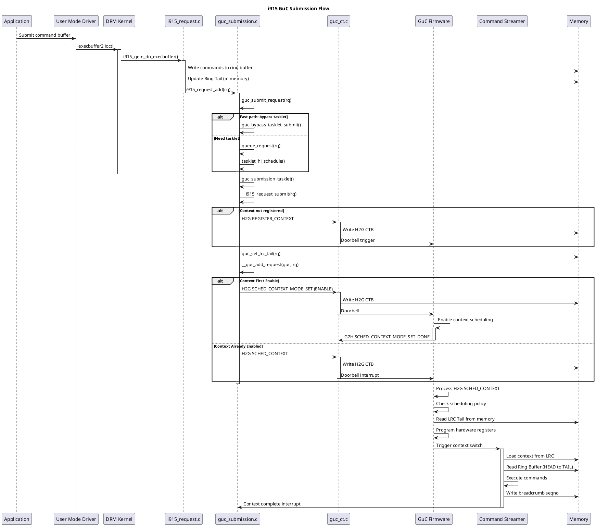
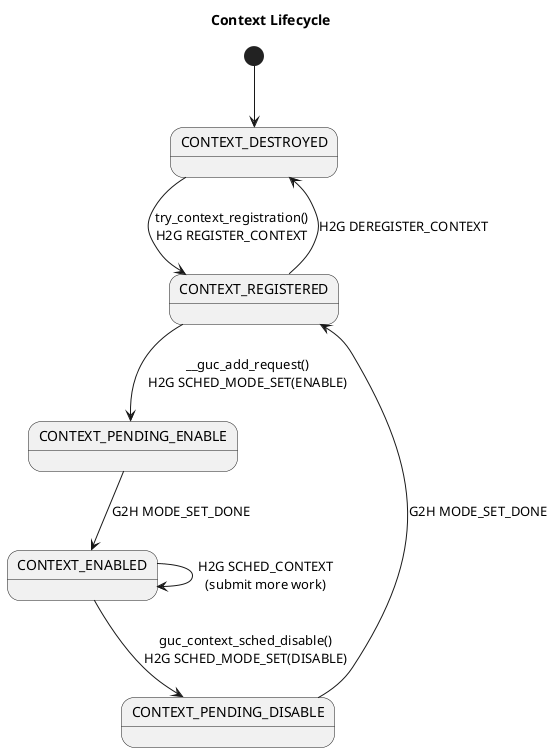
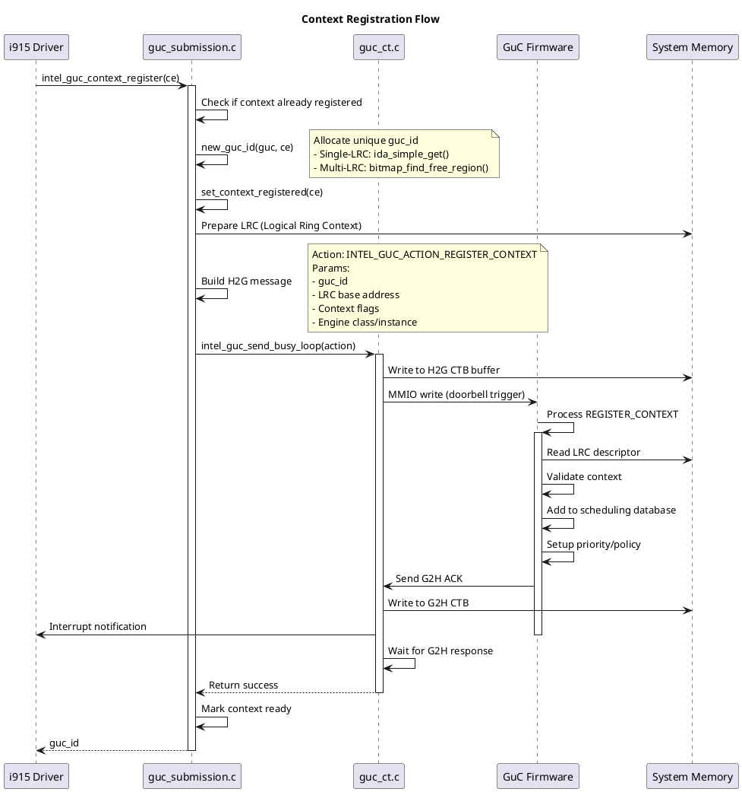
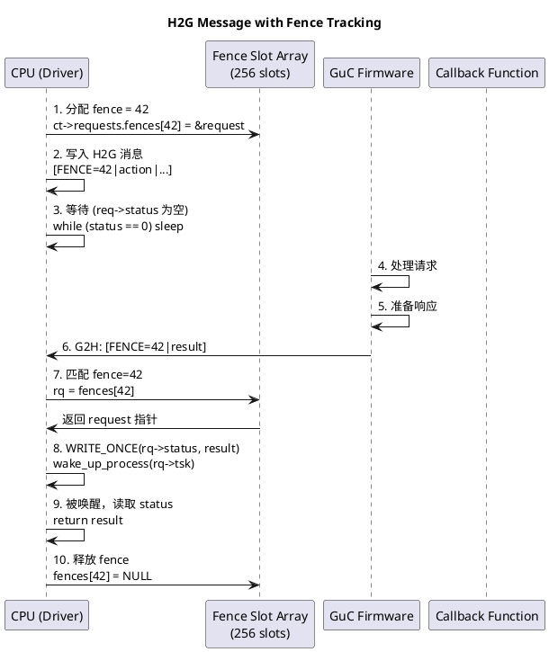
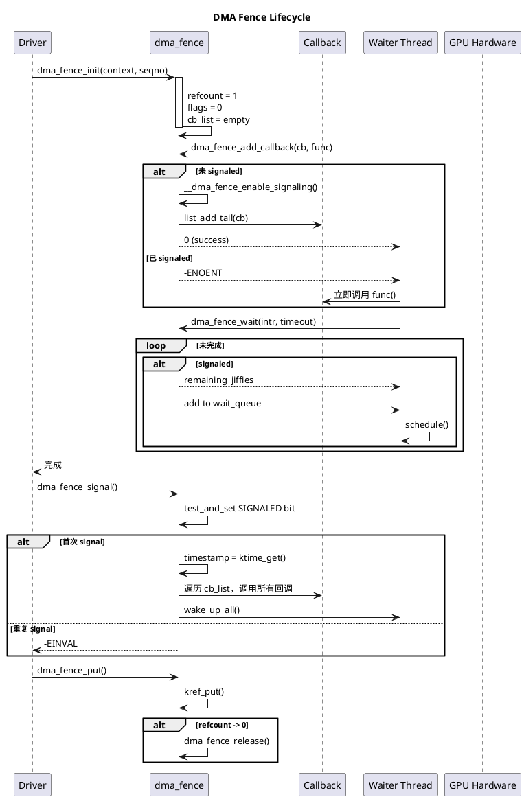
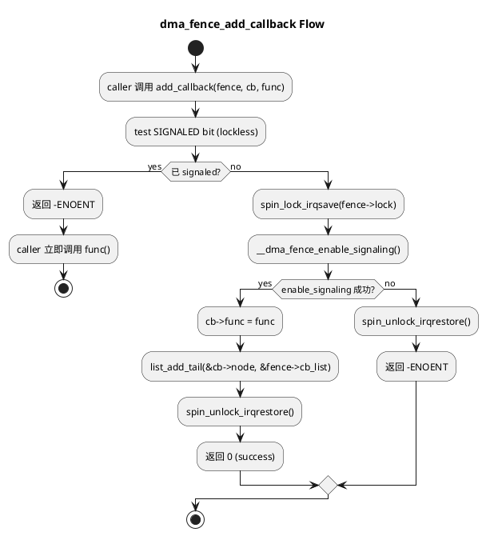
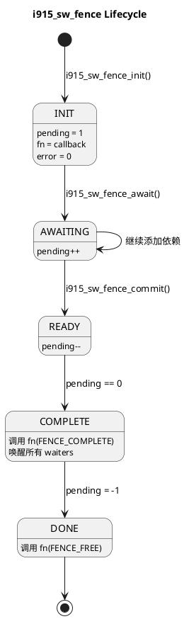
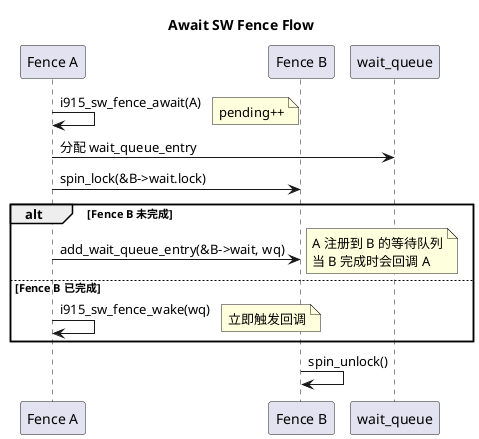
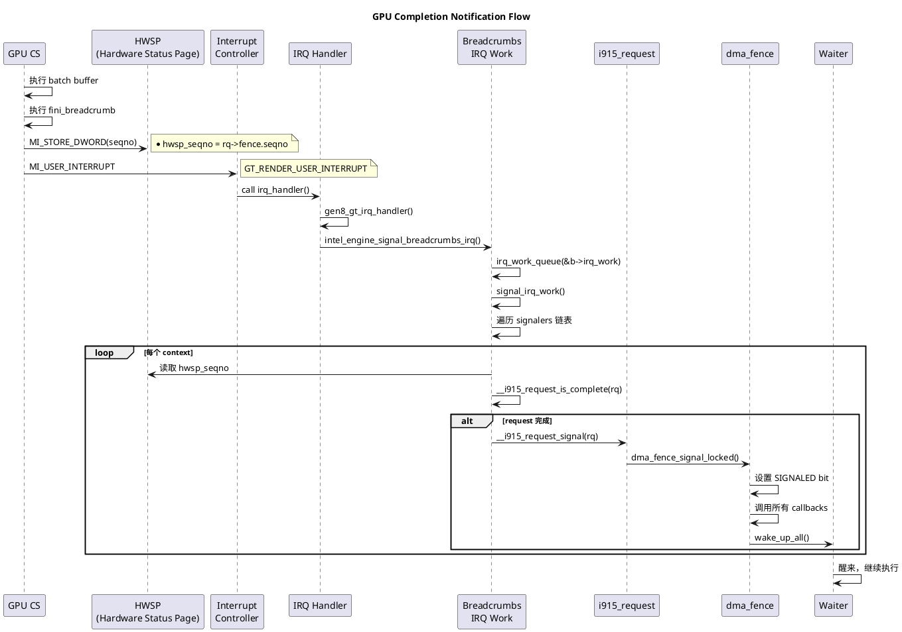
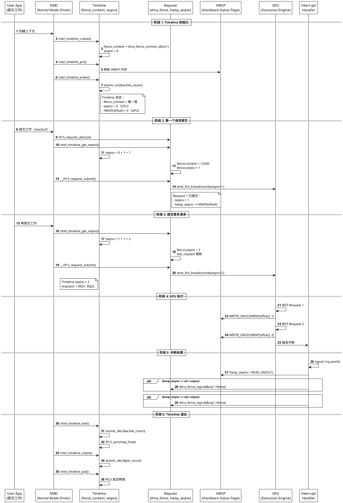

# Intel i915 GPU 驱动深度学习指南

## 目录
1. [GuC Submission 机制](#guc-submission-机制)
2. [Context 管理](#context-管理)
3. [Priority System](#priority-system)
4. [H2G/G2H CTB 通讯](#h2gg2h-ctb-通讯)
5. [内存同步原语](#内存同步原语)
6. [DMA Fence 机制](#dma-fence-机制)
7. [i915_sw_fence](#i915_sw_fence)
8. [GPU 完成通知](#gpu-完成通知)
9. [Timeline 概念](#timeline-概念)

---

## GuC Submission 机制

### 核心概念
在 i915 驱动中，Ring buffer 和 GuC 的交互关系：
- **Ring Buffer 中的命令**提交给 **CS (Command Streamer)** 去解析和执行
- **GuC (Graphics Microcontroller)** 负责**调度** context，决定何时将该 context 提交给 CS
- GuC 不执行 Ring buffer 里的绘图指令，只负责"指挥 CS 去执行"

### 提交流程

```
CPU (Driver)              GuC Firmware          CS (Command Streamer)
    |                          |                        |
    | 写 Ring Tail 到内存      |                        |
    | (但不动硬件寄存器)       |                        |
    |                          |                        |
    | H2G: SCHED_CONTEXT      |                        |
    |------------------------->|                        |
    |                          | 调度 context           |
    |                          | GuC programs ELSP      |
    |                          |------------------------>| 加载 context
    |                          |                        | 读取 Ring Tail
    |                          |                        | 执行指令
    |                          |                        |
    |                          |                        | 完成并中断 CPU
    |                          |<------------------------
```

### 提交流程详解



---

## Context 管理

### Context 生命周期



### Context 注册流程



### Context 调度与抢占

```plantuml
@startuml
title Context Scheduling and Preemption

participant CtxA
participant GucSub
participant GuC
participant CS
participant CtxB
participant Memory

CtxB -> CS: Executing commands
activate CS

CtxA -> GucSub: Submit high priority work
activate GucSub

GucSub -> GuC: H2G SCHED_CONTEXT
activate GuC

GuC -> CS: Trigger preemption
CS -> Memory: Save Context B state
CS -> Memory: Load Context A LRC
deactivate CS

activate CS
CS -> Memory: Execute Context A commands

CS -> GuC: Context A complete
deactivate CS

GuC -> CS: Resume Context B
deactivate GuC

activate CS
CS -> Memory: Load Context B LRC
CS -> Memory: Execute Context B commands
deactivate CS

deactivate GucSub

@enduml
```

---

## Priority System

### 优先级层次

GuC 支持 4 个优先级级别：

```c
#define GUC_CLIENT_PRIORITY_KMD_HIGH    0  // 内核高优先级 (Display, Heartbeat)
#define GUC_CLIENT_PRIORITY_HIGH        1  // 用户高优先级
#define GUC_CLIENT_PRIORITY_KMD_NORMAL  2  // 内核普通优先级
#define GUC_CLIENT_PRIORITY_NORMAL      3  // 用户普通优先级
```

### i915 到 GuC 的优先级映射

| GuC 优先级 | 值 | i915 优先级范围 | 用途 | 典型场景 |
|-----------|---|----------------|------|---------|
| KMD_HIGH | 0 | >= I915_PRIORITY_DISPLAY | 内核高优先级 | Display 页面翻转、心跳检测、内核任务 |
| HIGH | 1 | 1 ~ 1023 | 用户高优先级 | 用户显式设置、低延迟应用 |
| KMD_NORMAL | 2 | 0 (I915_PRIORITY_NORMAL) | 内核普通优先级 | 默认内核任务 |
| NORMAL | 3 | -1023 ~ -1 | 用户普通优先级 | 默认用户任务、后台工作 |

### 调度算法

GuC 固件使用**基于优先级的抢占式调度 + 时间片轮转**：

**关键参数**：
- **execution_quantum**：单次运行时间片（通常 1-10ms）
- **preemption_timeout**：抢占等待超时（通常 640ms）
- **priority**：Context 优先级（0-3）

**调度流程**：
```
1. 收到 H2G SCHED_CONTEXT 消息
   ↓
2. GuC 检查该 context 的优先级
   ↓
3. 与当前运行的 context 比较
   ↓
4. 高优先级？
   ├─ 是 → 立即触发抢占
   │      ├─ 保存当前 context 状态
   │      ├─ 加载新 context
   │      └─ CS 开始执行新 context
   │
   └─ 否 → 加入调度队列
          └─ 等待当前 context：
              ├─ 时间片用完 (execution_quantum)
              ├─ 主动 yield
              ├─ 工作完成
              └─ 遇到 semaphore 等待
```

---

## H2G/G2H CTB 通讯

### CTB 架构

```plantuml
@startuml
title CTB Circular Buffer Architecture

rectangle "System Memory" {
  rectangle "H2G CTB\n(Host to GuC)" as H2G {
    circle "HEAD\n(GuC读)" as h_head
    rectangle "Messages" as h_msg
    circle "TAIL\n(CPU写)" as h_tail
  }
  
  rectangle "G2H CTB\n(GuC to Host)" as G2H {
    circle "HEAD\n(CPU读)" as g_head
    rectangle "Messages" as g_msg
    circle "TAIL\n(GuC写)" as g_tail
  }
}

H2G <-- : CPU 写入
H2G --> : GuC 读取
G2H <-- : GuC 写入
G2H --> : CPU 读取

@enduml
```

### Fence 跟踪机制



### Fence 设计特性

- **并发支持**：256 个 fence 槽位支持最多 256 个并发 H2G 请求
- **快速查找**：O(1) 哈希表查找
- **线程安全**：CAS 原子操作、WRITE_ONCE/READ_ONCE
- **超时保护**：忙等待 100us + 睡眠等待 10 秒
- **容错处理**：线性探测冲突、超时错误处理

---

## 内存同步原语

### WRITE_ONCE/READ_ONCE 的使用场景

#### 核心原理

```c
#define READ_ONCE(x)  (*((volatile typeof(x) *)&(x)))
#define WRITE_ONCE(x, val)  (*((volatile typeof(x) *)&(x)) = (val))
```

**主要作用**：
- ✅ 防止编译器优化（缓存到寄存器）
- ✅ 确保每次访问都从内存读取/写入
- ❌ 不保证原子性
- ❌ 不保证与其他操作的顺序

#### 何时使用

| 场景 | 是否需要 | 原因 |
|------|---------|------|
| 有 spinlock/mutex 保护 | ❌ | 锁已提供内存屏障 |
| 对象初始化阶段 | ❌ | 对象尚未发布 |
| 函数内局部使用 | ❌ | 数据还未共享 |
| 跨线程无锁共享变量 | ✅ | 防止编译器优化 |
| 硬件 DMA 写入的内存 | ✅ | 强制从内存读取 |
| IRQ/tasklet 共享的变量 | ✅ | 异步上下文访问 |

#### 编译器优化的危险

```c
// 不使用 READ_ONCE 的问题
bool igt_wait_for_spinner(struct igt_spinner *spin, ...) {
    u32 seqno = *spin->seqno;  // 编译器可能缓存到寄存器
    
    while (*spin->seqno != target) {  // 永远相等！
        cpu_relax();
    }
    
    // 编译器优化为：
    u32 seqno_cached = *spin->seqno;  // 只读一次
    while (seqno_cached != target) {  // 死循环！
        cpu_relax();
    }
}

// 使用 READ_ONCE 的正确做法
while (READ_ONCE(*spin->seqno) != target) {  // 每次都读
    cpu_relax();
}
```

### wmb()/rmb()/mb() 的使用场景

| 操作 | 使用场景 | 作用 |
|------|---------|------|
| `wmb()` | 多个写操作的顺序保证 | Store-Store 顺序 |
| `rmb()` | 多个读操作的顺序保证 | Load-Load 顺序 |
| `mb()` | 完全读写顺序保证 | 所有顺序保证 |
| `smp_wmb()` | CPU 间的写同步 | CPU 缓存一致 |
| `smp_rmb()` | CPU 间的读同步 | CPU 缓存一致 |
| `smp_mb()` | CPU 间的完全同步 | 最强保证 |

#### 典型模式：先写数据，再写标志

```c
// CTB 发送消息的例子
cmds[0] = header;
cmds[1] = type;
cmds[2] = action[0];
wmb();  // 确保 cmds[] 的写入先于 tail
WRITE_ONCE(desc->tail, new_tail);

// GuC 读取
tail = desc->tail;
if (tail != head) {
    // 此时保证能读到完整的 cmds[]
    data = cmds[head];
}
```

### CPU 缓存一致性与 WRITE_ONCE

```
WRITE_ONCE 并不直接操作 cache line，但会：

1. 编译器层面：
   ├─ 生成真实的 store 指令
   └─ 不会优化掉写入

2. CPU 层面：
   ├─ L1 Cache: 写入 L1（Mark Modified 状态）
   ├─ MESI 协议：
   │  ├─ 本 CPU 的 line 变为 Modified
   │  └─ 其他 CPU 的 line 变为 Invalid
   ├─ 其他 CPU 读取时：
   │  ├─ Cache Miss (Invalid 状态)
   │  └─ 从本 CPU 或 Memory 获取最新数据
   └─ Write Combining Buffer：MMIO 操作时刷新

3. 设备端（非 CPU）：
   ├─ MMIO 写：立即可见（PCIe 事务）
   ├─ DMA 访问：通过 PCIe 读取
   └─ 通过 PCIe 一致性协议同步
```

---

## DMA Fence 机制

### 核心数据结构

```c
struct dma_fence {
    spinlock_t *lock;
    const struct dma_fence_ops *ops;
    
    union {
        struct list_head cb_list;      // 回调链表
        ktime_t timestamp;             // 信号时间戳
        struct rcu_head rcu;
    };
    
    u64 context;        // 执行上下文 ID
    u64 seqno;          // 序列号
    unsigned long flags; // SIGNALED, ENABLE_SIGNAL, etc.
    struct kref refcount;
    int error;
};
```

### DMA Fence 生命周期



### 关键操作详解

#### dma_fence_add_callback() 流程



#### dma_fence_signal() 流程

```c
int dma_fence_signal(struct dma_fence *fence)
{
    unsigned long flags;
    int ret;
    
    spin_lock_irqsave(fence->lock, flags);
    
    // 原子检查并设置 SIGNALED bit
    if (test_and_set_bit(DMA_FENCE_FLAG_SIGNALED_BIT, &fence->flags)) {
        spin_unlock_irqrestore(fence->lock, flags);
        return -EINVAL;  // 已经 signaled
    }
    
    // 记录时间戳
    fence->timestamp = ktime_get();
    set_bit(DMA_FENCE_FLAG_TIMESTAMP_BIT, &fence->flags);
    
    // 遍历并调用所有回调
    list_for_each_entry_safe(cur, tmp, &fence->cb_list, node) {
        INIT_LIST_HEAD(&cur->node);
        cur->func(fence, cur);  // 在 spinlock 内！
    }
    
    spin_unlock_irqrestore(fence->lock, flags);
    return 0;
}
```

---

## i915_sw_fence

### 核心定义

**i915_sw_fence 是纯软件 fence**，可以：
- ✅ 基于多个 dma_fence
- ✅ 作为纯软件同步手段（无 fence 依赖）
- ✅ 灵活组合各种依赖（N:M）

### 数据结构

```c
struct i915_sw_fence {
    wait_queue_head_t wait;           // Linux 标准等待队列
    i915_sw_fence_notify_t fn;        // 完成通知回调
    atomic_t pending;                 // 待完成计数（核心！）
    int error;                        // 错误传播
};
```

### Pending 计数器状态机

```
pending = 1:   初始状态（未提交）
pending > 1:   有依赖等待
pending = 0:   所有依赖完成，触发 FENCE_COMPLETE
pending = -1:  已完成（done）
```

### 生命周期



### 三种使用模式

#### 模式 1: 纯软件同步

```c
struct i915_sw_fence fence;

i915_sw_fence_init(&fence, my_notify);  // pending = 1
queue_work(workqueue, &my_work);
i915_sw_fence_commit(&fence);  // pending = 0 → 立即触发
```

#### 模式 2: 基于多个 dma_fence

```c
struct i915_sw_fence fence;

i915_sw_fence_init(&fence, notify);           // pending = 1
i915_sw_fence_await_dma_fence(&fence, dma1);  // pending = 2
i915_sw_fence_await_dma_fence(&fence, dma2);  // pending = 3
i915_sw_fence_commit(&fence);                 // pending = 2

// dma1 完成 → pending = 1
// dma2 完成 → pending = 0 → FENCE_COMPLETE
```

#### 模式 3: 基于其他 sw_fence（链式）

```c
i915_sw_fence_await_sw_fence(&rq_B->submit,
                             &rq_A->submit,
                             &wq);

// rq_A->submit 完成时 → rq_B->submit.pending--
```

### 关键操作详解

#### 等待另一个 sw_fence



#### 完成处理

```c
static void __i915_sw_fence_complete(
    struct i915_sw_fence *fence,
    struct list_head *continuation)
{
    // 1. 原子递减并检查
    if (!atomic_dec_and_test(&fence->pending))
        return;  // 还有未完成的依赖
    
    // 2. pending == 0，触发 FENCE_COMPLETE
    if (__i915_sw_fence_notify(fn, fence, FENCE_COMPLETE) != NOTIFY_DONE)
        return;
    
    // 3. 唤醒所有 waiters
    __i915_sw_fence_wake_up_all(fence, continuation);
    
    // 4. 触发 FENCE_FREE
    __i915_sw_fence_notify(fn, fence, FENCE_FREE);
}
```

---

## GPU 完成通知

### 核心机制

GPU 通过三个步骤通知 CPU 任务完成：

1. **写 HWSP (Hardware Status Page)**：GPU 执行 `MI_STORE_DWORD` 写入 seqno
2. **触发中断**：GPU 执行 `MI_USER_INTERRUPT` 信号
3. **CPU 检测完成**：CPU 读取 HWSP 中的 seqno 并比较

### 完整流程



### 关键代码

#### 生成 Breadcrumb 命令

```c
static u32 *emit_breadcrumb(struct i915_request *rq, u32 *cs)
{
    u32 offset = hwsp_offset(rq);
    
    // 写 seqno 到 HWSP
    *cs++ = MI_STORE_DWORD_IMM_GEN4 | MI_USE_GGTT | MI_POSTED;
    *cs++ = offset;                    // HWSP GGTT 地址
    *cs++ = 0;                         // upper 32 bits
    *cs++ = i915_request_seqno(rq);    // seqno 值
    
    // 触发用户中断
    *cs++ = MI_USER_INTERRUPT;
    
    return cs;
}
```

#### Seqno 比较（处理回绕）

```c
static inline bool __i915_request_is_complete(const struct i915_request *rq)
{
    return i915_seqno_passed(__hwsp_seqno(rq), i915_request_seqno(rq));
}

static inline bool i915_seqno_passed(u32 seq1, u32 seq2)
{
    return (s32)(seq1 - seq2) >= 0;  // 有符号比较，处理 wrap
}

static inline u32 __hwsp_seqno(const struct i915_request *rq)
{
    const u32 *hwsp = READ_ONCE(rq->hwsp_seqno);
    return READ_ONCE(*hwsp);  // 从 HWSP 读取当前 seqno
}
```

#### 中断处理与 Signal

```c
static void signal_irq_work(struct irq_work *work)
{
    struct intel_breadcrumbs *b = container_of(work, typeof(*b), irq_work);
    
    rcu_read_lock();
    list_for_each_entry_rcu(ce, &b->signalers, signal_link) {
        list_for_each_entry_rcu(rq, &ce->signals, signal_link) {
            if (!__i915_request_is_complete(rq))
                break;  // 同一 context 按序完成
            
            dma_fence_signal_locked(&rq->fence);
        }
    }
    rcu_read_unlock();
}
```

### 多 Request 批量处理

```
时间线：

Request 1: seqno=1
Request 2: seqno=2
Request 3: seqno=3

GPU 执行：
  Request 1: HWSP[offset] = 1
  Request 2: HWSP[offset] = 2
  Request 3: HWSP[offset] = 3
  
  触发一次中断

CPU 处理（一次中断处理多个）：
  读取 HWSP[offset] = 3
  
  Request 1: 3 >= 1 ✅ signal
  Request 2: 3 >= 2 ✅ signal
  Request 3: 3 >= 3 ✅ signal
  Request 4: 3 >= 4 ❌ 未完成，break
```

---

## Timeline 概念

### 核心定义

**Timeline = 在一个特定上下文中，按顺序提交的 GPU 请求形成的序列**

### 数据结构

```c
struct intel_timeline {
    u64 fence_context;          // dma_fence 的上下文标识符（唯一）
    u32 seqno;                  // CPU 侧的递增序列号计数器
    
    struct mutex mutex;         // 保护请求流的锁
    
    atomic_t pin_count;         // Pin 计数
    atomic_t active_count;      // 活跃计数
    
    void *hwsp_map;             // CPU 侧 HWSP 的虚拟地址映射
    const u32 *hwsp_seqno;      // 指向 HWSP 中 seqno 存储位置
    struct i915_vma *hwsp_ggtt; // HWSP 的 GGTT 映射
    u32 hwsp_offset;            // HWSP 中的偏移量
    
    enum intel_timeline_mode mode;  // HWSP 存储位置模式
    
    struct list_head requests;      // 该 timeline 上的所有请求
    struct i915_active_fence last_request;  // 最后一个请求
    struct i915_active active;      // 活跃追踪
    struct i915_syncmap *sync;      // 其他 timeline 的同步映射
};
```

### Timeline 的三种 HWSP 存储模式

```c
enum intel_timeline_mode {
    INTEL_TIMELINE_ABSOLUTE = 0,
        // HWSP 在共享页面中，支持回绕时重新分配
        // 用于临时上下文
        
    INTEL_TIMELINE_RELATIVE_ENGINE = BIT(1),
        // HWSP 在引擎的全局状态页面（固定）
        // 用于常驻内核上下文
        
    INTEL_TIMELINE_RELATIVE_CONTEXT = BIT(0),
        // HWSP 在上下文自己的页面（固定）
        // 用于需要快速访问的上下文
};
```

### Timeline 生命周期

```
① 创建 (Create)
   ├─ intel_timeline_create()
   ├─ 分配唯一的 fence_context
   ├─ 初始化 HWSP 映射
   └─ seqno 从 0 开始

② Pin (固定在内存)
   ├─ intel_timeline_pin()
   ├─ 获取 GGTT 引脚
   ├─ 映射 HWSP CPU 地址
   └─ atomic_inc(&pin_count)

③ Enter (进入活跃)
   ├─ intel_timeline_enter()
   ├─ atomic_inc(&active_count)
   └─ 初始化 syncmap

④ 请求提交和执行
   ├─ intel_timeline_get_seqno() 分配 seqno
   ├─ seqno 递增
   ├─ GPU 执行
   └─ GPU 更新 HWSP

⑤ 完成检测 (Completion)
   ├─ CPU 读取 HWSP
   ├─ 与 seqno 比较
   └─ signal fence

⑥ Exit (退出活跃)
   ├─ intel_timeline_exit()
   ├─ atomic_dec(&active_count)
   └─ 清空 syncmap

⑦ Unpin (取消固定)
   ├─ intel_timeline_unpin()
   ├─ atomic_dec(&pin_count)
   └─ 释放 GGTT 引脚

⑧ 销毁 (Free)
   ├─ intel_timeline_put()
   ├─ RCU 延迟清理
   └─ 释放资源
```

### Timeline 与 Request 的关系

```
Timeline 维护两个请求结构：

struct intel_timeline {
    struct list_head requests;              // 所有请求
    struct i915_active_fence last_request;  // 最后一个（RCU）
};

Request 中的 Timeline 信息：
struct i915_request {
    u64 fence.seqno;        // Timeline 分配的序列号
    u32 *hwsp_seqno;        // 指向 HWSP 存储位置
    u64 fence.context;      // Timeline 的 fence_context
};

执行流程：
    Timeline seqno (CPU): 0 → 1 → 2 → 3 → ...
                          ↓    ↓    ↓    ↓
    Request:        [RQ1][RQ2][RQ3][RQ4]
                      ↓    ↓    ↓    ↓
    GPU 执行:       Exec Exec Exec Exec
                      ↓    ↓    ↓    ↓
    HWSP[offset]:   1    2    3    4   (GPU 写入)
```

### Seqno 管理

```c
static u32 timeline_advance(struct intel_timeline *tl)
{
    return tl->seqno += 1 + intel_timeline_has_initial_breadcrumb(tl);
    // 每次递增 1 或 2（如果有初始 breadcrumb）
}

int intel_timeline_get_seqno(struct intel_timeline *tl,
                             struct i915_request *rq,
                             u32 *seqno)
{
    *seqno = timeline_advance(tl);  // 分配新的 seqno
    
    // 处理回绕
    if (unlikely(!*seqno && intel_timeline_has_initial_breadcrumb(tl)))
        return __intel_timeline_get_seqno(tl, seqno);
}
```

### Timeline 的详细时序图



---

## 关键概念总结

### Fence 类型体系

| Fence 类型 | 基于 dma_fence? | 跨驱动? | 导出用户空间? | 主要用途 |
|-----------|----------------|---------|-------------|---------|
| dma_fence | ✅ 自身 | ✅ | ✅ | 通用同步原语 |
| i915_sw_fence | ❌ 独立 | ❌ | ❌ | 内部依赖管理 |
| i915_request | ✅ 内嵌 | ✅ | ✅ | GPU 命令提交 |
| i915_active_fence | ❌ 仅引用 | - | ❌ | 跟踪最近 fence |

### 核心同步机制

```
User Space
    ↓ (sync_file, dma_fence)
dma_fence ← 跨子系统通用接口
    ↓
i915_request ← GPU 命令提交单元
    ↓
i915_sw_fence ← 内部快速同步
    ↓
Hardware (HWSP + Interrupt)
```

### Timeline 的三个关键数据

| 数据 | 更新者 | 读取者 | 用途 |
|------|--------|--------|------|
| fence_context | CPU (一次) | dma_fence | 全局唯一标识符 |
| seqno (CPU侧) | CPU (每个请求) | dma_fence, breadcrumb | 分配序列号 |
| HWSP[offset] | GPU | CPU IRQ | 完成状态 |

---

## 总结

本文档详细介绍了 Intel i915 GPU 驱动的核心机制：

✅ **GuC Submission**：从 CPU 提交到 GPU 的完整流程
✅ **Context 管理**：Context 的生命周期和调度
✅ **Priority System**：优先级映射和抢占机制
✅ **CTB 通讯**：H2G/G2H 消息通讯和 fence 跟踪
✅ **内存同步**：WRITE_ONCE/READ_ONCE 和内存屏障
✅ **DMA Fence**：跨驱动通用同步原语
✅ **i915_sw_fence**：纯软件同步实现
✅ **GPU 完成通知**：HWSP + Interrupt 机制
✅ **Timeline**：请求执行顺序和 seqno 管理

所有这些机制共同工作，实现了高效、可靠的 GPU 同步和执行管理。
