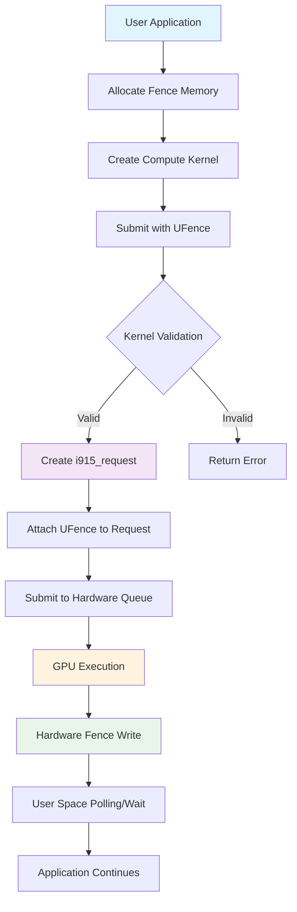
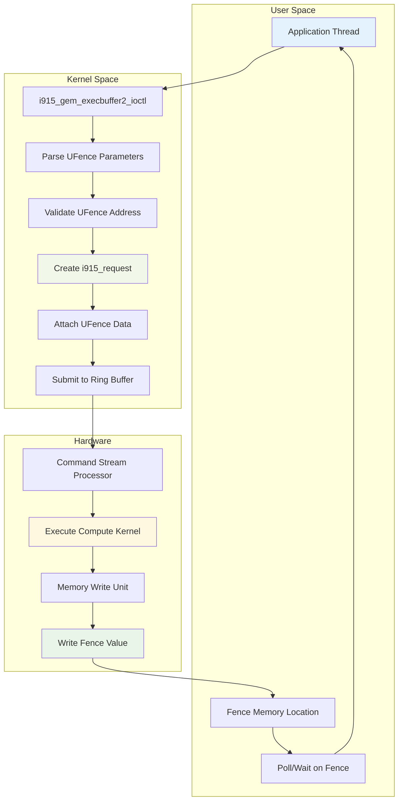
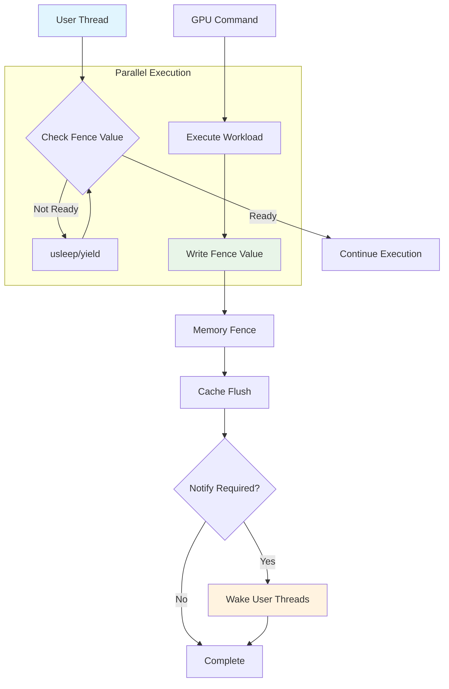
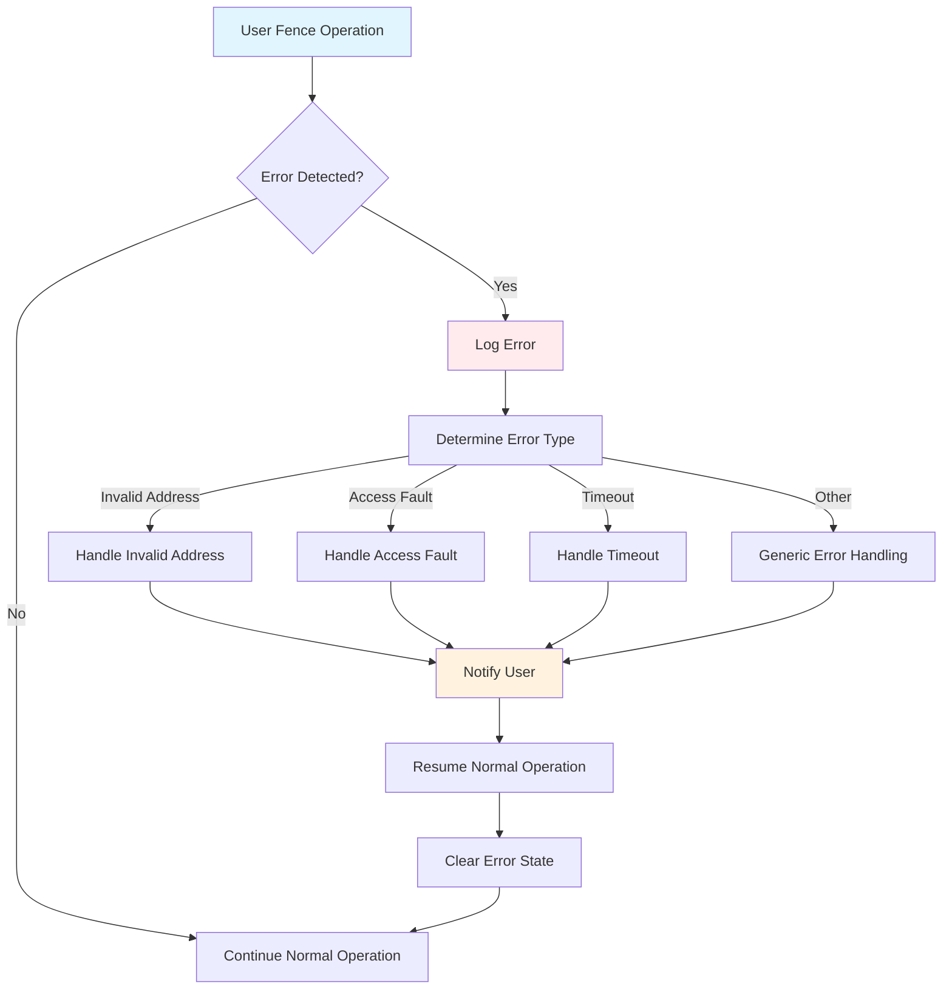
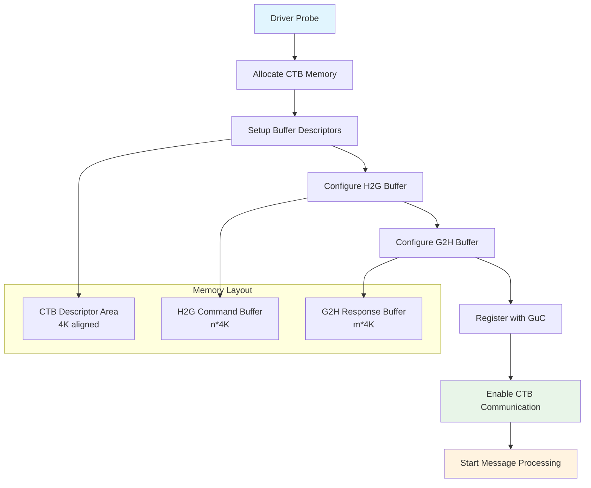
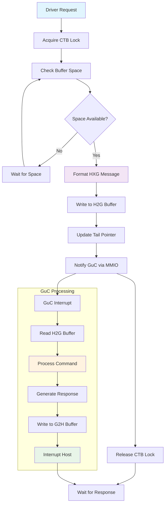
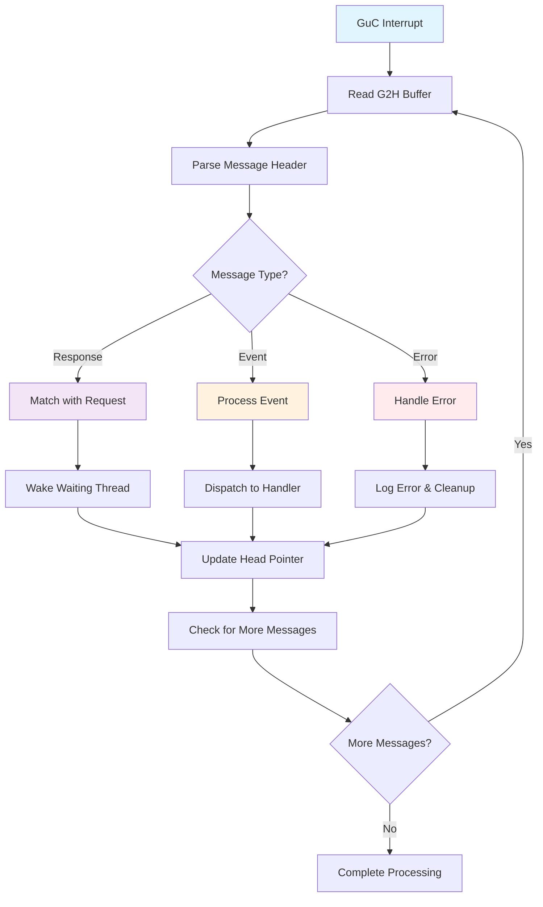
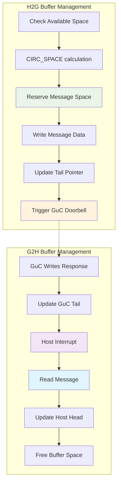

# Intel i915 Graphics Driver Software Design Documentation

## Table of Contents

1. [Overview](#overview)
2. [Architecture Overview](#architecture-overview)
3. [Core Components](#core-components)
4. [Memory Management](#memory-management)
5. [Command Execution](#command-execution)
6. [User Fences (UFence) Detailed Architecture](#user-fences-ufence-detailed-architecture)
7. [GuC CTB Communication Detailed Architecture](#guc-ctb-communication-detailed-architecture)
8. [Display Subsystem](#display-subsystem)
9. [Graphics Technology (GT) Subsystem](#graphics-technology-gt-subsystem)
10. [Security and Protection](#security-and-protection)
11. [Debugging and Diagnostics](#debugging-and-diagnostics)
12. [Performance and Power Management](#performance-and-power-management)
13. [Virtualization Support](#virtualization-support)
14. [Fabric Connectivity](#fabric-connectivity)

## Overview

The Intel i915 graphics driver is a complex kernel driver that manages Intel integrated and discrete graphics hardware. It provides support for:

- Graphics rendering and compute workloads
- 
- Display output management
- Memory management for GPU resources
- Command submission and scheduling
- **User Fences (UFence)**: Direct user-space GPU synchronization
- Hardware virtualization
- Power management
- Security features (PXP - Protected Xe Path)
- Multi-tile GPU configurations
- Fabric connectivity for distributed computing

## Architecture Overview

### High-Level Architecture

```
┌─────────────────────────────────────────────────────────────┐
│                    User Space Applications                  │
├─────────────────────────────────────────────────────────────┤
│                    DRM/GEM Interface                        │
├─────────────────────────────────────────────────────────────┤
│                    i915 Driver Core                         │
├──────────────┬──────────────┬──────────────┬────────────────┤
│   Display    │   GT (GPU)   │   Memory     │   Power Mgmt   │
│  Subsystem   │  Subsystem   │  Management  │   Subsystem    │
├──────────────┼──────────────┼──────────────┼────────────────┤
│              │   GuC/HuC    │    GGTT      │   Runtime PM   │
│   Outputs    │  Firmware    │    PPGTT     │   Freq Scaling │
│   Encoders   │  Scheduling  │   Buddy      │   RC States    │
│   Planes     │  Contexts    │   Allocator  │                │
│              │ User Fences  │              │                │
└──────────────┴──────────────┴──────────────┴────────────────┘
```

### Key Design Principles

1. **Modular Architecture**: Separated into distinct subsystems (GT, Display, Memory)
2. **Hardware Abstraction**: Platform-specific code isolated from generic functionality
3. **Resource Management**: Careful tracking and lifecycle management of GPU resources
4. **Performance Optimization**: Efficient command submission and memory management
5. **User-Space Synchronization**: Direct user fence support for low-latency operations
6. **Security**: Protected content support and memory isolation
7. **Extensibility**: Support for new hardware generations and features

## Core Components

### Driver Initialization (`i915_driver.c`)

The driver initialization follows these key phases:

```c
// Driver initialization sequence
1. Device probe and hardware detection
2. Memory region setup (LMEM, SMEM)
3. Graphics Technology (GT) initialization
4. Display subsystem initialization
5. Firmware loading (GuC/HuC)
6. Context and engine setup
7. User fence infrastructure initialization
8. Debugfs and sysfs interface creation
```

**Key Functions:**
- `i915_driver_probe()`: Main driver probe function
- `i915_driver_hw_probe()`: Hardware-specific initialization
- `i915_driver_register()`: Register driver interfaces

### Device Management (`i915_drv.h`)

The main driver structure `drm_i915_private` contains:

```c
struct drm_i915_private {
    struct drm_device drm;           // Base DRM device
    struct intel_gt *gt;             // Graphics Technology
    struct intel_display display;    // Display subsystem
    struct i915_ggtt ggtt;          // Global GTT
    struct intel_memory_regions mm;  // Memory regions
    
    // User fence support
    struct wait_queue_head user_fence_wq;  // User fence wait queue
    
    // ... additional subsystems
};
```

## Memory Management

### Memory Architecture

The i915 driver manages several types of memory:

1. **System Memory (SMEM)**: Traditional system RAM accessible to GPU
2. **Local Memory (LMEM)**: High-bandwidth memory attached directly to GPU
3. **Stolen Memory**: Reserved system memory for GPU use

### Memory Regions (`intel_memory_region.c`)

```c
// Memory region types
enum intel_memory_type {
    INTEL_MEMORY_SYSTEM = 0,    // System memory
    INTEL_MEMORY_LOCAL,         // Local memory (VRAM)
    INTEL_MEMORY_STOLEN_SYSTEM, // Stolen system memory
    INTEL_MEMORY_STOLEN_LOCAL,  // Stolen local memory
};

struct intel_memory_region {
    struct drm_i915_private *i915;
    const struct intel_memory_region_ops *ops;
    struct io_mapping iomap;
    struct resource region;
    struct i915_buddy mm;           // Buddy allocator for this region
    struct list_head reserved;      // Reserved address ranges
    dma_addr_t remap_addr;         // CPU remapping address
    u16 type;                      // Memory type identifier
    u16 instance;                  // Instance number for this type
    unsigned int id;               // Unique region ID
    char name[16];                 // Human readable name
    bool private;                  // Private to single GT
    bool is_range_manager;         // Manages address ranges
};
```

### Advanced Memory Management Features

#### Multi-Segment Objects
Large objects can be split across multiple segments for better memory utilization:

```c
struct i915_gem_object_segment {
    struct drm_i915_gem_object *obj;
    struct i915_buddy_block *block;
    u64 offset;                    // Offset within object
    u64 size;                      // Size of this segment
    struct list_head link;         // Link in object's segment list
};

// Object with segmented allocation
struct drm_i915_gem_object {
    // ...existing code...
    struct {
        struct list_head list;     // List of segments
        unsigned int count;        // Number of segments
        bool is_segmented;         // Whether object is segmented
    } segments;
};
```

#### Memory Migration and Eviction

```c
// Memory migration operations
struct i915_gem_migrate {
    struct drm_i915_gem_object *obj;
    struct intel_memory_region *from;
    struct intel_memory_region *to;
    struct i915_request *fence;
    bool async;                    // Asynchronous migration
};

// Eviction and placement policies
enum i915_gem_placement_policy {
    I915_PLACEMENT_FIRST_FIT,      // First available region
    I915_PLACEMENT_BEST_FIT,       // Best size match
    I915_PLACEMENT_PREFER_LOCAL,   // Prefer LMEM when available
    I915_PLACEMENT_SYSTEM_ONLY,    // System memory only
    I915_PLACEMENT_LOCAL_ONLY,     // Local memory only
};
```

#### Memory Bandwidth Management

```c
struct i915_gem_memory_class_instance {
    u16 memory_class;              // Memory type
    u16 memory_instance;           // Instance within type
};

struct i915_gem_create_ext_memory_regions {
    struct i915_user_extension base;
    u32 num_regions;               // Number of allowed regions
    u32 pad;
    u64 regions;                   // Pointer to region array
};

// Memory bandwidth tracking
struct i915_memory_bandwidth {
    u64 read_bandwidth;            // Current read bandwidth usage
    u64 write_bandwidth;           // Current write bandwidth usage
    u64 max_bandwidth;             // Maximum available bandwidth
    spinlock_t lock;               // Protects bandwidth counters
};
```

### GEM Objects (`i915_gem_object.c`)

Graphics Execution Manager (GEM) objects represent GPU memory allocations:

```c
struct drm_i915_gem_object {
    struct drm_gem_object base;
    
    // Memory placement and management
    struct intel_memory_region_set mm;
    struct list_head region_link;     // Link in region's object list
    
    // Virtual memory mappings
    struct i915_vma_resource *vma_list;
    struct rb_root vma_tree;          // Red-black tree of VMAs
    
    // Page management
    struct i915_gem_object_page_iter get_page;
    struct scatterlist *pages;
    struct i915_page_sizes page_sizes;
    
    // Memory attributes
    enum i915_cache_level cache_level;
    unsigned int cache_coherent:2;    // Cache coherency mode
    unsigned int cache_dirty:1;       // Needs cache flush
    
    // Placement and migration
    struct {
        struct intel_memory_region *cur;  // Current region
        struct list_head list;            // Migration request list
        struct work_struct work;           // Migration work item
        atomic_t busy;                     // Migration in progress
    } migrate;
    
    // Advanced features
    struct {
        bool is_protected:1;          // PXP protected object
        bool is_persistent:1;         // Survives context destruction
        bool is_userptr:1;           // Backed by userspace memory
        bool needs_async_cancel:1;    // Requires async cancellation
    } flags;
    
    // Performance and debugging
    struct {
        u64 created_at;               // Creation timestamp
        u64 last_access;              // Last access timestamp
        u32 access_count;             // Number of accesses
        struct list_head lru;         // LRU list for eviction
    } usage;
};
```

**Advanced Object Features:**
- **Zero-Copy Operations**: Direct mapping of userspace memory
- **Async Object Creation**: Non-blocking object allocation
- **Object Compression**: Transparent compression for bandwidth savings
- **Memory Encryption**: Hardware-based encryption for protected content

### Virtual Memory Management

#### Global Graphics Translation Table (GGTT)
```c
struct i915_ggtt {
    struct i915_address_space vm;
    
    struct io_mapping iomap;          // CPU mapping of GGTT
    void __iomem *gsm;               // Graphics Stolen Memory base
    
    bool do_idle_maps;                // Map during idle
    int mtrr;                        // MTRR for GGTT region
    
    u32 pin_bias;                    // Address allocation bias
    u32 fenced_size;                 // Size of fenced region
    
    struct intel_wakeref_auto userfault_wakeref;
    
    struct drm_mm_node error_capture; // Error capture region
    struct drm_mm_node uc_fw;        // Microcontroller firmware region
    
    // GGTT management functions
    int (*probe)(struct i915_ggtt *ggtt);
    void (*invalidate)(struct i915_ggtt *ggtt);
};
```

#### Per-Process Graphics Translation Table (PPGTT)
```c
struct i915_ppgtt {
    struct i915_address_space vm;
    
    struct i915_page_directory *pd;   // Root page directory
    struct gen6_ppgtt_cleanup_work *cleanup_work;
    
    // VM operations specific to PPGTT
    int (*enable)(struct intel_context *ce);
    void (*disable)(struct intel_context *ce);
};

// Advanced PPGTT features
struct i915_vm_pt_stash {
    struct list_head pt_list;         // Page table allocation cache
    u64 pt_sz;                       // Size of cached page tables
};

struct i915_address_space {
    struct kref ref;
    struct rcu_work rcu;
    
    struct drm_mm mm;                 // Address space manager
    struct intel_gt *gt;              // Associated GT
    struct drm_i915_private *i915;    // Device instance
    
    // Address space properties
    u64 total;                       // Total address space size
    u64 reserved;                    // Reserved address space
    bool closed;                     // Address space is closed
    
    // Page table management
    struct i915_vm_pt_stash stash;   // Page table cache
    
    // VM operations
    struct i915_vma *(*allocate_va_range)(struct i915_address_space *vm,
                                          u64 start, u64 length);
    void (*clear_range)(struct i915_address_space *vm,
                       u64 start, u64 length);
    void (*insert_page)(struct i915_address_space *vm,
                       dma_addr_t addr, u64 offset,
                       enum i915_cache_level cache_level, u32 flags);
    void (*insert_entries)(struct i915_address_space *vm,
                          struct i915_vma_resource *vma_res,
                          enum i915_cache_level cache_level, u32 flags);
    void (*cleanup)(struct i915_address_space *vm);
    
    // Debugging and error handling
    struct i915_vma_ops vma_ops;
    const char *name;                // Human readable name
    
    // Performance tracking
    atomic64_t bytes_allocated;      // Total allocated bytes
    atomic_t open_count;             // Number of open references
};
```

### Buddy Allocator (`i915_buddy.c`)

The buddy allocator manages large contiguous memory blocks with advanced features:

```c
struct i915_buddy {
    struct mutex lock;               // Protects allocator state
    
    // Free block lists by order
    struct list_head *free_list;
    
    // Allocator properties  
    u64 size;                       // Total managed size
    u64 avail;                      // Available size
    u32 chunk_size;                 // Minimum allocation unit
    u32 max_order;                  // Maximum allocation order
    
    // Advanced features
    struct {
        bool enable_clear_on_free;   // Clear blocks on free
        bool enable_debug;           // Debug mode
        u32 default_color;           // Default block color
    } flags;
    
    // Performance counters
    struct {
        u64 total_allocated;         // Total bytes ever allocated
        u64 peak_allocated;          // Peak allocation
        u32 allocation_count;        // Number of allocations
        u32 fragmentation_ratio;     // Current fragmentation
    } stats;
};

// Buddy block with extended metadata
struct i915_buddy_block {
    u32 header;                     // Block metadata
    
    struct list_head link;          // Free list linkage
    struct list_head tmp_link;      // Temporary operations
    
    u64 offset;                     // Offset within region
    
    // Extended block properties
    u32 color;                      // Block coloring for cache optimization
    u32 flags;                      // Block-specific flags
    atomic_t ref_count;             // Reference counting
    
    // Performance tracking
    u64 allocated_at;               // Allocation timestamp
    u32 allocation_id;              // Unique allocation identifier
};

// Advanced allocation policies
enum i915_buddy_alloc_flags {
    I915_BUDDY_ALLOC_CONTIGUOUS = BIT(0),  // Require contiguous allocation
    I915_BUDDY_ALLOC_TOPDOWN = BIT(1),     // Allocate from top of range
    I915_BUDDY_ALLOC_CLEAR = BIT(2),       // Clear allocated memory
    I915_BUDDY_ALLOC_COLOR = BIT(3),       // Use specific color
    I915_BUDDY_ALLOC_RANGE = BIT(4),       // Allocate within range
};
```

## Execute Queues and Command Submission

### Execute Queue Architecture

Modern i915 uses execute queues for efficient command submission:

```c
struct i915_execqueue {
    struct kref ref;
    struct xe_device *xe;
    
    // Queue properties
    enum intel_engine_class class;   // Engine class
    u32 width;                      // Number of parallel contexts
    u32 logical_mask;               // Logical engine mask
    
    // Execution context
    struct intel_context **lrc;     // Logical ring contexts
    struct intel_guc_id guc_id;     // GuC assigned ID
    
    // User fence support
    struct {
        bool supports_user_fences;  // Queue supports user fences
        u32 max_user_fences;        // Maximum concurrent user fences
        struct list_head pending_ufences; // Pending user fences
        spinlock_t ufence_lock;     // Protects user fence operations
    } ufence;
    
    // Scheduling and priority
    struct {
        enum drm_sched_priority priority;
        u32 timeslice;              // Time slice duration
        u32 preempt_timeout;        // Preemption timeout
    } sched_props;
    
    // Queue state management
    struct {
        bool banned;                // Queue is banned
        bool pending_disable;       // Disable pending
        bool pending_destroy;       // Destruction pending
        atomic_t fence_seqno;       // Fence sequence number
    } flags;
    
    // Performance monitoring
    struct {
        u64 total_runtime;          // Total execution time
        u64 last_submission;        // Last submission timestamp
        u32 submission_count;       // Number of submissions
        u32 completion_count;       // Number of completions
        u32 ufence_signal_count;    // User fence signals
    } stats;
    
    // Synchronization
    struct list_head compute_jobs;   // Pending compute jobs
    struct list_head bind_jobs;      // Pending bind jobs
    spinlock_t job_list_lock;       // Protects job lists
    
    // VM binding support
    struct {
        struct mutex lock;          // Protects VM operations
        struct list_head rebind_list; // Objects needing rebind
        struct work_struct rebind_work; // Rebind work item
    } vm;
};
```

### Advanced Command Submission

#### Parallel Submission
```c
struct i915_parallel_context {
    struct intel_context *parent;   // Parent context
    struct intel_context **children; // Child contexts
    u32 number_children;            // Number of child contexts
    
    struct {
        u32 last_rq_seqno;          // Last request sequence
        struct i915_request **requests; // Parallel requests
    } submit;
    
    // User fence coordination
    struct {
        struct i915_request_ufence *ufences; // Per-child user fences
        u64 barrier_value;          // Barrier synchronization value
        atomic_t completion_mask;    // Completion tracking
    } ufence_sync;
    
    // Load balancing
    struct {
        atomic_t next_port;         // Next port for round-robin
        u32 *engine_mask;           // Available engines per child
    } load_balance;
};

// Multi-LRC (Logical Ring Context) submission
struct i915_multi_lrc_submit {
    struct intel_context *parent_ce; // Parent context
    u32 num_children;               // Number of child contexts
    
    struct {
        struct intel_context *ce;   // Child context
        struct i915_request *rq;    // Associated request
        u32 engine_mask;            // Available engines
        struct i915_request_ufence ufence; // Per-child user fence
    } children[];
};
```

#### VM_BIND Command Submission
```c
struct i915_vm_bind_op {
    struct drm_i915_gem_vm_bind base; // Base bind operation
    
    // Object and mapping info
    struct drm_i915_gem_object *obj;
    struct i915_vma *vma;
    u64 offset;                     // Offset within object
    u64 addr;                       // GPU virtual address
    u64 size;                       // Size of mapping
    u64 flags;                      // Bind flags
    
    // User fence integration
    struct {
        struct i915_request_ufence bind_fence;   // Bind completion fence
        struct i915_request_ufence unbind_fence; // Unbind completion fence
        bool use_ufence;            // Use user fences for this operation
    } ufence;
    
    // Synchronization
    struct {
        u32 in_fence_count;         // Number of input fences
        u32 out_fence_count;        // Number of output fences
        struct drm_i915_gem_exec_fence *in_fences;
        struct drm_i915_gem_exec_fence *out_fences;
    } sync;
    
    // Operation context
    struct i915_gem_ww_ctx ww;      // Locking context
    struct i915_request *rq;        // Associated request
    struct list_head link;          // Link in operation queue
    
    // Error handling
    int error;                      // Operation error code
    bool async;                     // Asynchronous operation
};

// VM_BIND timeline for ordering operations
struct i915_vm_bind_timeline {
    struct dma_fence_chain chain;   // Fence chain for ordering
    struct mutex mutex;             // Protects timeline
    u64 seqno;                     // Current sequence number
    struct list_head pending_ops;   // Pending operations
    
    // User fence timeline integration
    struct {
        u64 ufence_seqno;          // User fence sequence number
        struct list_head ufence_ops; // Operations with user fences
    } ufence_timeline;
};
```

### Request Management (`i915_request.c`)

Enhanced request structure with advanced features:

```c
struct i915_request {
    struct dma_fence fence;         // Base synchronization primitive
    
    // Execution context
    struct intel_context *context;  // Execution context
    struct intel_engine_cs *engine; // Target engine
    struct intel_ring *ring;        // Command ring
    
    // Timeline and ordering
    struct intel_timeline *timeline; // Timeline for ordering
    struct list_head link;          // Link in timeline
    
    // Dependencies and synchronization
    struct i915_sw_fence submit;    // Submission dependencies
    struct i915_sw_fence semaphore; // Semaphore dependencies
    struct list_head execute_cb;    // Execution callbacks
    
    // Command buffer and state
    u32 head;                       // Ring head position
    u32 tail;                       // Ring tail position
    u32 wa_tail;                    // Workaround tail
    u32 reserved_space;             // Reserved ring space
    struct i915_vma *batch;         // Batch buffer VMA
    
    // Advanced features
    struct {
        bool has_user_fence;        // Has user-mode fence
        bool is_parallel;           // Parallel submission
        bool needs_breadcrumb;      // Needs completion breadcrumb
        bool is_compute;            // Compute workload
    } flags;
    
    // Performance and debugging
    struct {
        ktime_t submitted_at;       // Submission timestamp
        ktime_t started_at;         // Execution start timestamp
        u32 preempt_count;          // Number of preemptions
        u64 total_runtime;          // Total execution time
    } perf;
    
    // GuC integration
    struct {
        struct list_head guc_fence_link; // GuC fence list
        u8 guc_prio;                // GuC priority level
        u32 guc_id;                 // GuC request ID
    } guc;
    
    // User fence support - ENHANCED
    struct i915_request_ufence user_fence;
    bool has_user_fence;
};
```

## User Fences (UFence) Detailed Architecture

### Overview of User Fences

User Fences (UFence) provide a mechanism for direct user-space to GPU synchronization without requiring kernel intervention for each synchronization point. This dramatically reduces latency and improves performance for compute workloads that require fine-grained synchronization.

### User Fence Architecture

```
┌─────────────────────────────────────────────────────────────┐
│                    User Space Application                   │
├─────────────────────────────────────────────────────────────┤
│  ┌─────────────────┐    ┌─────────────────┐                 │
│  │   User Fence    │    │   Compute       │                 │
│  │   Address       │    │   Kernel        │                 │
│  │   (Memory)      │    │                 │                 │
│  └─────────────────┘    └─────────────────┘                 │
├─────────────────────────────────────────────────────────────┤
│                    DRM/GEM Interface                        │
├─────────────────────────────────────────────────────────────┤
│                 i915 Kernel Driver                          │
│  ┌─────────────────┐    ┌─────────────────┐                 │
│  │   User Fence    │    │   Request       │                 │
│  │   Management    │    │   Submission    │                 │
│  │                 │    │                 │                 │
│  └─────────────────┘    └─────────────────┘                 │
├─────────────────────────────────────────────────────────────┤
│                    Hardware (GPU)                           │
│  ┌─────────────────┐    ┌─────────────────┐                 │
│  │   Command       │    │   Memory        │                 │
│  │   Processor     │    │   Write Unit    │                 │
│  │                 │    │                 │                 │
│  └─────────────────┘    └─────────────────┘                 │
└─────────────────────────────────────────────────────────────┘
```

### User Fence Data Structures

#### Core User Fence Structure
```c
struct i915_request_ufence {
    u64 __user *addr;           // User-space fence address
    u64 value;                  // Value to write when complete
    u32 flags;                  // Fence flags
    
    // Internal state
    struct {
        bool enabled;           // Fence is enabled
        bool signaled;         // Fence has been signaled
        bool needs_wakeup;     // Needs user-space wakeup
    } state;
    
    // Synchronization
    struct list_head link;      // Link in context fence list
    struct work_struct work;    // Work item for async signaling
};

// Context-level user fence support
struct i915_gem_context {
    // ...existing code...
    
    // User fence wait queue for this context
    struct wait_queue_head user_fence_wq;
    
    // List of active user fences
    struct {
        struct list_head active_fences;  // Active user fences
        struct mutex lock;               // Protects fence operations
        atomic_t count;                  // Number of active fences
    } user_fences;
    
    // ...existing code...
};
```

### User Fence Workflow Diagrams

#### 1. User Fence Setup and Submission Flow



#### 2. Detailed User Fence Request Lifecycle



#### 3. User Fence Wait and Signaling Flow



#### 4. User Fence Error Handling and Recovery



## GuC CTB Communication Detailed Architecture

### Overview of GuC CTB Communication

The Graphics Microcontroller (GuC) Command Transport Buffer (CTB) provides a high-performance, bidirectional communication channel between the host driver and the GuC firmware. This replaces the traditional MMIO-based communication with a more efficient buffer-based mechanism.

### GuC CTB Architecture Overview

```
┌─────────────────────────────────────────────────────────────┐
│                    Host Driver (i915)                       │
├─────────────────────────────────────────────────────────────┤
│  ┌─────────────────┐    ┌─────────────────┐                 │
│  │   H2G CTB       │    │   G2H CTB       │                 │
│  │   (Host to GuC) │    │   (GuC to Host) │                 │
│  │                 │    │                 │                 │
│  └─────────────────┘    └─────────────────┘                 │
├─────────────────────────────────────────────────────────────┤
│                 Shared Memory (GGTT)                        │
│  ┌─────────────────┐    ┌─────────────────┐                 │
│  │   H2G Buffer    │    │   G2H Buffer    │                 │
│  │   Descriptor    │    │   Descriptor    │                 │
│  │                 │    │                 │                 │
│  └─────────────────┘    └─────────────────┘                 │
│  ┌─────────────────┐    ┌─────────────────┐                 │
│  │   H2G Command  │    │   G2H Response  │                 │
│  │   Buffer        │    │   Buffer        │                 │
│  │                 │    │                 │                 │
│  └─────────────────┘    └─────────────────┘                 │
├─────────────────────────────────────────────────────────────┤
│                    GuC Firmware                             │
│  ┌─────────────────┐    ┌─────────────────┐                 │
│  │   Command       │    │   Response      │                 │
│  │   Processor     │    │   Generator     │                 │
│  │                 │    │                 │                 │
│  └─────────────────┘    └─────────────────┘                 │
└─────────────────────────────────────────────────────────────┘
```

### CTB Data Structures and Implementation

#### CTB Buffer Descriptor
```c
// CTB Buffer Descriptor (from guc_communication_ctb_abi.h)
struct guc_ct_buffer_desc {
    u32 head;                    // Offset to last read dword
    u32 tail;                    // Offset to last written dword
    u32 status;                  // Buffer status
#define GUC_CTB_STATUS_NO_ERROR     0
#define GUC_CTB_STATUS_OVERFLOW     BIT(0)
#define GUC_CTB_STATUS_UNDERFLOW    BIT(1)
#define GUC_CTB_STATUS_MISMATCH     BIT(2)
#define GUC_CTB_STATUS_UNUSED       BIT(3)
    u32 reserved[13];            // Reserved for future use
} __packed;

// Intel CTB Buffer Implementation
struct intel_guc_ct_buffer {
    spinlock_t lock;             // Protects buffer operations
    struct guc_ct_buffer_desc *desc; // Buffer descriptor
    u32 *cmds;                   // Command buffer
    u32 size;                    // Buffer size in dwords
    u32 resv_space;              // Reserved space in dwords
    u32 tail;                    // Local shadow of tail
    u32 head;                    // Local shadow of head
    atomic_t space;              // Available space
    bool broken;                 // Buffer status flag
};

// Main CTB Structure
struct intel_guc_ct {
    struct i915_vma *vma;        // VMA for CTB memory
    bool enabled;                // CTB enabled state
    
    // Bidirectional buffers
    struct {
        struct intel_guc_ct_buffer send; // H2G buffer
        struct intel_guc_ct_buffer recv; // G2H buffer
    } ctbs;
    
    // Synchronization and queuing
    wait_queue_head_t wq;        // Wait queue for G2H channel
    
    // Request management
    struct {
        struct i915_tbb tbb;     // Task buffer for incoming requests
        struct llist_head incoming; // Incoming message list
        void *fences[256];       // Fence array for tracking
    } requests;
    
    // Debug and error handling
#if IS_ENABLED(CPTCFG_DRM_I915_DEBUG_GEM)
    int dead_ct_reason;          // Dead CT reason code
    bool dead_ct_reported;       // Dead CT already reported
    struct work_struct dead_ct_worker; // Dead CT worker
#endif
    
    // Test overrides
    I915_SELFTEST_DECLARE(int (*rcv_override)(struct intel_guc_ct *ct, const u32 *msg));
};
```

#### CTB Message Format
```c
// CTB Message Header (from guc_communication_ctb_abi.h)
#define GUC_CTB_HDR_LEN                1u
#define GUC_CTB_MSG_MIN_LEN            GUC_CTB_HDR_LEN
#define GUC_CTB_MSG_MAX_LEN            256u
#define GUC_CTB_MSG_0_FENCE            (0xffffU << 16)
#define GUC_CTB_MSG_0_FORMAT           (0xf << 12)
#define GUC_CTB_MSG_0_RESERVED         (0xf << 8)
#define GUC_CTB_MSG_0_NUM_DWORDS       (0xff << 0)

// HXG Message Format
#define GUC_CTB_HXG_MSG_MIN_LEN        (GUC_CTB_MSG_MIN_LEN + GUC_HXG_MSG_MIN_LEN)
#define GUC_CTB_HXG_MSG_MAX_LEN        GUC_CTB_MSG_MAX_LEN

// CTB Message Processing
struct ct_incoming_msg {
    struct llist_node link;      // Link for message queue
    u32 msg[];                   // Variable length message data
};

struct ct_request {
    struct task_struct *tsk;     // Requesting task
    u32 fence;                   // Request fence ID
    u32 status;                  // Request status
    u32 response_len;            // Expected response length
    u32 *response_buf;           // Response buffer
};
```

### GuC CTB Communication Flow Diagrams

#### 1. CTB Initialization Flow



#### 2. H2G (Host-to-GuC) Message Flow



#### 3. G2H (GuC-to-Host) Message Processing



#### 4. CTB Buffer Management Flow



### Detailed CTB Implementation

#### CTB Initialization and Setup
```c
// CTB Memory Layout Calculation
#define CTB_DESC_SIZE           ALIGN(sizeof(struct guc_ct_buffer_desc), SZ_2K)
#define CTB_H2G_BUFFER_SIZE     (SZ_4K)
#define PVC_CTB_H2G_BUFFER_SIZE (SZ_32K)  // For concurrent pagefault replies
#define CTB_G2H_RESERVED        (SZ_16K)

// CTB Buffer Initialization
static void guc_ct_buffer_init(struct intel_guc_ct_buffer *ctb,
                              struct guc_ct_buffer_desc *desc,
                              u32 *cmds, u32 size_in_bytes, u32 resv_space)
{
    GEM_BUG_ON(size_in_bytes % 4);
    
    ctb->desc = desc;
    ctb->cmds = cmds;
    ctb->size = size_in_bytes / 4;
    ctb->resv_space = resv_space / 4;
    
    guc_ct_buffer_reset(ctb);
}

// CTB Buffer Reset
static void guc_ct_buffer_reset(struct intel_guc_ct_buffer *ctb)
{
    u32 space;
    
    GEM_BUG_ON(!is_power_of_2(ctb->size));
    
    ctb->broken = false;
    ctb->tail = 0;
    ctb->head = 0;
    space = CIRC_SPACE(ctb->tail, ctb->head, ctb->size) - ctb->resv_space;
    atomic_set(&ctb->space, space);
    
    guc_ct_buffer_desc_init(ctb->desc);
}

// CTB Memory Allocation
int intel_guc_ct_init(struct intel_guc_ct *ct)
{
    struct intel_guc *guc = ct_to_guc(ct);
    struct guc_ct_buffer_desc *desc;
    u32 h2g_bufsz, g2h_bufsz;
    u32 blob_size;
    void *blob;
    u32 *cmds;
    int err;
    
    // Calculate buffer sizes
    h2g_bufsz = CTB_H2G_BUFFER_SIZE;
    if (HAS_RECOVERABLE_PAGE_FAULT(guc_to_gt(guc)->i915))
        h2g_bufsz = PVC_CTB_H2G_BUFFER_SIZE;
    
    g2h_bufsz = 4 * h2g_bufsz; // Expect each H2G to generate a reply
    g2h_bufsz += CTB_G2H_RESERVED;
    g2h_bufsz = roundup_pow_of_two(g2h_bufsz);
    
    blob_size = 2 * CTB_DESC_SIZE + h2g_bufsz + g2h_bufsz;
    
    // Allocate and map memory
    err = __intel_guc_allocate_and_map_vma(guc, blob_size, true, &ct->vma, &blob);
    if (unlikely(err))
        return err;
    
    // Setup H2G buffer
    desc = blob;
    cmds = blob + 2 * CTB_DESC_SIZE;
    guc_ct_buffer_init(&ct->ctbs.send, desc, cmds, h2g_bufsz, 0);
    
    // Setup G2H buffer
    desc = blob + CTB_DESC_SIZE;
    cmds = blob + 2 * CTB_DESC_SIZE + h2g_bufsz;
    guc_ct_buffer_init(&ct->ctbs.recv, desc, cmds, g2h_bufsz, CTB_G2H_RESERVED);
    
    return 0;
}
```

#### Message Sending Implementation
```c
// CTB Message Size Calculation
static inline int __ct_msg_size(u32 hdr)
{
    return FIELD_GET(GUC_CTB_MSG_0_NUM_DWORDS, hdr) + GUC_CTB_MSG_MIN_LEN;
}

// Send CTB Message
int intel_guc_ct_send(struct intel_guc_ct *ct, const u32 *action, u32 len,
                     u32 *response_buf, u32 response_buf_size, u32 flags)
{
    struct intel_guc_ct_buffer *ctb = &ct->ctbs.send;
    struct intel_guc *guc = ct_to_guc(ct);
    u32 fence;
    int ret;
    
    GEM_BUG_ON(!ct->enabled);
    GEM_BUG_ON(!len);
    GEM_BUG_ON(len & ~GUC_CTB_MSG_0_NUM_DWORDS);
    GEM_BUG_ON(len > GUC_CTB_MSG_MAX_LEN);
    
    // Allocate fence for tracking
    fence = ct_get_next_fence(ct);
    
    // Lock the send buffer
    spin_lock_irq(&ctb->lock);
    
    // Check if we have enough space
    if (unlikely(!ct_has_room(ctb, len + GUC_CTB_HDR_LEN))) {
        spin_unlock_irq(&ctb->lock);
        return -ENOBUFS;
    }
    
    // Write message to buffer
    ct_write_msg(ctb, action, len, fence, flags);
    
    // Update tail and notify GuC
    ct_update_tail(ctb);
    spin_unlock_irq(&ctb->lock);
    
    // Trigger GuC processing
    intel_guc_notify(guc);
    
    // Wait for response if needed
    if (response_buf) {
        ret = ct_wait_for_response(ct, fence, response_buf, response_buf_size);
    } else {
        ret = 0;
    }
    
    return ret;
}

// Write Message to CTB Buffer
static void ct_write_msg(struct intel_guc_ct_buffer *ctb,
                        const u32 *action, u32 len, u32 fence, u32 flags)
{
    u32 *cmds = ctb->cmds;
    u32 tail = ctb->tail;
    u32 size = ctb->size;
    u32 header;
    u32 i;
    
    // Build message header
    header = FIELD_PREP(GUC_CTB_MSG_0_FENCE, fence) |
             FIELD_PREP(GUC_CTB_MSG_0_FORMAT, GUC_CTB_FORMAT_HXG) |
             FIELD_PREP(GUC_CTB_MSG_0_NUM_DWORDS, len);
    
    // Write header
    cmds[tail] = header;
    tail = (tail + 1) % size;
    
    // Write payload
    for (i = 0; i < len; i++) {
        cmds[tail] = action[i];
        tail = (tail + 1) % size;
    }
    
    // Update local tail
    ctb->tail = tail;
}
```

#### Message Reception Implementation
```c
// Process Incoming G2H Messages
void intel_guc_ct_receive(struct intel_guc_ct *ct)
{
    struct intel_guc_ct_buffer *ctb = &ct->ctbs.recv;
    u32 *cmds = ctb->cmds;
    u32 size = ctb->size;
    u32 head = ctb->head;
    u32 tail = READ_ONCE(ctb->desc->tail);
    
    if (unlikely(ctb->broken))
        return;
    
    if (unlikely(tail != ctb->tail)) {
        CT_ERROR(ct, "G2H tail mismatch (%u != %u)\n", tail, ctb->tail);
        ctb->broken = true;
        return;
    }
    
    // Process all available messages
    while (head != tail) {
        u32 msg_len;
        u32 *msg;
        
        // Check for complete message
        if (!ct_header_complete(cmds[head])) {
            CT_ERROR(ct, "Incomplete message header at %u\n", head);
            break;
        }
        
        msg_len = __ct_msg_size(cmds[head]);
        
        // Check if complete message is available
        if (!ct_has_complete_msg(ctb, head, tail, msg_len)) {
            break;
        }
        
        // Extract message
        msg = &cmds[head];
        
        // Process message
        ct_handle_msg(ct, msg);
        
        // Advance head
        head = (head + msg_len) % size;
    }
    
    // Update head pointer
    ctb->head = head;
    WRITE_ONCE(ctb->desc->head, head);
}

// Handle Individual CTB Message
static int ct_handle_msg(struct intel_guc_ct *ct, u32 *msg)
{
    u32 fence = FIELD_GET(GUC_CTB_MSG_0_FENCE, msg[0]);
    u32 format = FIELD_GET(GUC_CTB_MSG_0_FORMAT, msg[0]);
    u32 len = FIELD_GET(GUC_CTB_MSG_0_NUM_DWORDS, msg[0]);
    u32 *payload = &msg[GUC_CTB_MSG_MIN_LEN];
    int ret = 0;
    
    if (format != GUC_CTB_FORMAT_HXG) {
        CT_ERROR(ct, "Unsupported message format %u\n", format);
        return -EOPNOTSUPP;
    }
    
    if (fence) {
        // This is a response to a previous request
        ret = ct_handle_response(ct, fence, payload, len);
    } else {
        // This is an event from GuC
        ret = ct_handle_event(ct, payload, len);
    }
    
    return ret;
}
```

#### Advanced CTB Features

##### Flow Control and Backpressure
```c
// CTB Flow Control
struct intel_guc_ct_flow_control {
    atomic_t pending_requests;       // Number of pending requests
    u32 max_pending;                // Maximum pending requests
    wait_queue_head_t flow_wq;      // Wait queue for flow control
    
    // Rate limiting
    struct {
        u64 last_reset;             // Last rate limit reset
        u32 current_rate;           // Current request rate
        u32 max_rate;               // Maximum allowed rate
    } rate_limit;
    
    // Adaptive backoff
    struct {
        u32 backoff_time;           // Current backoff time
        u32 max_backoff;            // Maximum backoff time
        u32 consecutive_failures;   // Consecutive send failures
    } backoff;
};

// Check and apply flow control
static bool ct_check_flow_control(struct intel_guc_ct *ct)
{
    struct intel_guc_ct_flow_control *fc = &ct->flow_control;
    
    // Check pending request limit
    if (atomic_read(&fc->pending_requests) >= fc->max_pending) {
        return false;
    }
    
    // Check rate limiting
    if (ct_rate_limit_exceeded(fc)) {
        return false;
    }
    
    return true;
}
```

##### CTB Error Recovery
```c
// CTB Error Recovery Mechanisms
enum ct_error_type {
    CT_ERROR_BUFFER_OVERFLOW,
    CT_ERROR_BUFFER_UNDERFLOW,
    CT_ERROR_CORRUPTED_HEADER,
    CT_ERROR_TIMEOUT,
    CT_ERROR_GUC_CRASH,
};

struct ct_error_recovery {
    enum ct_error_type error_type;
    u32 error_count;
    ktime_t last_error;
    
    // Recovery actions
    bool reset_buffers;
    bool reinit_ct;
    bool reset_guc;
};

// CTB Recovery Handler
static void ct_handle_error(struct intel_guc_ct *ct, enum ct_error_type error)
{
    struct ct_error_recovery *recovery = &ct->error_recovery;
    
    recovery->error_type = error;
    recovery->error_count++;
    recovery->last_error = ktime_get();
    
    CT_ERROR(ct, "CTB error detected: %d (count: %u)\n", error, recovery->error_count);
    
    switch (error) {
    case CT_ERROR_BUFFER_OVERFLOW:
        // Reset buffer pointers
        ct_reset_buffers(ct);
        break;
        
    case CT_ERROR_GUC_CRASH:
        // Full GuC reset required
        schedule_work(&ct->reset_work);
        break;
        
    case CT_ERROR_TIMEOUT:
        // Implement exponential backoff
        ct_apply_backoff(ct);
        break;
        
    default:
        // Generic recovery
        ct_soft_reset(ct);
        break;
    }
}
```

##### CTB Performance Monitoring
```c
// CTB Performance Metrics
struct ct_performance_metrics {
    // Throughput metrics
    u64 messages_sent;
    u64 messages_received;
    u64 bytes_sent;
    u64 bytes_received;
    
    // Latency metrics
    u64 min_latency_ns;
    u64 max_latency_ns;
    u64 avg_latency_ns;
    u64 total_latency_ns;
    
    // Buffer utilization
    u32 h2g_peak_usage;
    u32 g2h_peak_usage;
    u32 h2g_avg_usage;
    u32 g2h_avg_usage;
    
    // Error statistics
    u32 send_failures;
    u32 receive_errors;
    u32 timeout_count;
    u32 retry_count;
    
    // Performance counters
    struct {
        u64 buffer_full_events;
        u64 fast_path_sends;
        u64 slow_path_sends;
        u64 interrupt_count;
    } counters;
};

// Update performance metrics
static void ct_update_metrics(struct intel_guc_ct *ct,
                             enum ct_operation_type op,
                             u64 latency_ns, u32 size)
{
    struct ct_performance_metrics *metrics = &ct->metrics;
    
    switch (op) {
    case CT_OP_SEND:
        metrics->messages_sent++;
        metrics->bytes_sent += size;
        break;
        
    case CT_OP_RECEIVE:
        metrics->messages_received++;
        metrics->bytes_received += size;
        break;
    }
    
    // Update latency statistics
    if (latency_ns > 0) {
        metrics->total_latency_ns += latency_ns;
        if (latency_ns < metrics->min_latency_ns || metrics->min_latency_ns == 0)
            metrics->min_latency_ns = latency_ns;
        if (latency_ns > metrics->max_latency_ns)
            metrics->max_latency_ns = latency_ns;
        
        metrics->avg_latency_ns = div64_u64(metrics->total_latency_ns,
                                           metrics->messages_sent + metrics->messages_received);
    }
}
```

### CTB Message Types and Protocols

#### Common CTB Message Categories
```c
// CTB Message Categories
enum guc_ctb_msg_category {
    GUC_CTB_MSG_SUBMISSION,         // Context submission/scheduling
    GUC_CTB_MSG_POLICY,             // Policy updates
    GUC_CTB_MSG_POWER,              // Power management
    GUC_CTB_MSG_TELEMETRY,          // Performance telemetry
    GUC_CTB_MSG_ERROR,              // Error reporting
    GUC_CTB_MSG_DEBUG,              // Debug and diagnostics
    GUC_CTB_MSG_VIRTUALIZATION,    // SR-IOV management
    GUC_CTB_MSG_MEMORY,             // Memory management
};

// CTB Protocol States
enum guc_ctb_protocol_state {
    GUC_CTB_PROTOCOL_INIT,          // Initial state
    GUC_CTB_PROTOCOL_ACTIVE,        // Normal operation
    GUC_CTB_PROTOCOL_DEGRADED,      // Limited functionality
    GUC_CTB_PROTOCOL_ERROR,         // Error state
    GUC_CTB_PROTOCOL_RECOVERY,      // Recovery in progress
};

// CTB Message Priority Levels
enum guc_ctb_msg_priority {
    GUC_CTB_MSG_PRIO_CRITICAL,      // Critical system messages
    GUC_CTB_MSG_PRIO_HIGH,          // High priority requests
    GUC_CTB_MSG_PRIO_NORMAL,        // Normal priority
    GUC_CTB_MSG_PRIO_LOW,           // Background/maintenance
};
```

### Integration with Virtualization

#### SR-IOV CTB Communication
```c
// VF-PF Communication via CTB
struct vf_pf_ctb_relay {
    u32 vfid;                       // Virtual Function ID
    u32 relay_id;                   // Message relay identifier
    u32 opcode;                     // Operation code
    u32 payload[];                  // Variable payload data
};

// CTB Relay for VF2PF Communication
int intel_guc_ct_send_vf2pf_relay(struct intel_guc_ct *ct, u32 vfid,
                                 u32 relay_id, const u32 *payload, u32 len)
{
    u32 action[VF2GUC_RELAY_TO_PF_REQUEST_MSG_MAX_LEN];
    u32 total_len = VF2GUC_RELAY_TO_PF_REQUEST_MSG_MIN_LEN + len;
    
    if (len > VF2GUC_RELAY_TO_PF_REQUEST_MSG_NUM_RELAY_DATA)
        return -EMSGSIZE;
    
    action[0] = GUC_ACTION_VF2GUC_RELAY_TO_PF;
    action[1] = relay_id;
    memcpy(&action[2], payload, len * sizeof(u32));
    
    return intel_guc_ct_send(ct, action, total_len, NULL, 0, 0);
}
```

This comprehensive addition covers the detailed architecture and implementation of GuC CTB communication, including initialization, message flow, error handling, performance monitoring, and integration with other subsystems. The CTB system is crucial for efficient communication between the host driver and GuC firmware in modern Intel graphics hardware.

---

*This document provides an overview of the i915 driver design and implementation with detailed focus on user fence architecture. For detailed implementation specifics, refer to the source code and inline documentation.*

# Intel i915 Graphics Driver Software Design Documentation

## Table of Contents

1. [Overview](#overview)
2. [Architecture Overview](#architecture-overview)
3. [Core Components](#core-components)
4. [Memory Management](#memory-management)
5. [Command Execution](#command-execution)
6. [User Fences (UFence) Detailed Architecture](#user-fences-ufence-detailed-architecture)
7. [GuC CTB Communication Detailed Architecture](#guc-ctb-communication-detailed-architecture)
8. [Display Subsystem](#display-subsystem)
9. [Graphics Technology (GT) Subsystem](#graphics-technology-gt-subsystem)
10. [Security and Protection](#security-and-protection)
11. [Debugging and Diagnostics](#debugging-and-diagnostics)
12. [Performance and Power Management](#performance-and-power-management)
13. [Virtualization Support](#virtualization-support)
14. [Fabric Connectivity](#fabric-connectivity)

## Overview

The Intel i915 graphics driver is a complex kernel driver that manages Intel integrated and discrete graphics hardware. It provides support for:

- Graphics rendering and compute workloads
- Display output management
- Memory management for GPU resources
- Command submission and scheduling
- **User Fences (UFence)**: Direct user-space GPU synchronization
- Hardware virtualization
- Power management
- Security features (PXP - Protected Xe Path)
- Multi-tile GPU configurations
- Fabric connectivity for distributed computing

## Architecture Overview

### High-Level Architecture

```
┌─────────────────────────────────────────────────────────────┐
│                    User Space Applications                  │
├─────────────────────────────────────────────────────────────┤
│                    DRM/GEM Interface                        │
├─────────────────────────────────────────────────────────────┤
│                    i915 Driver Core                         │
├──────────────┬──────────────┬──────────────┬────────────────┤
│   Display    │   GT (GPU)   │   Memory     │   Power Mgmt   │
│  Subsystem   │  Subsystem   │  Management  │   Subsystem    │
├──────────────┼──────────────┼──────────────┼────────────────┤
│              │   GuC/HuC    │    GGTT      │   Runtime PM   │
│   Outputs    │  Firmware    │    PPGTT     │   Freq Scaling │
│   Encoders   │  Scheduling  │   Buddy      │   RC States    │
│   Planes     │  Contexts    │   Allocator  │                │
│              │ User Fences  │              │                │
└──────────────┴──────────────┴──────────────┴────────────────┘
```

### Key Design Principles

1. **Modular Architecture**: Separated into distinct subsystems (GT, Display, Memory)
2. **Hardware Abstraction**: Platform-specific code isolated from generic functionality
3. **Resource Management**: Careful tracking and lifecycle management of GPU resources
4. **Performance Optimization**: Efficient command submission and memory management
5. **User-Space Synchronization**: Direct user fence support for low-latency operations
6. **Security**: Protected content support and memory isolation
7. **Extensibility**: Support for new hardware generations and features

## Core Components

### Driver Initialization (`i915_driver.c`)

The driver initialization follows these key phases:

```c
// Driver initialization sequence
1. Device probe and hardware detection
2. Memory region setup (LMEM, SMEM)
3. Graphics Technology (GT) initialization
4. Display subsystem initialization
5. Firmware loading (GuC/HuC)
6. Context and engine setup
7. User fence infrastructure initialization
8. Debugfs and sysfs interface creation
```

**Key Functions:**
- `i915_driver_probe()`: Main driver probe function
- `i915_driver_hw_probe()`: Hardware-specific initialization
- `i915_driver_register()`: Register driver interfaces

### Device Management (`i915_drv.h`)

The main driver structure `drm_i915_private` contains:

```c
struct drm_i915_private {
    struct drm_device drm;           // Base DRM device
    struct intel_gt *gt;             // Graphics Technology
    struct intel_display display;    // Display subsystem
    struct i915_ggtt ggtt;          // Global GTT
    struct intel_memory_regions mm;  // Memory regions
    
    // User fence support
    struct wait_queue_head user_fence_wq;  // User fence wait queue
    
    // ... additional subsystems
};
```

## Memory Management

### Memory Architecture

The i915 driver manages several types of memory:

1. **System Memory (SMEM)**: Traditional system RAM accessible to GPU
2. **Local Memory (LMEM)**: High-bandwidth memory attached directly to GPU
3. **Stolen Memory**: Reserved system memory for GPU use

### Memory Regions (`intel_memory_region.c`)

```c
// Memory region types
enum intel_memory_type {
    INTEL_MEMORY_SYSTEM = 0,    // System memory
    INTEL_MEMORY_LOCAL,         // Local memory (VRAM)
    INTEL_MEMORY_STOLEN_SYSTEM, // Stolen system memory
    INTEL_MEMORY_STOLEN_LOCAL,  // Stolen local memory
};

struct intel_memory_region {
    struct drm_i915_private *i915;
    const struct intel_memory_region_ops *ops;
    struct io_mapping iomap;
    struct resource region;
    struct i915_buddy mm;           // Buddy allocator for this region
    struct list_head reserved;      // Reserved address ranges
    dma_addr_t remap_addr;         // CPU remapping address
    u16 type;                      // Memory type identifier
    u16 instance;                  // Instance number for this type
    unsigned int id;               // Unique region ID
    char name[16];                 // Human readable name
    bool private;                  // Private to single GT
    bool is_range_manager;         // Manages address ranges
};
```

### Advanced Memory Management Features

#### Multi-Segment Objects
Large objects can be split across multiple segments for better memory utilization:

```c
struct i915_gem_object_segment {
    struct drm_i915_gem_object *obj;
    struct i915_buddy_block *block;
    u64 offset;                    // Offset within object
    u64 size;                      // Size of this segment
    struct list_head link;         // Link in object's segment list
};

// Object with segmented allocation
struct drm_i915_gem_object {
    // ...existing code...
    struct {
        struct list_head list;     // List of segments
        unsigned int count;        // Number of segments
        bool is_segmented;         // Whether object is segmented
    } segments;
};
```

#### Memory Migration and Eviction

```c
// Memory migration operations
struct i915_gem_migrate {
    struct drm_i915_gem_object *obj;
    struct intel_memory_region *from;
    struct intel_memory_region *to;
    struct i915_request *fence;
    bool async;                    // Asynchronous migration
};

// Eviction and placement policies
enum i915_gem_placement_policy {
    I915_PLACEMENT_FIRST_FIT,      // First available region
    I915_PLACEMENT_BEST_FIT,       // Best size match
    I915_PLACEMENT_PREFER_LOCAL,   // Prefer LMEM when available
    I915_PLACEMENT_SYSTEM_ONLY,    // System memory only
    I915_PLACEMENT_LOCAL_ONLY,     // Local memory only
};
```

#### Memory Bandwidth Management

```c
struct i915_gem_memory_class_instance {
    u16 memory_class;              // Memory type
    u16 memory_instance;           // Instance within type
};

struct i915_gem_create_ext_memory_regions {
    struct i915_user_extension base;
    u32 num_regions;               // Number of allowed regions
    u32 pad;
    u64 regions;                   // Pointer to region array
};

// Memory bandwidth tracking
struct i915_memory_bandwidth {
    u64 read_bandwidth;            // Current read bandwidth usage
    u64 write_bandwidth;           // Current write bandwidth usage
    u64 max_bandwidth;             // Maximum available bandwidth
    spinlock_t lock;               // Protects bandwidth counters
};
```

### GEM Objects (`i915_gem_object.c`)

Graphics Execution Manager (GEM) objects represent GPU memory allocations:

```c
struct drm_i915_gem_object {
    struct drm_gem_object base;
    
    // Memory placement and management
    struct intel_memory_region_set mm;
    struct list_head region_link;     // Link in region's object list
    
    // Virtual memory mappings
    struct i915_vma_resource *vma_list;
    struct rb_root vma_tree;          // Red-black tree of VMAs
    
    // Page management
    struct i915_gem_object_page_iter get_page;
    struct scatterlist *pages;
    struct i915_page_sizes page_sizes;
    
    // Memory attributes
    enum i915_cache_level cache_level;
    unsigned int cache_coherent:2;    // Cache coherency mode
    unsigned int cache_dirty:1;       // Needs cache flush
    
    // Placement and migration
    struct {
        struct intel_memory_region *cur;  // Current region
        struct list_head list;            // Migration request list
        struct work_struct work;           // Migration work item
        atomic_t busy;                     // Migration in progress
    } migrate;
    
    // Advanced features
    struct {
        bool is_protected:1;          // PXP protected object
        bool is_persistent:1;         // Survives context destruction
        bool is_userptr:1;           // Backed by userspace memory
        bool needs_async_cancel:1;    // Requires async cancellation
    } flags;
    
    // Performance and debugging
    struct {
        u64 created_at;               // Creation timestamp
        u64 last_access;              // Last access timestamp
        u32 access_count;             // Number of accesses
        struct list_head lru;         // LRU list for eviction
    } usage;
};
```

**Advanced Object Features:**
- **Zero-Copy Operations**: Direct mapping of userspace memory
- **Async Object Creation**: Non-blocking object allocation
- **Object Compression**: Transparent compression for bandwidth savings
- **Memory Encryption**: Hardware-based encryption for protected content

### Virtual Memory Management

#### Global Graphics Translation Table (GGTT)
```c
struct i915_ggtt {
    struct i915_address_space vm;
    
    struct io_mapping iomap;          // CPU mapping of GGTT
    void __iomem *gsm;               // Graphics Stolen Memory base
    
    bool do_idle_maps;                // Map during idle
    int mtrr;                        // MTRR for GGTT region
    
    u32 pin_bias;                    // Address allocation bias
    u32 fenced_size;                 // Size of fenced region
    
    struct intel_wakeref_auto userfault_wakeref;
    
    struct drm_mm_node error_capture; // Error capture region
    struct drm_mm_node uc_fw;        // Microcontroller firmware region
    
    // GGTT management functions
    int (*probe)(struct i915_ggtt *ggtt);
    void (*invalidate)(struct i915_ggtt *ggtt);
};
```

#### Per-Process Graphics Translation Table (PPGTT)
```c
struct i915_ppgtt {
    struct i915_address_space vm;
    
    struct i915_page_directory *pd;   // Root page directory
    struct gen6_ppgtt_cleanup_work *cleanup_work;
    
    // VM operations specific to PPGTT
    int (*enable)(struct intel_context *ce);
    void (*disable)(struct intel_context *ce);
};

// Advanced PPGTT features
struct i915_vm_pt_stash {
    struct list_head pt_list;         // Page table allocation cache
    u64 pt_sz;                       // Size of cached page tables
};

struct i915_address_space {
    struct kref ref;
    struct rcu_work rcu;
    
    struct drm_mm mm;                 // Address space manager
    struct intel_gt *gt;              // Associated GT
    struct drm_i915_private *i915;    // Device instance
    
    // Address space properties
    u64 total;                       // Total address space size
    u64 reserved;                    // Reserved address space
    bool closed;                     // Address space is closed
    
    // Page table management
    struct i915_vm_pt_stash stash;   // Page table cache
    
    // VM operations
    struct i915_vma *(*allocate_va_range)(struct i915_address_space *vm,
                                          u64 start, u64 length);
    void (*clear_range)(struct i915_address_space *vm,
                       u64 start, u64 length);
    void (*insert_page)(struct i915_address_space *vm,
                       dma_addr_t addr, u64 offset,
                       enum i915_cache_level cache_level, u32 flags);
    void (*insert_entries)(struct i915_address_space *vm,
                          struct i915_vma_resource *vma_res,
                          enum i915_cache_level cache_level, u32 flags);
    void (*cleanup)(struct i915_address_space *vm);
    
    // Debugging and error handling
    struct i915_vma_ops vma_ops;
    const char *name;                // Human readable name
    
    // Performance tracking
    atomic64_t bytes_allocated;      // Total allocated bytes
    atomic_t open_count;             // Number of open references
};
```

### Buddy Allocator (`i915_buddy.c`)

The buddy allocator manages large contiguous memory blocks with advanced features:

```c
struct i915_buddy {
    struct mutex lock;               // Protects allocator state
    
    // Free block lists by order
    struct list_head *free_list;
    
    // Allocator properties  
    u64 size;                       // Total managed size
    u64 avail;                      // Available size
    u32 chunk_size;                 // Minimum allocation unit
    u32 max_order;                  // Maximum allocation order
    
    // Advanced features
    struct {
        bool enable_clear_on_free;   // Clear blocks on free
        bool enable_debug;           // Debug mode
        u32 default_color;           // Default block color
    } flags;
    
    // Performance counters
    struct {
        u64 total_allocated;         // Total bytes ever allocated
        u64 peak_allocated;          // Peak allocation
        u32 allocation_count;        // Number of allocations
        u32 fragmentation_ratio;     // Current fragmentation
    } stats;
};

// Buddy block with extended metadata
struct i915_buddy_block {
    u32 header;                     // Block metadata
    
    struct list_head link;          // Free list linkage
    struct list_head tmp_link;      // Temporary operations
    
    u64 offset;                     // Offset within region
    
    // Extended block properties
    u32 color;                      // Block coloring for cache optimization
    u32 flags;                      // Block-specific flags
    atomic_t ref_count;             // Reference counting
    
    // Performance tracking
    u64 allocated_at;               // Allocation timestamp
    u32 allocation_id;              // Unique allocation identifier
};

// Advanced allocation policies
enum i915_buddy_alloc_flags {
    I915_BUDDY_ALLOC_CONTIGUOUS = BIT(0),  // Require contiguous allocation
    I915_BUDDY_ALLOC_TOPDOWN = BIT(1),     // Allocate from top of range
    I915_BUDDY_ALLOC_CLEAR = BIT(2),       // Clear allocated memory
    I915_BUDDY_ALLOC_COLOR = BIT(3),       // Use specific color
    I915_BUDDY_ALLOC_RANGE = BIT(4),       // Allocate within range
};
```

## Execute Queues and Command Submission

### Execute Queue Architecture

Modern i915 uses execute queues for efficient command submission:

```c
struct i915_execqueue {
    struct kref ref;
    struct xe_device *xe;
    
    // Queue properties
    enum intel_engine_class class;   // Engine class
    u32 width;                      // Number of parallel contexts
    u32 logical_mask;               // Logical engine mask
    
    // Execution context
    struct intel_context **lrc;     // Logical ring contexts
    struct intel_guc_id guc_id;     // GuC assigned ID
    
    // User fence support
    struct {
        bool supports_user_fences;  // Queue supports user fences
        u32 max_user_fences;        // Maximum concurrent user fences
        struct list_head pending_ufences; // Pending user fences
        spinlock_t ufence_lock;     // Protects user fence operations
    } ufence;
    
    // Scheduling and priority
    struct {
        enum drm_sched_priority priority;
        u32 timeslice;              // Time slice duration
        u32 preempt_timeout;        // Preemption timeout
    } sched_props;
    
    // Queue state management
    struct {
        bool banned;                // Queue is banned
        bool pending_disable;       // Disable pending
        bool pending_destroy;       // Destruction pending
        atomic_t fence_seqno;       // Fence sequence number
    } flags;
    
    // Performance monitoring
    struct {
        u64 total_runtime;          // Total execution time
        u64 last_submission;        // Last submission timestamp
        u32 submission_count;       // Number of submissions
        u32 completion_count;       // Number of completions
        u32 ufence_signal_count;    // User fence signals
    } stats;
    
    // Synchronization
    struct list_head compute_jobs;   // Pending compute jobs
    struct list_head bind_jobs;      // Pending bind jobs
    spinlock_t job_list_lock;       // Protects job lists
    
    // VM binding support
    struct {
        struct mutex lock;          // Protects VM operations
        struct list_head rebind_list; // Objects needing rebind
        struct work_struct rebind_work; // Rebind work item
    } vm;
};
```

### Advanced Command Submission

#### Parallel Submission
```c
struct i915_parallel_context {
    struct intel_context *parent;   // Parent context
    struct intel_context **children; // Child contexts
    u32 number_children;            // Number of child contexts
    
    struct {
        u32 last_rq_seqno;          // Last request sequence
        struct i915_request **requests; // Parallel requests
    } submit;
    
    // User fence coordination
    struct {
        struct i915_request_ufence *ufences; // Per-child user fences
        u64 barrier_value;          // Barrier synchronization value
        atomic_t completion_mask;    // Completion tracking
    } ufence_sync;
    
    // Load balancing
    struct {
        atomic_t next_port;         // Next port for round-robin
        u32 *engine_mask;           // Available engines per child
    } load_balance;
};

// Multi-LRC (Logical Ring Context) submission
struct i915_multi_lrc_submit {
    struct intel_context *parent_ce; // Parent context
    u32 num_children;               // Number of child contexts
    
    struct {
        struct intel_context *ce;   // Child context
        struct i915_request *rq;    // Associated request
        u32 engine_mask;            // Available engines
        struct i915_request_ufence ufence; // Per-child user fence
    } children[];
};
```

#### VM_BIND Command Submission
```c
struct i915_vm_bind_op {
    struct drm_i915_gem_vm_bind base; // Base bind operation
    
    // Object and mapping info
    struct drm_i915_gem_object *obj;
    struct i915_vma *vma;
    u64 offset;                     // Offset within object
    u64 addr;                       // GPU virtual address
    u64 size;                       // Size of mapping
    u64 flags;                      // Bind flags
    
    // User fence integration
    struct {
        struct i915_request_ufence bind_fence;   // Bind completion fence
        struct i915_request_ufence unbind_fence; // Unbind completion fence
        bool use_ufence;            // Use user fences for this operation
    } ufence;
    
    // Synchronization
    struct {
        u32 in_fence_count;         // Number of input fences
        u32 out_fence_count;        // Number of output fences
        struct drm_i915_gem_exec_fence *in_fences;
        struct drm_i915_gem_exec_fence *out_fences;
    } sync;
    
    // Operation context
    struct i915_gem_ww_ctx ww;      // Locking context
    struct i915_request *rq;        // Associated request
    struct list_head link;          // Link in operation queue
    
    // Error handling
    int error;                      // Operation error code
    bool async;                     // Asynchronous operation
};

// VM_BIND timeline for ordering operations
struct i915_vm_bind_timeline {
    struct dma_fence_chain chain;   // Fence chain for ordering
    struct mutex mutex;             // Protects timeline
    u64 seqno;                     // Current sequence number
    struct list_head pending_ops;   // Pending operations
    
    // User fence timeline integration
    struct {
        u64 ufence_seqno;          // User fence sequence number
        struct list_head ufence_ops; // Operations with user fences
    } ufence_timeline;
};
```

### Request Management (`i915_request.c`)

Enhanced request structure with advanced features:

```c
struct i915_request {
    struct dma_fence fence;         // Base synchronization primitive
    
    // Execution context
    struct intel_context *context;  // Execution context
    struct intel_engine_cs *engine; // Target engine
    struct intel_ring *ring;        // Command ring
    
    // Timeline and ordering
    struct intel_timeline *timeline; // Timeline for ordering
    struct list_head link;          // Link in timeline
    
    // Dependencies and synchronization
    struct i915_sw_fence submit;    // Submission dependencies
    struct i915_sw_fence semaphore; // Semaphore dependencies
    struct list_head execute_cb;    // Execution callbacks
    
    // Command buffer and state
    u32 head;                       // Ring head position
    u32 tail;                       // Ring tail position
    u32 wa_tail;                    // Workaround tail
    u32 reserved_space;             // Reserved ring space
    struct i915_vma *batch;         // Batch buffer VMA
    
    // Advanced features
    struct {
        bool has_user_fence;        // Has user-mode fence
        bool is_parallel;           // Parallel submission
        bool needs_breadcrumb;      // Needs completion breadcrumb
        bool is_compute;            // Compute workload
    } flags;
    
    // Performance and debugging
    struct {
        ktime_t submitted_at;       // Submission timestamp
        ktime_t started_at;         // Execution start timestamp
        u32 preempt_count;          // Number of preemptions
        u64 total_runtime;          // Total execution time
    } perf;
    
    // GuC integration
    struct {
        struct list_head guc_fence_link; // GuC fence list
        u8 guc_prio;                // GuC priority level
        u32 guc_id;                 // GuC request ID
    } guc;
    
    // User fence support - ENHANCED
    struct i915_request_ufence user_fence;
    bool has_user_fence;
};
```

## User Fences (UFence) Detailed Architecture

### Overview of User Fences

User Fences (UFence) provide a mechanism for direct user-space to GPU synchronization without requiring kernel intervention for each synchronization point. This dramatically reduces latency and improves performance for compute workloads that require fine-grained synchronization.

### User Fence Architecture

```
┌─────────────────────────────────────────────────────────────┐
│                    User Space Application                   │
├─────────────────────────────────────────────────────────────┤
│  ┌─────────────────┐    ┌─────────────────┐                 │
│  │   User Fence    │    │   Compute       │                 │
│  │   Address       │    │   Kernel        │                 │
│  │   (Memory)      │    │                 │                 │
│  └─────────────────┘    └─────────────────┘                 │
├─────────────────────────────────────────────────────────────┤
│                    DRM/GEM Interface                        │
├─────────────────────────────────────────────────────────────┤
│                 i915 Kernel Driver                          │
│  ┌─────────────────┐    ┌─────────────────┐                 │
│  │   User Fence    │    │   Request       │                 │
│  │   Management    │    │   Submission    │                 │
│  │                 │    │                 │                 │
│  └─────────────────┘    └─────────────────┘                 │
├─────────────────────────────────────────────────────────────┤
│                    Hardware (GPU)                           │
│  ┌─────────────────┐    ┌─────────────────┐                 │
│  │   Command       │    │   Memory        │                 │
│  │   Processor     │    │   Write Unit    │                 │
│  │                 │    │                 │                 │
│  └─────────────────┘    └─────────────────┘                 │
└─────────────────────────────────────────────────────────────┘
```

### User Fence Data Structures

#### Core User Fence Structure
```c
struct i915_request_ufence {
    u64 __user *addr;           // User-space fence address
    u64 value;                  // Value to write when complete
    u32 flags;                  // Fence flags
    
    // Internal state
    struct {
        bool enabled;           // Fence is enabled
        bool signaled;         // Fence has been signaled
        bool needs_wakeup;     // Needs user-space wakeup
    } state;
    
    // Synchronization
    struct list_head link;      // Link in context fence list
    struct work_struct work;    // Work item for async signaling
};

// Context-level user fence support
struct i915_gem_context {
    // ...existing code...
    
    // User fence wait queue for this context
    struct wait_queue_head user_fence_wq;
    
    // List of active user fences
    struct {
        struct list_head active_fences;  // Active user fences
        struct mutex lock;               // Protects fence operations
        atomic_t count;                  // Number of active fences
    } user_fences;
    
    // ...existing code...
};
```

### User Fence Workflow Diagrams

#### 1. User Fence Setup and Submission Flow


#### 2. Detailed User Fence Request Lifecycle


#### 3. User Fence Wait and Signaling Flow


#### 4. User Fence Error Handling and Recovery


## GuC CTB Communication Detailed Architecture

### Overview of GuC CTB Communication

The Graphics Microcontroller (GuC) Command Transport Buffer (CTB) provides a high-performance, bidirectional communication channel between the host driver and the GuC firmware. This replaces the traditional MMIO-based communication with a more efficient buffer-based mechanism.

### GuC CTB Architecture Overview

```
┌─────────────────────────────────────────────────────────────┐
│                    Host Driver (i915)                       │
├─────────────────────────────────────────────────────────────┤
│  ┌─────────────────┐    ┌─────────────────┐                 │
│  │   H2G CTB       │    │   G2H CTB       │                 │
│  │   (Host to GuC) │    │   (GuC to Host) │                 │
│  │                 │    │                 │                 │
│  └─────────────────┘    └─────────────────┘                 │
├─────────────────────────────────────────────────────────────┤
│                 Shared Memory (GGTT)                        │
│  ┌─────────────────┐    ┌─────────────────┐                 │
│  │   H2G Buffer    │    │   G2H Buffer    │                 │
│  │   Descriptor    │    │   Descriptor    │                 │
│  │                 │    │                 │                 │
│  └─────────────────┘    └─────────────────┘                 │
│  ┌─────────────────┐    ┌─────────────────┐                 │
│  │   H2G Command  │    │   G2H Response  │                 │
│  │   Buffer        │    │   Buffer        │                 │
│  │                 │    │                 │                 │
│  └─────────────────┘    └─────────────────┘                 │
├─────────────────────────────────────────────────────────────┤
│                    GuC Firmware                             │
│  ┌─────────────────┐    ┌─────────────────┐                 │
│  │   Command       │    │   Response      │                 │
│  │   Processor     │    │   Generator     │                 │
│  │                 │    │                 │                 │
│  └─────────────────┘    └─────────────────┘                 │
└─────────────────────────────────────────────────────────────┘
```

### CTB Data Structures and Implementation

#### CTB Buffer Descriptor
```c
// CTB Buffer Descriptor (from guc_communication_ctb_abi.h)
struct guc_ct_buffer_desc {
    u32 head;                    // Offset to last read dword
    u32 tail;                    // Offset to last written dword
    u32 status;                  // Buffer status
#define GUC_CTB_STATUS_NO_ERROR     0
#define GUC_CTB_STATUS_OVERFLOW     BIT(0)
#define GUC_CTB_STATUS_UNDERFLOW    BIT(1)
#define GUC_CTB_STATUS_MISMATCH     BIT(2)
#define GUC_CTB_STATUS_UNUSED       BIT(3)
    u32 reserved[13];            // Reserved for future use
} __packed;

// Intel CTB Buffer Implementation
struct intel_guc_ct_buffer {
    spinlock_t lock;             // Protects buffer operations
    struct guc_ct_buffer_desc *desc; // Buffer descriptor
    u32 *cmds;                   // Command buffer
    u32 size;                    // Buffer size in dwords
    u32 resv_space;              // Reserved space in dwords
    u32 tail;                    // Local shadow of tail
    u32 head;                    // Local shadow of head
    atomic_t space;              // Available space
    bool broken;                 // Buffer status flag
};

// Main CTB Structure
struct intel_guc_ct {
    struct i915_vma *vma;        // VMA for CTB memory
    bool enabled;                // CTB enabled state
    
    // Bidirectional buffers
    struct {
        struct intel_guc_ct_buffer send; // H2G buffer
        struct intel_guc_ct_buffer recv; // G2H buffer
    } ctbs;
    
    // Synchronization and queuing
    wait_queue_head_t wq;        // Wait queue for G2H channel
    
    // Request management
    struct {
        struct i915_tbb tbb;     // Task buffer for incoming requests
        struct llist_head incoming; // Incoming message list
        void *fences[256];       // Fence array for tracking
    } requests;
    
    // Debug and error handling
#if IS_ENABLED(CPTCFG_DRM_I915_DEBUG_GEM)
    int dead_ct_reason;          // Dead CT reason code
    bool dead_ct_reported;       // Dead CT already reported
    struct work_struct dead_ct_worker; // Dead CT worker
#endif
    
    // Test overrides
    I915_SELFTEST_DECLARE(int (*rcv_override)(struct intel_guc_ct *ct, const u32 *msg));
};
```

#### CTB Message Format
```c
// CTB Message Header (from guc_communication_ctb_abi.h)
#define GUC_CTB_HDR_LEN                1u
#define GUC_CTB_MSG_MIN_LEN            GUC_CTB_HDR_LEN
#define GUC_CTB_MSG_MAX_LEN            256u
#define GUC_CTB_MSG_0_FENCE            (0xffffU << 16)