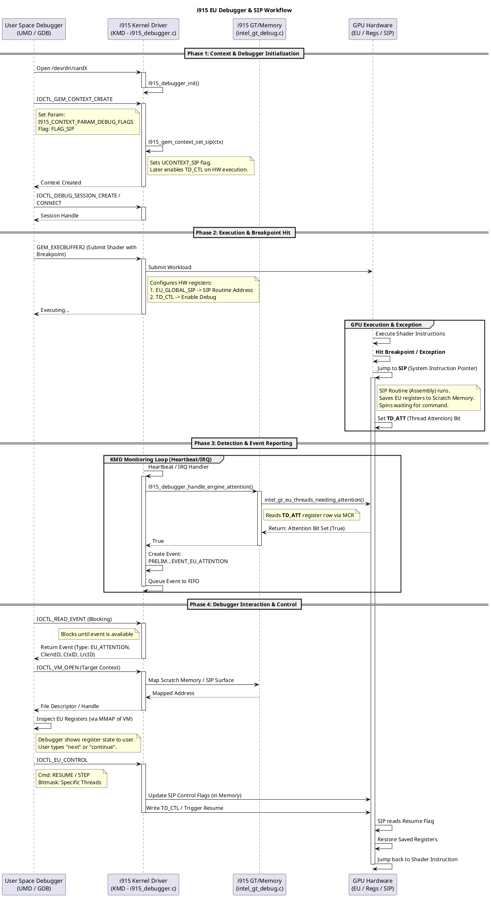
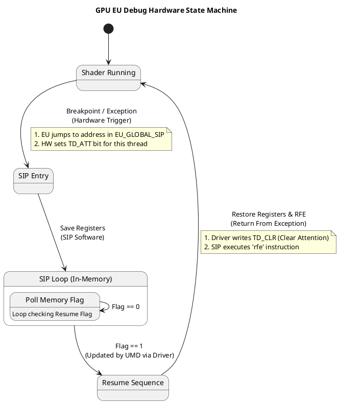
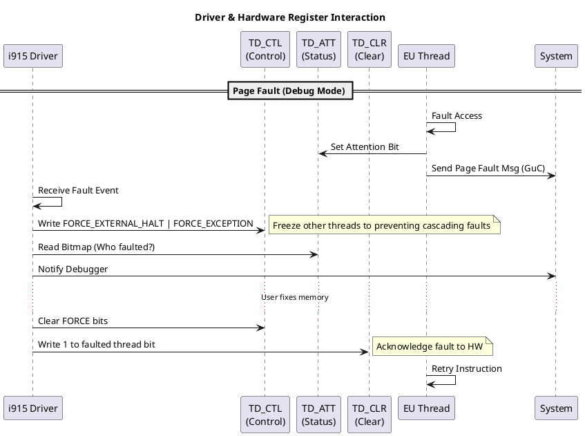

# i915 Debugger 与 SIP 处理机制详解

本文档总结了 Intel i915 驱动中关于 SIP (System Instruction Pointer) 设置、Debugger 支持架构及相关处理流程的详细机制。

## 1. SIP (System Instruction Pointer) 设置

SIP 是发生异常或调试事件时 EU (Execution Unit) 跳转到的系统例程地址。其启用和配置主要通过 GEM 上下文参数完成。

### 1.1 启用方式
*   **用户空间设置**: 用户空间通过 `ioctl` 设置 context 参数 `I915_CONTEXT_PARAM_DEBUG_FLAGS`，并传入标志 `PRELIM_I915_CONTEXT_PARAM_DEBUG_FLAG_SIP`。
*   **内核处理**: 
    在 `drivers/gpu/drm/i915/gem/i915_gem_context.c` 中，此标志会设置上下文的 `UCONTEXT_SIP` 标志。

### 1.2 硬件状态传递
*   当上下文被调度时，`UCONTEXT_SIP` 标志会转化为 `intel_context` 上的 `CONTEXT_DEBUG` 标志。
*   驱动确保硬件寄存器（如 `TD_CTL`）开启调试模式。

### 1.3 关键寄存器
*   **TD_CTL (Thread Debug Control)**: 用于开启调试功能。驱动通过读取此寄存器判断当前是否启用了 SIP 调试（例如在处理页错误时）。
*   **EU_GLOBAL_SIP (0xe42c)**: 存储 SIP 的入口地址。该地址通常由用户空间调试器在初始化时配置。

## 2. Debugger 模块处理

i915 包含一个专门的调试器子系统，主要在 `drivers/gpu/drm/i915/i915_debugger.c` 中实现。

### 2.1 初始化与通信
*   **初始化**: `i915_debugger_init` 初始化调试子系统。
*   **接口**: 调试器通过专有的 IOCTL 接口与驱动通信（详见下文接口部分）。

### 2.2 事件处理 (Events)
驱动捕获硬件事件并封装成 `i915_debug_event` 发送给用户空间：
*   **EU Attention (断点)**: 当 EU 命中硬件断点或显式请求关注时触发。
*   **Page Fault**: 调试模式下的页错误会通知调试器，而非直接杀死上下文。
*   **资源事件**: Context 创建/销毁、VM 绑定/解绑等。

### 2.3 EU 控制
通过 `PRELIM_I915_DEBUG_IOCTL_EU_CONTROL`，用户空间可以控制 EU 线程的挂起、恢复或单步执行。这通过向 `TD_CTL` 或相关寄存器写入位掩码实现。

## 3. SIP 运行状态检测

i915 驱动**通过读取硬件寄存器**知道 EU 是否触发了 Attention 并在运行 SIP。

### 3.1 检测机制：TD_ATT (Thread Attention)
*   **硬件信号**: 当 EU 线程命中断点并跳转到 SIP 时，硬件会自动置位 `TD_ATT` 寄存器。
*   **唯一性**: `TD_ATT` 是 SIP 正在运行的**唯一**硬件指标。驱动没有其他边带信号或中断来确认 SIP 的运行状态。

### 3.2 驱动检测流程
驱动通过以下方式主动检测 `TD_ATT`：
1.  **心跳检测 (Heartbeat)**: 周期性调用 `i915_debugger_handle_engine_attention` -> `intel_gt_eu_threads_needing_attention` 轮询 `TD_ATT`。
2.  **异常处理 (Pagefault)**: 在处理 Pagefault 时，驱动会读取 `TD_ATT` 以确认是否由调试引起。

一旦检测到 `TD_ATT` 置位，驱动认为 SIP 已在运行，并生成 `PRELIM_DRM_I915_DEBUG_EVENT_EU_ATTENTION` 事件。

## 4. 架构、接口与流程总结

### 4.1 核心架构三层
1.  **User Space Debugger (UMD)**: GDB 等工具，负责交互、解析 ELF、发送控制命令。
2.  **Kernel Mode Driver (KMD)**: i915 驱动，负责资源管理、硬件状态设置、事件转发。
3.  **Hardware (GPU & SIP)**: EU 执行单元、SIP 例程代码、调试寄存器 (`TD_CTL`, `TD_ATT`)。

### 4.2 关键 IOCTL 接口
| 命令 | 作用 |
| :--- | :--- |
| `PRELIM_I915_DEBUG_IOCTL_READ_EVENT` | 读取内核调试事件（阻塞）。 |
| `PRELIM_I915_DEBUG_IOCTL_ACK_EVENT` | 确认事件已处理。 |
| `PRELIM_I915_DEBUG_IOCTL_EU_CONTROL` | 控制 EU 线程（Stop, Resume, Step）。 |
| `PRELIM_I915_DEBUG_IOCTL_VM_OPEN` | 打开目标 Context VM 以读写显存（查看寄存器）。 |
| `PRELIM_I915_DEBUG_IOCTL_READ_UUID` | 读取 Shader UUID 关联源码。 |

### 4.3 完整调试流程图

## 5. 术语辨析：TD_ATT vs EU_ATT

*   **TD_ATT**: 这是驱动代码中使用的**寄存器宏名** (Thread Attention)，例如 `MCR_REG(0xe470)`.
*   **EU_ATT**: 这是对该寄存器功能的**描述性名称**或硬件文档别名 ("EU Attention Register")。
*   **PRELIM_DRM_I915_DEBUG_EVENT_EU_ATTENTION**: 这是驱动检测到 `TD_ATT` 置位后发送给用户空间的事件名称。

它们本质上指代同一个硬件机制：用于在 EU 线程进入 SIP 时通知外部。

## 6. IOCTL 接口详情

以下是 i915 调试器接口的详细说明，这些定义通常位于 `i915_drm_prelim.h` 中。

### 6.1 `PRELIM_I915_DEBUG_IOCTL_READ_EVENT`
**功能**: 阻塞读取内核产生的调试事件。这是调试器的主循环接口。
**参数**: 无直接输入，返回 `struct prelim_drm_i915_debug_event` 及其子类。

**核心事件类型 (`type`)**:
*   `PRELIM_DRM_I915_DEBUG_EVENT_EU_ATTENTION` (8): 报告 EU 线程命中 Attention（断点/异常）。包含 `struct prelim_drm_i915_debug_event_eu_attention`，提供 `bitmask` 指示具体的 EU 线程。
*   `PRELIM_DRM_I915_DEBUG_EVENT_PAGE_FAULT` (10): 报告调试相关的页错误。
*   `PRELIM_DRM_I915_DEBUG_EVENT_CONTEXT` (3): 上下文创建/销毁通知。
*   `PRELIM_DRM_I915_DEBUG_EVENT_VM_BIND` (6): VM 映射变更，包含 `uuids` 列表，用于代码关联。

### 6.2 `PRELIM_I915_DEBUG_IOCTL_ACK_EVENT`
**功能**: 确认某些需要同步的事件已处理完毕。
**参数**: `struct prelim_drm_i915_debug_event_ack`
*   `type`: 事件类型。
*   `seqno`: 事件序列号（来源于 READ_EVENT 读取到的 `seqno`）。

### 6.3 `PRELIM_I915_DEBUG_IOCTL_EU_CONTROL`
**功能**: 控制 EU 线程的执行状态（停止、恢复、中断）。
**参数**: `struct prelim_drm_i915_debug_eu_control`
*   `client_handle`: 调试会话句柄。
*   `cmd`:
    *   `INTERRUPT_ALL` (0): 中断所有。
    *   `STOPPED` (1): 确认停止？(通常用于查询或握手)。
    *   `RESUME` (2): 恢复线程执行 (SIP -> Shader)。
    *   `INTERRUPT` (3): 中断特定线程。
*   `bitmask_ptr`: 指向用户空间内存的指针，包含需要操作的线程位掩码。
*   `ci`: 指定 Engine Class 和 Instance (如 Render 引擎)。

### 6.4 `PRELIM_I915_DEBUG_IOCTL_VM_OPEN`
**功能**: 获取目标 Context 虚拟地址空间 (PPGTT) 的文件描述符。
**作用**: 允许调试器通过 `mmap` 或 `read/write` 直接访问 GPU 内存，特别是用于读取 SIP 保存到 Scratch Space 中的寄存器数据。
**参数**: `struct prelim_drm_i915_debug_vm_open`
*   `handle`: 目标 VM 的句柄。
*   `flags`: 访问权限 (Read-Only/Read-Write)。

### 6.5 `PRELIM_I915_DEBUG_IOCTL_READ_UUID`
**功能**: 根据 UUID 获取 Shader 的元数据或源代码关联信息。
**参数**: `struct prelim_drm_i915_debug_read_uuid`
*   `handle`: UUID 资源句柄。
*   `payload_ptr`: 用户空间缓冲区，用于接收 UUID 关联的数据（如 ELF 文件路径或二进制内容）。

## 7. 详细函数调用流程

### 7.1 上下文调试模式开启 (SIP Enablement)

当用户创建一个用于调试的 Context 时，标志位的传递路径：

1.  **用户空间调用**:
    *   `ioctl(fd, DRM_IOCTL_I915_GEM_CONTEXT_CREATE_EXT, &param)`
    *   参数: `I915_CONTEXT_PARAM_DEBUG_FLAGS` = `FLAG_SIP`

2.  **内核配置 (i915_gem_context.c)**:
    *   `i915_gem_context_create_ioctl` -> ... -> `set_debug_flags`
    *   `i915_gem_context_set_sip(ctx)` -> 设置 `ctx->flags` (UCONTEXT_SIP)

3.  **硬件状态应用 (Pinning / Submission)**:
    *   在 Context 首次使用或被调度前：`i915_gem_do_execbuffer`
    *   `eb_pin_engine` -> `intel_context_pin` -> `__intel_context_do_pin`
    *   `__apply_debug_flags`: 检查 `i915_gem_context_has_sip(ctx)`
    *   设置 `ce->flags` |= `CONTEXT_DEBUG`
    *   GPU 调度该 Context 时，LRC (Logical Ring Context) 镜像中包含启用调试的寄存器设置。

### 7.2 调试事件检测与生成 (Detection)

####路径 A：心跳检测 (常规断点/Attention)
1.  **定时器触发**: `intel_engine_heartbeat` (intel_engine_heartbeat.c)
2.  **检查 Attention**:
    *   `i915_debugger_handle_engine_attention(engine)`
    *   `intel_gt_eu_threads_needing_attention(gt)`
    *   `read_first_attention_ss_fw` -> `intel_gt_mcr_read_fw(gt, TD_ATT(row))`
3.  **生成事件**:
    *   如果 `TD_ATT` 有值 -> `i915_debugger_queue_engine_attention(engine)`
    *   分配事件结构 -> 填充 Bitmask -> `event_push` -> 唤醒等待的 UMD。

####路径 B：页错误 (Pagefault, SIP 访问非法地址)
1.  **硬件分发**: GuC 发送 G2H 消息 -> `intel_gt_pagefault_process_page_fault_msg`
2.  **处理消息**: `intel_pagefault_req_process_msg` -> `dma_fence_work_init`
3.  **工作队列执行 (fault_work)**:
    *   `intel_gt_mcr_read_any(gt, TD_CTL)` (检查是否开启调试)
    *   `intel_eu_attentions_read` (读取当前 Attention 位图)
    *   **冻结硬件**: 写入 `TD_CTL` -> `FORCE_EXTERNAL_HALT` | `FORCE_EXCEPTION`
    *   **通知调试器**: `i915_debugger_handle_page_fault` -> 生成 `PAGE_FAULT` Event
    *   (等待用户空间修复内存映射...)
    *   **恢复**: `repair_fault` -> 解除 `TD_CTL` 强制位 -> 发送 Reply 给 GuC。

### 7.3 用户控制流程 (Resume Execution)

当用户在 GDB 中输入 `continue` 时：

1.  **IOCTL**:
    *   `ioctl(..., PRELIM_I915_DEBUG_IOCTL_EU_CONTROL, {cmd=RESUME, bitmask=...})`
2.  **内核处理 (i915_debugger.c)**:
    *   `i915_debugger_ioctl` -> `i915_debugger_eu_control`
    *   `do_eu_control` -> 获取 `eu_lock`
3.  **硬件操作**:
    *   调用 `eu_control_resume`
    *   `intel_gt_for_each_compute_slice_subslice(..., clear_attn_ss_fw)`
    *   `clear_attn_ss_fw`: `intel_gt_mcr_unicast_write_fw(gt, TD_CLR(row), val)`
    *   **TD_CLR**: 向该寄存器写入 1 会清除对应的 DO_ATTENTION 状态，允许 SIP 循环结束并跳回 Shader。

## 8. 硬件机制深度解析

GPU 硬件在调试过程中扮演着核心角色，主要涉及以下寄存器和状态机：

### 8.1 关键寄存器组
*   **TD_CTL (0xe400, Thread Debug Control)**:
    *   **Master Enable**: `BIT(30)` - 全局调试使能。如果置 0，EU 忽略断点指令。
    *   **Force Exception**: `BIT(1)` - 软件强制让所有运行中的线程产生异常并跳转 SIP。
    *   **Force External Halt**: `BIT(0)` - 强制 EU 暂停调度。
*   **TD_ATT (0xe470, Thread Attention)**:
    *   **Read-Only** 位图。
    *   每 1 位代表一个 EU 线程。
    *   当线程执行到 `bkpt` 指令或因其他原因进入 System Routine 时，该位被硬件置 1。
*   **TD_CLR (0xe474, Thread Attention Clear)**:
    *   **Write-Only**。
    *   向对应位写入 1，会清除 `TD_ATT` 中的对应位。
    *   这是 SIP "收到恢复信号" 的硬件触发器。SIP 代码通常在循环中不断检查内部某个标志，而该标志的更新往往通过驱动写显存完成，但清除 Attention 状态本身需要写这个寄存器。
*   **EU_GLOBAL_SIP (0xe42c)**:
    *   存储 SIP 内核在显存中的物理地址（或偏移）。
    *   所有 EU 共享同一个入口点。

### 8.2 SIP 状态机 (Hardware Flow)

### 8.3 Driver 与 HW 交互时序

